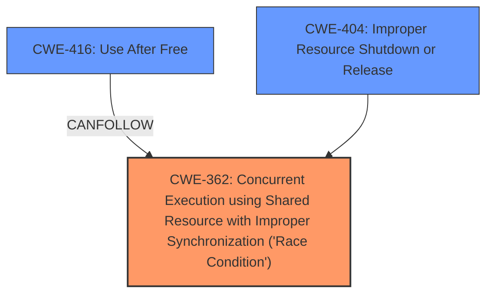

# Analysis Report for CVE-2024-56655

# Vulnerability Analysis Report: CVE-2024-56655

## Description

In the Linux kernel, the following vulnerability has been resolved netfilter nf_tables do not defer rule destruction via call_rcu **nf_tables_chain_destroy can sleep**, it cant be used from call_rcu callbacks. Moreover, nf_tables_rule_release() is only safe for error unwinding, while transaction mutex is held and the to-be-desroyed rule was not exposed to either dataplane or dumps, as it deactives+frees without the required synchronize_rcu() in-between. nft_rule_expr_deactivate() callbacks will change ->use counters of other chains/sets, see e.g. nft_lookup .deactivate callback, these must be serialized via transaction mutex. Also add a few lockdep asserts to make this more explicit. Calling synchronize_rcu() isnt ideal, but fixing this without is hard and way more intrusive. As-is, we can get WARNING .. net/netfilter/nf_tables_api.c5515 nft_set_destroy+0x.. Workqueue events nf_tables_trans_destroy_work RIP 0010nft_set_destroy+0x3fe/0x5c0 Call Trace nf_tables_trans_destroy_work+0x6b7/0xad0 process_one_work+0x64a/0xce0 worker_thread+0x613/0x10d0 In case the synchronize_rcu becomes an issue, we can explore alternatives. One way would be to allocate nft_trans_rule objects + one nft_trans_chain object, deactivate the rules + the chain and then defer the freeing to the nft destroy workqueue. Wed still need to keep the synchronize_rcu path as a fallback to handle -ENOMEM corner cases though.

## Vulnerability Description Key Phrases

- **Rootcause:** nf_tables_chain_destroy can sleep
- **Product:** Linux kernel
- **Component:** netfilter nf_tables

## Analysis (with Relationship Data)

# Summary
| CWE ID | CWE Name | Confidence | CWE Abstraction Level | CWE Vulnerability Mapping Label | CWE-Vulnerability Mapping Notes |
|---|---|---|---|---|---|
| CWE-362 | Concurrent Execution using Shared Resource with Improper Synchronization ('Race Condition') | 0.9 | Class | Allowed-with-Review | Primary CWE. The **nf_tables_chain_destroy can sleep** is the root cause. The **nft_rule_expr_deactivate() callbacks will change ->use counters of other chains/sets**, causing race conditions when multiple operations modify the same chains/sets. |
| CWE-404 | Improper Resource Shutdown or Release | 0.7 | Class | Allowed-with-Review | Due to the **improper resource cleanup** where the cleanup logic was not correctly waiting for RCU grace periods. |
| CWE-416 | Use After Free | 0.6 | Variant | Allowed | A possible consequence of the race condition and improper resource shutdown. |

## Evidence and Confidence

*   **Confidence Score:** 0.8
*   **Evidence Strength:** HIGH

## Relationship Analysis
The primary weakness is a race condition (CWE-362) arising from concurrent execution and improper synchronization. This can lead to improper resource shutdown or release (CWE-404) and potentially use-after-free vulnerabilities (CWE-416). The relationship between CWE-362 and CWE-416 is that a race condition can precede a use-after-free. CWE-404 is also connected because the race conditions can lead to premature resource release.



## Vulnerability Chain
The vulnerability chain starts with concurrent execution and improper synchronization (CWE-362), leading to improper resource shutdown or release (CWE-404), and ultimately resulting in a potential use-after-free condition (CWE-416).

CWE-362 (Root Cause) -> CWE-404 -> CWE-416 (Impact)

## Summary of Analysis
The analysis is based on the provided vulnerability description and the CVE Reference Links Content Summary. The key evidence includes:

*   `nf_tables_chain_destroy can sleep`, which is not allowed within `call_rcu` callbacks (CWE-362).
*   `nf_tables_rule_release()` deactivates and frees rules without the necessary `synchronize_rcu()`, leading to race conditions (CWE-362 and CWE-404).
*   Improper resource cleanup leads to use-after-free scenarios (CWE-416).

The graph relationships influenced the selection of CWEs by illustrating how the race condition can lead to improper resource management and a use-after-free vulnerability.

The selected CWEs are at the optimal level of specificity because they accurately represent the root cause and potential consequences of the vulnerability, as described in the provided information.

Relevant CWE Information:

# Enhanced Context (25 CWEs)
The following CWEs were identified as potentially relevant to this vulnerability:

## CWE-667: Improper Locking
**Abstraction Level**: Class
**Similarity Score**: 0.77
**Source**: dense

**Description**:
The product does not properly acquire or release a lock on a resource, leading to unexpected resource state changes and behaviors.

**Mapping Guidance**:
- Usage: Allowed-with-Review
- Rationale: This CWE entry is a Class and might have Base-level children that would be more appropriate

## CWE-362: Concurrent Execution using Shared Resource with Improper Synchronization ('Race Condition')
**Abstraction Level**: Class
**Similarity Score**: 0.77
**Source**: dense

**Description**:
The product contains a concurrent code sequence that requires temporary, exclusive access to a shared resource, but a timing window exists in which the shared resource can be modified by another code sequence operating concurrently.

**Mapping Guidance**:
- Usage: Allowed-with-Review
- Rationale: This CWE entry is a Class and might have Base-level children that would be more appropriate

## CWE-617: Reachable Assertion
**Abstraction Level**: Base
**Similarity Score**: 0.75
**Source**: dense

**Description**:
The product contains an assert() or similar statement that can be triggered by an attacker, which leads to an application exit or other behavior that is more severe than necessary.

**Mapping Guidance**:
- Usage: Allowed
- Rationale: This CWE entry is at the Base level of abstraction, which is a preferred level of abstraction for mapping to the root causes of vulnerabilities.

## CWE-755: Improper Handling of Exceptional Conditions
**Abstraction Level**: Class
**Similarity Score**: 0.75
**Source**: dense

**Description**:
The product does not handle or incorrectly handles an exceptional condition.

**Mapping Guidance**:
- Usage: Discouraged
- Rationale: This CWE entry is a level-1 Class (i.e., a child of a Pillar). It might have lower-level children that would be more appropriate

## CWE-703: Improper Check or Handling of Exceptional Conditions
**Abstraction Level**: Pillar
**Similarity Score**: 0.75
**Source**: dense

**Description**:
The product does not properly anticipate or handle exceptional conditions that rarely occur during normal operation of the product.

**Mapping Guidance**:
- Usage: Discouraged
- Rationale: This CWE entry is extremely high-level, a Pillar.

## CWE-833: Deadlock
**Abstraction Level**: Base
**Similarity Score**: 0.74
**Source**: dense

**Description**:
The product contains multiple threads or executable segments that are waiting for each other to release a necessary lock, resulting in deadlock.

**Mapping Guidance**:
- Usage: Allowed
- Rationale: This CWE entry is at the Base level of abstraction, which is a preferred level of abstraction for mapping to the root causes of vulnerabilities.

## CWE-404: Improper Resource Shutdown or Release
**Abstraction Level**: Class
**Similarity Score**: 0.74
**Source**: dense

**Description**:
The product does not release or incorrectly releases a resource before it is made available for re-use.

**Mapping Guidance**:
- Usage: Allowed-with-Review
- Rationale: This CWE entry is a Class and might have Base-level children that would be more appropriate

## CWE-367: Time-of-check Time-of-use (TOCTOU) Race Condition
**Abstraction Level**: Base
**Similarity Score**: 0.74
**Source**: dense

**Description**:
The product checks the state of a resource before using that resource, but the resource's state can change between the check and the use in a way that invalidates the results of the check. This can cause the product to perform invalid actions when the resource is in an unexpected state.

**Mapping Guidance**:
- Usage: Allowed
- Rationale: This CWE entry is at the Base level of abstraction, which is a preferred level of abstraction for mapping to the root causes of vulnerabilities.

## CWE-252: Unchecked Return Value
**Abstraction Level**: Base
**Similarity Score**: 0.74
**Source**: dense

**Description**:
The product does not check the return value from a method or function, which can prevent it from detecting unexpected states and conditions.

**Mapping Guidance**:
- Usage: Allowed
- Rationale: This CWE entry is at the Base level of abstraction, which is a preferred level of abstraction for mapping to the root causes of vulnerabilities.

## CWE-754: Improper Check for Unusual or Exceptional Conditions
**Abstraction Level**: Class
**Similarity Score**: 0.74
**Source**: dense

**Description**:
The product does not check or incorrectly checks for unusual or exceptional conditions that are not expected to occur frequently during day to day operation of the product.

**Mapping Guidance**:
- Usage: Allowed-with-Review
- Rationale: This CWE entry is a Class and might have Base-level children that would be more appropriate

## CWE-362: Concurrent Execution using Shared Resource with Improper Synchronization ('Race Condition')
**Abstraction Level**: Class
**Similarity Score**: 1304.75
**Source**: sparse

**Description**:
The product contains a concurrent code sequence that requires temporary, exclusive access to a shared resource, but a timing window exists in which the shared resource can be modified by another code sequence operating concurrently.

**Mapping Guidance**:
- Usage: Allowed-with-Review
- Rationale: This CWE entry is a Class and might have Base-level children that would be more appropriate


## CWE Relationship Analysis

Current CWEs represent these abstraction levels: .


### Vulnerability Chain Analysis

**Chain starting from CWE-416:**
- 416 (Use After Free) - ROOT


**Chain starting from CWE-404:**
- 404 (Improper Resource Shutdown or Release) - ROOT


### CWE Relationship Diagram

```mermaid
graph TD
    classDef primary fill:#f96,stroke:#333,stroke-width:2px
    classDef secondary fill:#69f,stroke:#333
    classDef tertiary fill:#9e9,stroke:#333
```


*Report generated on 2025-07-13 23:52:55*
