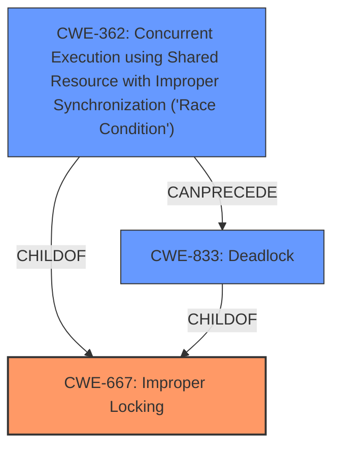

# Enhanced Analysis for CVE-2024-56680

# Summary
| CWE ID  | CWE Name                                                                                                 | Confidence | CWE Abstraction Level | CWE Vulnerability Mapping Label | CWE-Vulnerability Mapping Notes |
| :-------- | :--------------------------------------------------------------------------------------------------------- | :--------- | :---------------------- | :------------------------------ | :------------------------------ |
| CWE-667   | Improper Locking                                                                                           | 0.8        | Class                   | Primary CWE                     | Allowed-with-Review           |
| CWE-362   | Concurrent Execution using Shared Resource with Improper Synchronization ('Race Condition')                 | 0.7        | Class                   | Secondary Candidate             | Allowed-with-Review           |
| CWE-833   | Deadlock                                                                                                   | 0.6        | Base                    | Secondary Candidate             | Allowed                       |

## Evidence and Confidence

*   **Confidence Score:** 0.7
*   **Evidence Strength:** MEDIUM

## Relationship Analysis
The primary relationship considered was the parent-child relationship, particularly in the context of locking and concurrency. CWE-667 (Improper Locking) is a class-level CWE. The analysis also considered chain relationships, where improper locking can lead to race conditions and deadlocks. The abstraction levels influenced the decision to prioritize class-level CWEs initially, but base-level CWEs were also considered for their specificity.



## Vulnerability Chain
The vulnerability chain begins with **improper handling of interrupts** when the device is disabled, leading to potential race conditions as the driver attempts to suspend the device while handling the interrupt. This can escalate to a system hang, representing a denial-of-service. The root cause is the **failure to properly manage access to shared resources**, potentially involving **improper locking mechanisms** or **lack of synchronization**.

## Summary of Analysis
The initial analysis focused on the **failure to handle interrupts correctly when the device is disabled**. The primary evidence supporting this is the phrase "**do not handle interrupts when device is disabled**" from the "Vulnerability Description Key Phrases" section, as well as the description in the "CVE Reference Links Content Summary" section. This led to the consideration of CWEs related to resource management, concurrency, and locking.

The Retriever results suggested CWE-833 (Deadlock), CWE-367 (Time-of-check Time-of-use (TOCTOU) Race Condition), and CWE-362 (Concurrent Execution using Shared Resource with Improper Synchronization ('Race Condition')). However, the root cause appears to be the improper locking or synchronization that allows these conditions to arise.

The final decision was to assign CWE-667 (Improper Locking) as the primary CWE, since the device **does not handle interrupts when disabled**, which implies a locking issue if the device is trying to access shared resources when it should not.
CWE-362 (Concurrent Execution using Shared Resource with Improper Synchronization ('Race Condition')) and CWE-833 (Deadlock) are secondary candidates because they are potential consequences of the **improper locking**.

The selected CWEs are at the optimal level of specificity because they address the underlying causes of the vulnerability rather than just the symptoms. CWE-667, as a Class, provides a broad categorization of the weakness, while CWE-362 and CWE-833 describe more specific scenarios that could arise from the improper locking.

Relevant CWE Information:

# Enhanced Context (25 CWEs)
The following CWEs were identified as potentially relevant to this vulnerability:

## CWE-667: Improper Locking
**Abstraction Level**: Class
**Similarity Score**: 0.74
**Source**: dense

**Description**:
The product does not properly acquire or release a lock on a resource, leading to unexpected resource state changes and behaviors.

**Mapping Guidance**:
- Usage: Allowed-with-Review
- Rationale: This CWE entry is a Class and might have Base-level children that would be more appropriate

**Explanation**: The vulnerability involves the **failure to handle interrupts when the device is disabled**, indicating a potential locking issue, making this a relevant consideration.

## CWE-362: Concurrent Execution using Shared Resource with Improper Synchronization ('Race Condition')
**Abstraction Level**: Class
**Similarity Score**: 0.71
**Source**: dense

**Description**:
The product contains a concurrent code sequence that requires temporary, exclusive access to a shared resource, but a timing window exists in which the shared resource can be modified by another code sequence operating concurrently.

**Mapping Guidance**:
- Usage: Allowed-with-Review
- Rationale: This CWE entry is a Class and might have Base-level children that would be more appropriate

**Explanation**: If the IPU6 device doesn't properly handle interrupts when disabled and shares interrupts, a race condition can occur.

## CWE-833: Deadlock
**Abstraction Level**: Base
**Similarity Score**: 0.72
**Source**: dense

**Description**:
The product contains multiple threads or executable segments that are waiting for each other to release a necessary lock, resulting in deadlock.

**Mapping Guidance**:
- Usage: Allowed
- Rationale: This CWE entry is at the Base level of abstraction, which is a preferred level of abstraction for mapping to the root causes of vulnerabilities.

**Explanation**: A deadlock could occur if multiple devices sharing the same IRQ line are waiting for each other, and the IPU6 device is disabled without proper interrupt handling.


## CWE Relationship Analysis

Current CWEs represent these abstraction levels: .


### Vulnerability Chain Analysis

**Chain starting from CWE-667:**
- 667 (Improper Locking) - ROOT


**Chain starting from CWE-833:**
- 833 (Deadlock) - ROOT


### CWE Relationship Diagram

```mermaid
graph TD
    classDef primary fill:#f96,stroke:#333,stroke-width:2px
    classDef secondary fill:#69f,stroke:#333
    classDef tertiary fill:#9e9,stroke:#333
```