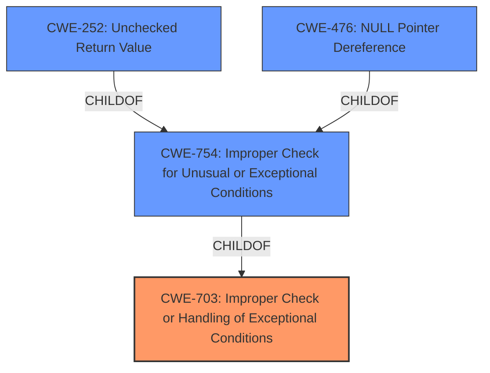

# Enhanced Analysis for CVE-2024-56690

# Summary
| CWE ID | CWE Name | Confidence | CWE Abstraction Level | CWE Vulnerability Mapping Label | CWE-Vulnerability Mapping Notes |
|---|---|---|---|---|---|
| CWE-703 | Improper Check or Handling of Exceptional Conditions | 0.7 | Pillar | Primary CWE | Discouraged |
| CWE-754 | Improper Check for Unusual or Exceptional Conditions | 0.6 | Class | Secondary Candidate | Allowed-with-Review |
| CWE-252 | Unchecked Return Value | 0.5 | Base | Secondary Candidate | Allowed |
| CWE-476 | NULL Pointer Dereference | 0.3 | Base | Secondary Candidate | Allowed |

## Evidence and Confidence

*   **Confidence Score:** 0.7
*   **Evidence Strength:** MEDIUM

## Relationship Analysis
The primary relationship that influenced my decision was the parent-child relationship between CWE-703 (Pillar) and CWE-754 (Class), and CWE-252 (Base). Although the goal is to identify the most specific CWE, the evidence is not enough to go below CWE-703. The Retriever Results show a list of Base CWEs that could be a fit, but not enough evidence is available to select them with confidence.



## Vulnerability Chain
The vulnerability chain starts with the improper handling of the `-EBUSY` return value from `padata_do_parallel()`, leading to a WARN being generated. When `panic_on_warn` is set, this leads to an unnecessary kernel panic.

## Summary of Analysis
My analysis is primarily based on the provided vulnerability description and the CVE reference links content summary. The key phrase is "the unnecessary panic will occur when panic_on_warn set 1". This highlights the **improper handling of the exceptional condition** where `padata_do_parallel()` returns `-EBUSY`.

The relationship graph helped in understanding the hierarchy of CWEs. While more specific CWEs like CWE-252 or CWE-476 could potentially apply, the provided evidence is insufficient to confidently classify the vulnerability at that level of detail. Therefore, CWE-703 and the related CWE-754 are selected as the most appropriate, with the understanding that more information might allow for a more precise classification.

The **root cause** is not so much a specific coding error such as a missing check, but is more of a design flaw where the system does not properly anticipate or handle exceptional conditions that rarely occur during normal operation of the product.

Relevant CWE Information:

# Enhanced Context (25 CWEs)
The following CWEs were identified as potentially relevant to this vulnerability:

## CWE-703: Improper Check or Handling of Exceptional Conditions
**Abstraction Level**: Pillar
**Similarity Score**: 0.74
**Source**: dense

**Description**:
The product does not properly anticipate or handle exceptional conditions that rarely occur during normal operation of the product.

**Mapping Guidance**:
- Usage: Discouraged
- Rationale: This CWE entry is extremely high-level, a Pillar.

**Justification:** Although discouraged, the vulnerability description indicates the product does not properly handle the **exceptional condition** of `padata_do_parallel()` returning `-EBUSY`.

## CWE-754: Improper Check for Unusual or Exceptional Conditions
**Abstraction Level**: Class
**Similarity Score**: 0.73
**Source**: dense

**Description**:
The product does not check or incorrectly checks for unusual or exceptional conditions that are not expected to occur frequently during day to day operation of the product.

**Mapping Guidance**:
- Usage: Allowed-with-Review
- Rationale: This CWE entry is a Class and might have Base-level children that would be more appropriate

**Justification:** As a child of CWE-703, the vulnerability is due to the product not checking or incorrectly checking for **unusual or exceptional conditions** that are not expected to occur frequently during day to day operation of the product

## CWE-252: Unchecked Return Value
**Abstraction Level**: Base
**Similarity Score**: 0.73
**Source**: dense

**Description**:
The product does not check the return value from a method or function, which can prevent it from detecting unexpected states and conditions.

**Mapping Guidance**:
- Usage: Allowed
- Rationale: This CWE entry is at the Base level of abstraction, which is a preferred level of abstraction for mapping to the root causes of vulnerabilities.

**Justification:** The return value `-EBUSY` from `padata_do_parallel()` is not correctly handled, leading to a panic.

## CWE-476: NULL Pointer Dereference
**Abstraction Level**: base
**Similarity Score**: 4.33
**Source**: graph

**Description**:
CWE-476: NULL Pointer Dereference

**Mapping Guidance**:
- Usage: Allowed
- Rationale: This CWE entry is at the Base level of abstraction, which is a preferred level of abstraction for mapping to the root causes of vulnerabilities.

**Justification:** Considered, but there is no direct evidence of a null pointer dereference. It is possible, but not explicit.


## CWE Relationship Analysis

Current CWEs represent these abstraction levels: .


### Vulnerability Chain Analysis

**Chain starting from CWE-252:**
- 252 (Unchecked Return Value) - ROOT


**Chain starting from CWE-476:**
- 476 (NULL Pointer Dereference) - ROOT


### CWE Relationship Diagram

```mermaid
graph TD
    classDef primary fill:#f96,stroke:#333,stroke-width:2px
    classDef secondary fill:#69f,stroke:#333
    classDef tertiary fill:#9e9,stroke:#333
```