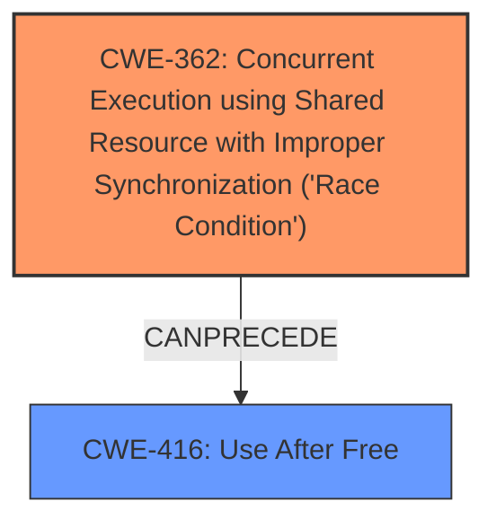

# Raw Analyzer Response for CVE-2024-56693

# Summary

| CWE ID  | CWE Name                                                                                               | Confidence | CWE Abstraction Level | CWE Vulnerability Mapping Label | CWE-Vulnerability Mapping Notes |
| :-------- | :------------------------------------------------------------------------------------------------------- | :--------- | :---------------------- | :------------------------------ | :------------------------------ |
| CWE-362   | Concurrent Execution using Shared Resource with Improper Synchronization ('Race Condition') | 0.8        | Class                     | Primary CWE                     | Allowed-with-Review           |
| CWE-416   | Use After Free                                                                                           | 0.7        | Base                      | Secondary Candidate             | Allowed                       |

## Evidence and Confidence

*   **Confidence Score:** 0.75
*   **Evidence Strength:** MEDIUM

## Relationship Analysis

The primary weakness is a **race condition** (CWE-362) leading to a **use-after-free** (CWE-416). CWE-362 is a class-level CWE and doesn't have a direct parent-child relationship with CWE-416. However, a race condition can *precede* a use-after-free if resources are improperly synchronized during allocation and deallocation. The fix introduced a mutex which prevents **race conditions** and ensures proper allocation/deallocation.

## Vulnerability Chain

The vulnerability chain starts with a **race condition** (CWE-362) in the `brd` driver's allocation/deallocation logic. This leads to premature release of a block device's resources. A file descriptor, still referencing the freed memory, results in a **use-after-free** (CWE-416) when an operation is attempted on the freed memory. The chain highlights how improper synchronization can lead to memory corruption vulnerabilities.

## Summary of Analysis

The analysis is based on the provided vulnerability description and the CVE reference links content summary. The key evidence points to a **race condition** during resource allocation, compounded by a **use-after-free** vulnerability.

The **race condition** (CWE-362) occurs because the allocation and registration of the block device are not properly synchronized with the module initialization process. If initialization fails, the premature release of the block device can occur. This is supported by the text: *"The vulnerability is due to a race condition and use-after-free (UAF) scenario in the `brd` (RAM disk) driver within the Linux kernel. The `brd_init()` function was calling `brd_alloc()` before `__register_blkdev()` succeeded, and if `brd_init()` encountered an error, it would release successfully created disks."*

The **use-after-free** (CWE-416) vulnerability arises because a file descriptor may still reference the memory after the block device's resources have been released. This is supported by the text: *"This premature release could lead to a UAF if a file descriptor was opened for the block device, causing a crash when the file operation attempts to access freed memory."*

The fix introduces a mutex to serialize modifications, addressing the **race condition** and preventing the **use-after-free**. This supports the assessment that these two weaknesses are present.

CWE-362 is classified as a Class, and the mapping guidance suggests reviewing child entries for more appropriate mappings. However, there isn't a clear child that fits the specific synchronization issue in the `brd` driver. Therefore, CWE-362 is the most appropriate high-level classification.

CWE-416 is a Base level which is appropriate.

Based on the evidence, the selected CWEs are at the optimal level of specificity.

Relevant CWE Information:

**CWE-362: Concurrent Execution using Shared Resource with Improper Synchronization ('Race Condition')**

*   **Abstraction Level**: Class
*   **Similarity Score**: 0.77 (dense), 1380.60 (sparse)
*   **Description**: The product contains a concurrent code sequence that requires temporary, exclusive access to a shared resource, but a timing window exists in which the shared resource can be modified by another code sequence operating concurrently.
*   **Mapping Guidance**: Allowed-with-Review. Rationale: This CWE entry is a Class and might have Base-level children that would be more appropriate

**CWE-416: Use After Free**

*   **Abstraction Level**: Base
*   **Similarity Score**: N/A
*   **Description**: Referencing memory after it has been freed can cause a program to crash, execute arbitrary code, or other unexpected behavior.
*   **Mapping Guidance**: Allowed.

CWEs considered but not used:

*   CWE-770: Allocation of Resources Without Limits or Throttling - While resource allocation is involved, the core issue is not the lack of limits but the **race condition** and subsequent **use-after-free**.
*   CWE-119: Improper Restriction of Operations within the Bounds of a Memory Buffer - This is a broad category, and CWE-416 provides a more specific description of the memory corruption.
*   CWE-787: Out-of-bounds Write - Not relevant.
*   CWE-1284: Improper Validation of Specified Quantity in Input - Not relevant.
*   CWE-131: Incorrect Calculation of Buffer Size - Not relevant.
*   CWE-755: Improper Handling of Exceptional Conditions - While an error condition triggers the vulnerability, the root cause is the **race condition** and subsequent **use-after-free**.
*   CWE-404: Improper Resource Shutdown or Release - While resource release is part of the issue, the core problem is the **race condition** that leads to premature release and the subsequent **use-after-free**.
*   CWE-908: Use of Uninitialized Resource - Not relevant.
*   CWE-823: Use of Out-of-range Pointer Offset - Not relevant.
*   CWE-822: Untrusted Pointer Dereference - Not relevant.
*   CWE-825: Expired Pointer Dereference - Not relevant.
*   CWE-609: Double-Checked Locking - Not relevant.
*   CWE-390: Detection of Error Condition Without Action - Not relevant.