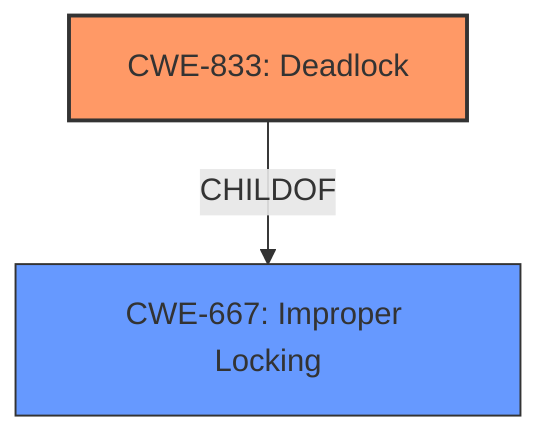

# Enhanced Analysis for CVE-2024-56744

# Summary
| CWE ID | CWE Name | Confidence | CWE Abstraction Level | CWE Vulnerability Mapping Label | CWE-Vulnerability Mapping Notes |
|---|---|---|---|---|---|
| CWE-833 | Deadlock | 1.0 | Base | Primary | Allowed |
| CWE-667 | Improper Locking | 0.7 | Class | Secondary | Allowed-with-Review |

## Evidence and Confidence

*   **Confidence Score:** 0.9
*   **Evidence Strength:** HIGH

## Relationship Analysis
The primary CWE is CWE-833 (Deadlock), which is caused by the program entering a deadlock state. CWE-833 is a Base level CWE. CWE-667 (Improper Locking) is a Class-level CWE that could be considered a parent of CWE-833. The vulnerability description clearly states the occurrence of a deadlock, making CWE-833 the most accurate and specific choice.



## Vulnerability Chain
The vulnerability chain starts with the **circular locking dependency** caused by the synchronous call to `f2fs_record_stop_reason()` within `f2fs_handle_critical_error()`. This leads to a **deadlock** where two threads are waiting for each other to release locks. The impact is system unavailability.

## Summary of Analysis
The primary vulnerability is a deadlock in the Linux kernel's f2fs filesystem. The evidence strongly supports the selection of CWE-833 (Deadlock) as the primary CWE. The vulnerability description explicitly mentions a **deadlock** due to a circular locking dependency. The synchronous call to `f2fs_record_stop_reason()` within `f2fs_handle_critical_error()` triggers this **deadlock**.

The CWE-833 accurately represents the vulnerability because the system becomes unresponsive due to the threads waiting for each other to release locks. The retriever results also listed CWE-833 and CWE-667 as top candidates, further supporting this selection.

CWE-667 (Improper Locking) was considered as a possible cause and secondary issue but was not selected as the primary CWE because it is a class-level CWE. The more specific, base-level CWE of CWE-833 (Deadlock) is a more precise classification.

Relevant CWE Information:

# Enhanced Context (25 CWEs)
The following CWEs were identified as potentially relevant to this vulnerability:

## CWE-833: Deadlock
**Abstraction Level**: Base
**Similarity Score**: 0.78
**Source**: dense

**Description**:
The product contains multiple threads or executable segments that are waiting for each other to release a necessary lock, resulting in deadlock.

**Mapping Guidance**:
- Usage: Allowed
- Rationale: This CWE entry is at the Base level of abstraction, which is a preferred level of abstraction for mapping to the root causes of vulnerabilities.

## CWE-667: Improper Locking
**Abstraction Level**: Class
**Similarity Score**: 0.77
**Source**: dense

**Description**:
The product does not properly acquire or release a lock on a resource, leading to unexpected resource state changes and behaviors.

**Mapping Guidance**:
- Usage: Allowed-with-Review
- Rationale: This CWE entry is a Class and might have Base-level children that would be more appropriate


## CWE Relationship Analysis

Current CWEs represent these abstraction levels: .


### Vulnerability Chain Analysis

**Chain starting from CWE-667:**
- 667 (Improper Locking) - ROOT


**Chain starting from CWE-833:**
- 833 (Deadlock) - ROOT


### CWE Relationship Diagram

```mermaid
graph TD
    classDef primary fill:#f96,stroke:#333,stroke-width:2px
    classDef secondary fill:#69f,stroke:#333
    classDef tertiary fill:#9e9,stroke:#333
```