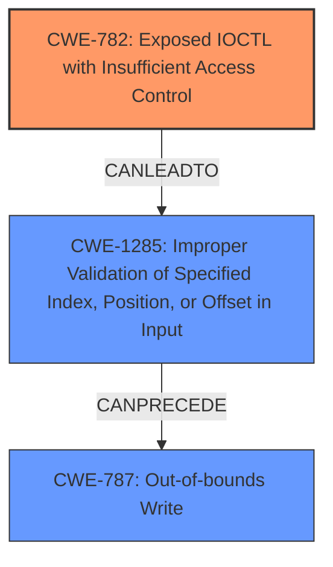

# Analysis Report for CVE-2024-5681

# Vulnerability Analysis Report: CVE-2024-5681

## Description

CWE-20 **Improper Input Validation** vulnerability exists that could cause local denial-of-service, privilege escalation, and potentially kernel execution when a malicious actor with local user access crafts a script/program using an IOCTL call in the Foxboro.sys driver.

## Vulnerability Description Key Phrases

- **Rootcause:** ['Improper Input Validation', 'Input Validation vulnerability']
- **Impact:** ["['local denial-of-service'", "'privilege escalation'", "'kernel execution']"]
- **Vector:** crafts a script/program using an IOCTL call
- **Attacker:** malicious actor with local user access
- **Product:** Foxboro.sys driver

## Analysis (with Relationship Data)

# Summary
| CWE ID  | CWE Name                                                                                                                               | Confidence | CWE Abstraction Level | CWE Vulnerability Mapping Label | CWE-Vulnerability Mapping Notes |
| :-------- | :--------------------------------------------------------------------------------------------------------------------------------------- | :--------- | :---------------------- | :------------------------------ | :------------------------------ |
| CWE-782   | Exposed IOCTL with Insufficient Access Control                                                                                          | 0.90       | Base                    | Primary CWE                     | Allowed                         |
| CWE-1285  | Improper Validation of Specified Index, Position, or Offset in Input                                                                   | 0.70       | Base                    | Secondary Candidate             | Allowed                         |
| CWE-787   | Out-of-bounds Write                                                                                                                      | 0.50       | Base                    | Secondary Candidate             | Allowed                         |

## Evidence and Confidence

*   **Confidence Score:** 0.80
*   **Evidence Strength:** MEDIUM

## Relationship Analysis
The primary weakness is **CWE-782 (Exposed IOCTL with Insufficient Access Control)** because the vulnerability description states that a malicious actor can craft a script/program using an IOCTL call in the Foxboro.sys driver. This indicates that the IOCTL is exposed and lacks sufficient access control. The other relevant CWEs (CWE-1285 and CWE-787) are related to improper input validation and out-of-bounds write, respectively, which could be potential consequences of the exposed IOCTL.



## Vulnerability Chain
1.  **Root Cause:** **CWE-782 (Exposed IOCTL with Insufficient Access Control)** - The IOCTL is exposed without proper access control.
2.  **Improper Input Validation (Potential):** **CWE-1285 (Improper Validation of Specified Index, Position, or Offset in Input)** - The IOCTL doesn't validate the index, position, or offset from the input.
3.  **Out-of-bounds Write (Potential Impact):** **CWE-787 (Out-of-bounds Write)** - Writing outside buffer boundaries due to the lack of input validation, leading to potential kernel execution.
4.  **Impact:** Local denial-of-service, privilege escalation, and potentially kernel execution.

## Summary of Analysis
Based on the provided information, the primary weakness is **CWE-782 (Exposed IOCTL with Insufficient Access Control)**. The vulnerability description clearly states that a malicious actor can exploit an IOCTL call due to **improper input validation**. While other CWEs like **CWE-1285 (Improper Validation of Specified Index, Position, or Offset in Input)** and **CWE-787 (Out-of-bounds Write)** are relevant, they are potential consequences of the exposed IOCTL and the lack of input validation. **CWE-782** is the root cause that enables the vulnerability.

*   **Evidence:** "crafts a script/program using an IOCTL call in the Foxboro.sys driver".
*   The graph relationships confirm that **CWE-782** can lead to **CWE-1285**, which can then lead to **CWE-787**.
*   The selected CWEs are at the optimal level of specificity, as they accurately represent the **root cause** and potential consequences of the vulnerability.

Relevant CWE Information:

*   **CWE-782 (Exposed IOCTL with Insufficient Access Control):** The product implements an IOCTL with functionality that should be restricted, but it does not properly enforce access control for the IOCTL. This aligns with the vulnerability description, which indicates that the IOCTL is exposed and can be exploited by a malicious actor with local user access.
*   **CWE-1285 (Improper Validation of Specified Index, Position, or Offset in Input):** The product receives input that is expected to specify an index, position, or offset into an indexable resource such as a buffer or file, but it does not validate or incorrectly validates that the specified index/position/offset has the required properties. This could be a secondary weakness, as the IOCTL may not properly validate the input, leading to further exploitation.
*   **CWE-787 (Out-of-bounds Write):** The product writes data past the end, or before the beginning, of the intended buffer. This could be a potential consequence of the lack of input validation in the IOCTL.

**CWE-20 (Improper Input Validation)** was considered, but it's a high-level class and **CWE-782** provides a more specific description of the weakness related to the IOCTL. Also, the other CWEs in the Enhanced Context section were considered, but they do not accurately represent the vulnerability described in the description.


## CWE Relationship Analysis

Current CWEs represent these abstraction levels: .


### Vulnerability Chain Analysis

**Chain starting from CWE-782:**
- 782 (Exposed IOCTL with Insufficient Access Control) - ROOT


**Chain starting from CWE-787:**
- 787 (Out-of-bounds Write) - ROOT


### CWE Relationship Diagram

```mermaid
graph TD
    classDef primary fill:#f96,stroke:#333,stroke-width:2px
    classDef secondary fill:#69f,stroke:#333
    classDef tertiary fill:#9e9,stroke:#333
```


*Report generated on 2025-07-13 23:58:37*
