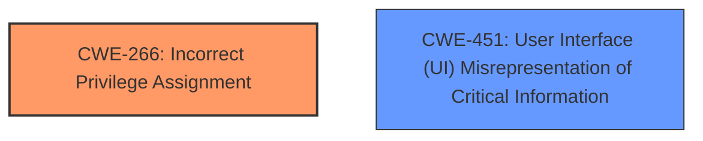

# Raw Analyzer Response for CVE-2024-5687

# Summary
| CWE ID | CWE Name | Confidence | CWE Abstraction Level | CWE Vulnerability Mapping Label | CWE-Vulnerability Mapping Notes |
|---|---|---|---|---|---|
| CWE-266 | Incorrect Privilege Assignment | 0.8 | Base | Allowed | Primary CWE |
| CWE-451 | User Interface (UI) Misrepresentation of Critical Information | 0.5 | Class | Allowed-with-Review | Secondary Candidate |

## Evidence and Confidence

*   **Confidence Score:** 0.8
*   **Evidence Strength:** MEDIUM

## Relationship Analysis
The primary relationship considered was the parent-child relationship. CWE-266 is a base level CWE, which is generally preferred. I also considered the retriever results which included several other potential CWEs like CWE-451, CWE-668, and CWE-787, but these did not fit as well as CWE-266 based on the vulnerability description.

## Vulnerability Chain
The vulnerability chain starts with the **incorrect triggering principal** being assigned. This leads to **incorrect security checks** and potentially misleading information being sent to remote websites. The root cause is the **incorrect privilege assignment** during the creation of a new tab, which then causes a chain reaction of security flaws and potential information leakage.

## Summary of Analysis
The primary assessment is based on the vulnerability description which highlights the **incorrect triggering principal**. The CVE Reference Links Content Summary also supports this by stating the **root cause** is that "an incorrect principal could be used when opening new tabs under specific circumstances". This directly relates to **Incorrect Privilege Assignment** CWE-266. The retriever results also suggested other CWEs, but they were not as directly related to the root cause as CWE-266.

The evidence from the vulnerability description is strong enough to support the selection of CWE-266 as the primary CWE. The relationship analysis did not significantly alter the initial assessment, as the parent-child relationships of the other suggested CWEs did not provide a more accurate or specific mapping. The selected CWE is at the optimal level of specificity as it directly addresses the root cause of the vulnerability.

Relevant CWE Information:

# Enhanced Context (25 CWEs)
The following CWEs were identified as potentially relevant to this vulnerability:

## CWE-451: User Interface (UI) Misrepresentation of Critical Information
**Abstraction Level**: Class
**Similarity Score**: 0.75
**Source**: dense

**Description**:
The user interface (UI) does not properly represent critical information to the user, allowing the information - or its source - to be obscured or spoofed. This is often a component in phishing attacks.

**Mapping Guidance**:
- Usage: Allowed-with-Review
- Rationale: This CWE entry is a Class and might have Base-level children that would be more appropriate

## CWE-266: Incorrect Privilege Assignment
**Abstraction Level**: base
**Similarity Score**: 2.47
**Source**: graph

**Description**:
CWE-266: Incorrect Privilege Assignment

**Mapping Guidance**:
- Usage: Allowed
- Rationale: This CWE entry is at the Base level of abstraction, which is a preferred level of abstraction for mapping to the root causes of vulnerabilities.

**Relationships**:
- PARENTOF -> CWE-9
- PARENTOF -> CWE-556
- PARENTOF -> CWE-520
- PARENTOF -> CWE-1022
- CANALSOBE -> CWE-286

## CWE-266: Incorrect Privilege Assignment (Primary)
CWE-266 [Incorrect Privilege Assignment]: This CWE is selected as the primary weakness because the vulnerability description and CVE summary clearly indicate that the root cause is related to an **incorrect triggering principal** being assigned when a new tab is opened. The **incorrect principal** leads to **incorrect security checks**. CWE-266 directly addresses this issue of assigning the wrong privileges (in this case, the triggering principal) which then has security implications. The base level of abstraction is appropriate as it is a specific flaw. Confidence is 0.8.

## CWE-451: User Interface (UI) Misrepresentation of Critical Information (Secondary)
CWE-451 [User Interface (UI) Misrepresentation of Critical Information]: This CWE is considered as a secondary candidate because the **incorrect triggering principal** could lead to misleading information being displayed to the user or sent to remote websites. While not the primary cause, the misrepresentation of information is a potential consequence of the initial privilege assignment error. This is a class level of abstraction. Confidence is 0.5.

CWEs Considered but Not Used:

*   CWE-668 [Exposure of Resource to Wrong Sphere]: This was considered, but the vulnerability is more specifically about incorrect privilege assignment rather than general exposure of resources.
*   CWE-787 [Out-of-bounds Write] and CWE-125 [Out-of-bounds Read]: These are memory safety issues and do not align with the described vulnerability, which is about logical errors in privilege assignment.
*   CWE-362 [Concurrent Execution using Shared Resource with Improper Synchronization ('Race Condition')]: While a "specific sequence of actions" is mentioned, there is no evidence to suggest a race condition is the root cause.
*   CWE-116 [Improper Encoding or Escaping of Output]: This doesn't directly relate to the principal assignment issue.
*   CWE-1022 [Use of Web Link to Untrusted Target with window.opener Access]: This is too specific to web links and doesn't fit the general principal assignment issue.
*   CWE-825 [Expired Pointer Dereference]: There's no mention of pointer issues in the description.