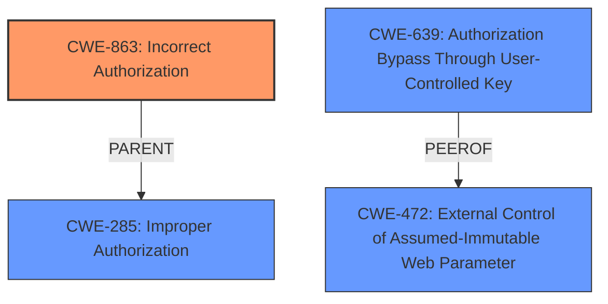

# Enhanced Analysis for CVE-2024-56883

# Summary
| CWE ID  | CWE Name                                     | Confidence | CWE Abstraction Level | CWE Vulnerability Mapping Label | CWE-Vulnerability Mapping Notes |
| :-------- | :------------------------------------------- | :--------- | :-------------------- | :------------------------------ | :------------------------------ |
| CWE-863   | Incorrect Authorization                      | 0.9        | Class                 | Allowed-with-Review           | Primary CWE                     |
| CWE-639   | Authorization Bypass Through User-Controlled Key | 0.7        | Base                  | Allowed                       | Secondary Candidate             |
| CWE-472   | External Control of Assumed-Immutable Web Parameter | 0.6        | Base                  | Allowed                       | Secondary Candidate             |

## Evidence and Confidence

*   **Confidence Score:** 0.9
*   **Evidence Strength:** HIGH

## Relationship Analysis
The primary CWE is CWE-863 (Incorrect Authorization) because the vulnerability arises from the application not correctly performing the authorization check, not from a complete lack of authorization (CWE-862). The related CWE, CWE-639 (Authorization Bypass Through User-Controlled Key), highlights a specific mechanism of the authorization bypass where the attacker modifies the user ID parameter. Another related CWE, CWE-472 (External Control of Assumed-Immutable Web Parameter), identifies that the application does not sufficiently verify inputs that are assumed to be immutable but are actually externally controllable. The abstraction levels of the selected CWEs are a Class (CWE-863) and a Base (CWE-639, CWE-472), providing a balance between generality and specificity.



## Vulnerability Chain
The vulnerability chain starts with **Incorrect Access Control** (which leads to **Incorrect Authorization**) where the application fails to properly enforce authorization checks. This allows low-privileged users to bypass authorization by manipulating the user ID parameter in a request. This results in the ability to create external courses for other employees without proper authorization.

## Summary of Analysis
The initial assessment pointed to CWE-863 (Incorrect Authorization) as the primary weakness, supported by the vulnerability description stating "The implemented role-based access controls are not always enforced on the server side." The CVE Reference Links Content Summary confirms this by identifying "Incorrect access control" and "Authorization bypass" as key weaknesses. The Retriever Results also list CWE-863 as the top combined result. The other CWEs listed in the Retriever Results are either too general (e.g., CWE-285, CWE-862) or represent specific attack vectors (e.g., CWE-639, CWE-472).
The relationship analysis reinforces the selection of CWE-863, as it is a more specific Class-level CWE than CWE-285 (Improper Authorization). The chain analysis highlights how the **incorrect authorization** leads directly to the ability to bypass access controls. The selection of CWE-863, CWE-639 and CWE-472 provides a detailed and accurate representation of the vulnerability.

Relevant CWE Information:

**CWE-863: Incorrect Authorization**
The product performs an authorization check when an actor attempts to access a resource or perform an action, but it does not correctly perform the check.

The vulnerability description states that "The implemented role-based access controls are not always enforced on the server side," indicating that authorization checks are present but **incorrect**. This aligns directly with the definition of CWE-863.

**CWE-639: Authorization Bypass Through User-Controlled Key**
The system's authorization functionality does not prevent one user from gaining access to another user's data or record by modifying the key value identifying the data.

The vulnerability description states that "a valid request to create a course simply needs to be modified, so that the current user ID in the id parameter is replaced with the ID of another user," demonstrating how an attacker can bypass authorization by modifying a user-controlled key (the user ID parameter).

**CWE-472: External Control of Assumed-Immutable Web Parameter**
The web application does not sufficiently verify inputs that are assumed to be immutable but are actually externally controllable, such as hidden form fields.

The vulnerability description indicates that the user ID parameter, which is assumed to be immutable and controlled by the server, is actually externally controllable, allowing attackers to modify it and bypass authorization.

CWE-285 was considered but not used as it is a more general class of improper authorization, whereas CWE-863 explicitly states that the authorization is present but incorrect. CWE-862 was also considered, but it describes a complete absence of authorization checks, which is not the case here.


## CWE Relationship Analysis

Current CWEs represent these abstraction levels: .


### Vulnerability Chain Analysis

**Chain starting from CWE-863:**
- 863 (Incorrect Authorization) - ROOT


**Chain starting from CWE-862:**
- 862 (Missing Authorization) - ROOT


### CWE Relationship Diagram

```mermaid
graph TD
    classDef primary fill:#f96,stroke:#333,stroke-width:2px
    classDef secondary fill:#69f,stroke:#333
    classDef tertiary fill:#9e9,stroke:#333
```