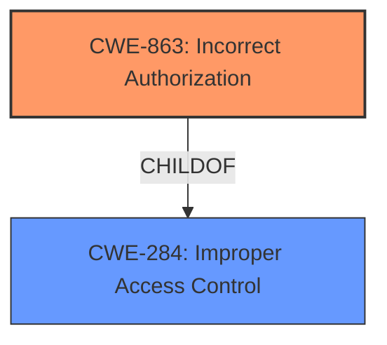

# Raw Analyzer Response for CVE-2024-56898

# Summary
| CWE ID  | CWE Name                                            | Confidence | CWE Abstraction Level | CWE Vulnerability Mapping Label | CWE-Vulnerability Mapping Notes |
| :-------- | :-------------------------------------------------- | :--------- | :-------------------- | :------------------------------ | :------------------------------ |
| CWE-863 | Incorrect Authorization  | 0.9  | Class |   |   |
| CWE-284 | Improper Access Control | 0.7 | Pillar |   |   |

## Evidence and Confidence

*   **Confidence Score:** 0.9
*   **Evidence Strength:** MEDIUM

## Relationship Analysis
The primary CWE is CWE-863 (Incorrect Authorization), which is a Class-level CWE. CWE-863 has child CWEs that could provide more specific details, but the description does not contain enough information to definitively choose one. CWE-284 (Improper Access Control) is a higher-level Pillar CWE that is related to authorization issues, but less specific.

## Vulnerability Chain
The vulnerability chain starts with **broken access control**, leading to unauthorized actions by low-privilege users. This allows them to escalate privileges and manipulate accounts.
  - **Root Cause:** **Broken Access Control**
  - **Weakness:** **Incorrect Authorization** (CWE-863)
  - **Impact:** Privilege escalation, account manipulation

## Summary of Analysis
The initial analysis identified **broken access control** as the root cause, with the impact being privilege escalation and account manipulation. The Retriever Results suggested several CWEs related to access control and authorization.

Given the available evidence and the CWE guidance, CWE-863 (Incorrect Authorization) is chosen as the primary CWE because it reflects the **incorrect** authorization checks that lead to the vulnerability. CWE-284 (Improper Access Control) is included as a secondary CWE because it's a broader category that applies when the root cause is a general access control issue.

The choice of CWE-863 is based on the vulnerability description stating that low privilege users can perform actions they aren't authorized to, indicating a problem with authorization checks. This aligns with the definition of CWE-863.

Relevant CWE Information:

# Enhanced Context (25 CWEs)
The following CWEs were identified as potentially relevant to this vulnerability:

## CWE-284: Improper Access Control
**Abstraction Level**: Pillar
**Similarity Score**: 0.238
**Source**: sparse

**Description**:
The product does not properly control access to resources.

**Mapping Guidance**:
- Usage: Discouraged
- Rationale: This CWE entry is very high-level and should only be used when a more specific child is not available. It is a level-0 Class (i.e., a child of a Pillar).

**Relationships**:
- PARENTOF -> CWE-200
- PARENTOF -> CWE-264
- PARENTOF -> CWE-266
- PARENTOF -> CWE-269
- PARENTOF -> CWE-280
- PARENTOF -> CWE-281
- PARENTOF -> CWE-282
- PARENTOF -> CWE-285
- PARENTOF -> CWE-287
- PARENTOF -> CWE-288
- PARENTOF -> CWE-290
- PARENTOF -> CWE-291
- PARENTOF -> CWE-294
- PARENTOF -> CWE-298
- PARENTOF -> CWE-300
- PARENTOF -> CWE-301
- PARENTOF -> CWE-302
- PARENTOF -> CWE-303
- PARENTOF -> CWE-304
- PARENTOF -> CWE-305
- PARENTOF -> CWE-306
- PARENTOF -> CWE-307
- PARENTOF -> CWE-308
- PARENTOF -> CWE-309
- PARENTOF -> CWE-310
- PARENTOF -> CWE-311
- PARENTOF -> CWE-312
- PARENTOF -> CWE-313
- PARENTOF -> CWE-314
- PARENTOF -> CWE-315
- PARENTOF -> CWE-316
- PARENTOF -> CWE-317
- PARENTOF -> CWE-318
- PARENTOF -> CWE-319
- PARENTOF -> CWE-320
- PARENTOF -> CWE-321
- PARENTOF -> CWE-322
- PARENTOF -> CWE-323
- PARENTOF -> CWE-324
- PARENTOF -> CWE-325
- PARENTOF -> CWE-326
- PARENTOF -> CWE-327
- PARENTOF -> CWE-328
- PARENTOF -> CWE-329
- PARENTOF -> CWE-330
- PARENTOF -> CWE-331
- PARENTOF -> CWE-332
- PARENTOF -> CWE-333
- PARENTOF -> CWE-334
- PARENTOF -> CWE-335
- PARENTOF -> CWE-336
- PARENTOF -> CWE-337
- PARENTOF -> CWE-338
- PARENTOF -> CWE-339
- PARENTOF -> CWE-340
- PARENTOF -> CWE-341
- PARENTOF -> CWE-342
- PARENTOF -> CWE-343
- PARENTOF -> CWE-344
- PARENTOF -> CWE-345
- PARENTOF -> CWE-346
- PARENTOF -> CWE-347
- PARENTOF -> CWE-348
- PARENTOF -> CWE-349
- PARENTOF -> CWE-350
- PARENTOF -> CWE-351
- PARENTOF -> CWE-352
- PARENTOF -> CWE-353
- PARENTOF -> CWE-354
- PARENTOF -> CWE-355
- PARENTOF -> CWE-356
- PARENTOF -> CWE-357
- PARENTOF -> CWE-358
- PARENTOF -> CWE-359
- PARENTOF -> CWE-360
- PARENTOF -> CWE-361
- PARENTOF -> CWE-362
- PARENTOF -> CWE-363
- PARENTOF -> CWE-364
- PARENTOF -> CWE-365
- PARENTOF -> CWE-366
- PARENTOF -> CWE-367
- PARENTOF -> CWE-368
- PARENTOF -> CWE-369
- PARENTOF -> CWE-370
- PARENTOF -> CWE-371
- PARENTOF -> CWE-372
- PARENTOF -> CWE-373
- PARENTOF -> CWE-374
- PARENTOF -> CWE-375
- PARENTOF -> CWE-376
- PARENTOF -> CWE-377
- PARENTOF -> CWE-378
- PARENTOF -> CWE-379
- PARENTOF -> CWE-380
- PARENTOF -> CWE-381
- PARENTOF -> CWE-382
- PARENTOF -> CWE-383
- PARENTOF -> CWE-384
- PARENTOF -> CWE-385
- PARENTOF -> CWE-386
- PARENTOF -> CWE-387
- PARENTOF -> CWE-388
- PARENTOF -> CWE-389
- PARENTOF -> CWE-390
- PARENTOF -> CWE-391
- PARENTOF -> CWE-392
- PARENTOF -> CWE-393
- PARENTOF -> CWE-394
- PARENTOF -> CWE-395
- PARENTOF -> CWE-396
- PARENTOF -> CWE-397
- PARENTOF -> CWE-398
- PARENTOF -> CWE-399
- PARENTOF -> CWE-400
- PARENTOF -> CWE-401
- PARENTOF -> CWE-402
- PARENTOF -> CWE-403
- PARENTOF -> CWE-404
- PARENTOF -> CWE-405
- PA