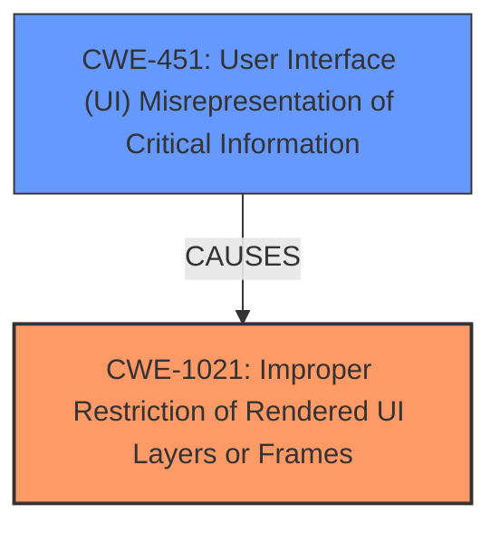

# Analysis for CVE-2024-5691

# Summary
| CWE ID | CWE Name | Confidence | CWE Abstraction Level | CWE Vulnerability Mapping Label | CWE-Vulnerability Mapping Notes |
|---|---|---|---|---|---|
| CWE-1021 | Improper Restriction of Rendered UI Layers or Frames | 0.8 | Base | Allowed | Primary CWE. The core issue is the **improper restriction** that allows the bypass. |
| CWE-451 | User Interface (UI) Misrepresentation of Critical Information | 0.6 | Class | Allowed-with-Review | Secondary candidate. The vulnerability involves **tricking** the user, which aligns with UI misrepresentation but is not the root cause. |

## Evidence and Confidence

*   **Confidence Score:** 0.7
*   **Evidence Strength:** MEDIUM

## Relationship Analysis
The primary CWE is CWE-1021, which describes the **improper restriction** of UI layers, directly relating to the bypass of sandbox restrictions. CWE-451 is a potential secondary CWE because the user is effectively tricked into clicking a button. The relationship between these CWEs is that CWE-451 could be a consequence of CWE-1021, but it's not the core issue. CWE-1021 is chosen because it is a Base level CWE, which is preferred, while CWE-451 is a Class level CWE.

## Vulnerability Chain
1.  **Root Cause:** **Improper restriction** of UI layers and frames (CWE-1021) leading to a sandbox bypass.
2.  **Mechanism:** Tricking the browser with a manipulated `X-Frame-Options` header.
3.  **User Interaction:** User clicks a button in the sandboxed iframe.
4.  **Impact:** Bypass of sandbox restrictions, allowing the iframe to open a new window.

The chain starts with the **improper restriction**, allowing subsequent steps to occur. The primary CWE is CWE-1021, representing this initial flaw.

## Summary of Analysis
The initial analysis focused on identifying the root cause of the vulnerability, which is the **bypass of restrictions** for sandboxed iframes. The evidence supports the selection of CWE-1021 because the vulnerability description and CVE summary specifically mention the manipulation of the `X-Frame-Options` header to **bypass restrictions**.

The relationship graph indicates that CWE-1021 is the primary issue, and CWE-451 is a possible secondary factor related to user interface **misrepresentation**.

The selected CWEs are at the optimal level of specificity because CWE-1021 is a Base-level CWE, representing the core weakness of the **improper restriction**. While CWE-451 is considered due to the "tricking" aspect, it's a Class-level CWE and less directly related to the root cause.

Relevant CWE Information:

# Enhanced Context (25 CWEs)
The following CWEs were identified as potentially relevant to this vulnerability:

## CWE-451: User Interface (UI) Misrepresentation of Critical Information
**Abstraction Level**: Class
**Similarity Score**: 0.74
**Source**: dense

**Description**:
The user interface (UI) does not properly represent critical information to the user, allowing the information - or its source - to be obscured or spoofed. This is often a component in phishing attacks.

**Mapping Guidance**:
- Usage: Allowed-with-Review
- Rationale: This CWE entry is a Class and might have Base-level children that would be more appropriate

## CWE-1021: Improper Restriction of Rendered UI Layers or Frames
**Abstraction Level**: Base
**Similarity Score**: 0.72
**Source**: dense

**Description**:
The web application does not restrict or incorrectly restricts frame objects or UI layers that belong to another application or domain, which can lead to user confusion about which interface the user is interacting with.

**Mapping Guidance**:
- Usage: Allowed
- Rationale: This CWE entry is at the Base level of abstraction, which is a preferred level of abstraction for mapping to the root causes of vulnerabilities.