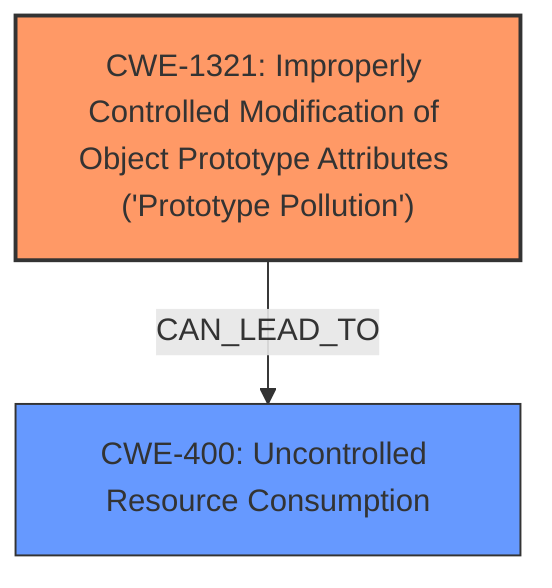

# Analysis for CVE-2024-57079

# Summary
| CWE ID | CWE Name | Confidence | CWE Abstraction Level | CWE Vulnerability Mapping Label | CWE-Vulnerability Mapping Notes |
|---|---|---|---|---|---|
| CWE-1321 | Improperly Controlled Modification of Object Prototype Attributes ('Prototype Pollution') | 1.0 | Variant | Allowed | Primary CWE. The vulnerability description explicitly states "prototype pollution". |
| CWE-400 | Uncontrolled Resource Consumption | 0.7 | Class | Discouraged | Secondary candidate. The vulnerability results in Denial of Service (DoS), which is a form of uncontrolled resource consumption. |

## Evidence and Confidence

*   **Confidence Score:** 0.9
*   **Evidence Strength:** HIGH

## Relationship Analysis
The primary CWE is CWE-1321, which is a variant. CWE-400 is a class that represents the impact of the vulnerability. CWE-1321 can lead to CWE-400 as a consequence.

## Vulnerability Chain
The vulnerability chain starts with **prototype pollution** (CWE-1321), which leads to Denial of Service (DoS) (CWE-400).

## Summary of Analysis
The vulnerability is a **prototype pollution** in the `lib.deepMerge` function of `@zag-js/core` v0.50.0. This allows attackers to cause a Denial of Service (DoS) by supplying a crafted payload.

The primary weakness is CWE-1321 (Improperly Controlled Modification of Object Prototype Attributes ('Prototype Pollution')), as the vulnerability description explicitly states "prototype pollution". The impact of the vulnerability is Denial of Service (DoS), which can be represented by CWE-400 (Uncontrolled Resource Consumption).

The retriever results also list CWE-1321 as the top candidate.

CWE-400 is included as a secondary candidate because it describes the impact of the vulnerability. The description states that the attacker can cause a Denial of Service (DoS).

The evidence from the vulnerability description is: "A **prototype pollution** in the lib.deepMerge function of @zag-js/core v0.50.0 allows attackers to cause a Denial of Service (DoS) via supplying a crafted payload."

The graph relationships influenced the selection because CWE-1321 can lead to CWE-400.

The selected CWEs are at the optimal level of specificity because CWE-1321 is a Variant, which is a preferred level of abstraction.

Relevant CWE Information:

*   **CWE-1321: Improperly Controlled Modification of Object Prototype Attributes ('Prototype Pollution')** - This is the primary weakness, as the vulnerability description explicitly states "prototype pollution".

*   **CWE-400: Uncontrolled Resource Consumption** - This is the impact of the vulnerability, as the attacker can cause a Denial of Service (DoS).

CWEs considered but not used:

*   CWE-1333: Inefficient Regular Expression Complexity - This CWE is not relevant to the vulnerability description.
*   CWE-1188: Initialization of a Resource with an Insecure Default - This CWE is not relevant to the vulnerability description.
*   CWE-122: Heap-based Buffer Overflow - This CWE is not relevant to the vulnerability description.
*   CWE-843: Access of Resource Using Incompatible Type ('Type Confusion') - This CWE is not relevant to the vulnerability description.
*   CWE-770: Allocation of Resources Without Limits or Throttling - This CWE is not relevant to the vulnerability description.
*   CWE-409: Improper Handling of Highly Compressed Data (Data Amplification) - This CWE is not relevant to the vulnerability description.
*   CWE-471: Modification of Assumed-Immutable Data (MAID) - While related to data modification, it's not as specific as prototype pollution.