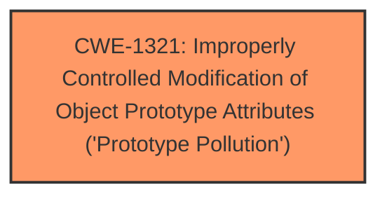

# Analysis Report for CVE-2024-57081

# Vulnerability Analysis Report: CVE-2024-57081

## Description

A **prototype pollution** in the lib.fromQuery function of underscore-contrib v0.3.0 allows attackers to cause a Denial of Service (DoS) via supplying a crafted payload.

## Vulnerability Description Key Phrases

- **Component:** lib.fromQuery function
- **Rootcause:** prototype pollution
- **Vector:** supplying a crafted payload
- **Product:** underscore-contrib
- **Impact:** Denial of Service (DoS), Denial of Service
- **Attacker:** attackers
- **Version:** v0.3.0

## Analysis (with Relationship Data)

# Summary
| CWE ID | CWE Name | Confidence | CWE Abstraction Level | CWE Vulnerability Mapping Label | CWE-Vulnerability Mapping Notes |
|---|---|---|---|---|---|
| CWE-1321 | Improperly Controlled Modification of Object Prototype Attributes ('Prototype Pollution') | 1.0 | Variant | Allowed | Primary CWE. The vulnerability is caused by the `lib.fromQuery` function not properly sanitizing user-supplied input, allowing an attacker to manipulate the prototype chain. |

## Evidence and Confidence

*   **Confidence Score:** 1.0
*   **Evidence Strength:** HIGH

## Relationship Analysis
The primary relationship that influenced the decision was the direct match of the vulnerability description to the CWE-1321 description.



## Vulnerability Chain
The vulnerability chain is as follows:
1.  **Root Cause:** CWE-1321 - Improperly Controlled Modification of Object Prototype Attributes ('Prototype Pollution') due to the `lib.fromQuery` function **not properly sanitizing user-supplied input**.
2.  **Impact:** Denial of Service (DoS).

## Summary of Analysis
The initial analysis focused on identifying the root cause of the vulnerability. The description clearly states that the vulnerability is due to a **prototype pollution** in the `lib.fromQuery` function. The CVE Reference Links Content Summary reinforces this by stating that the `lib.fromQuery` function in the `underscore-contrib` library **not properly sanitizing user-supplied input**, allowing an attacker to manipulate the prototype chain via Prototype Pollution. This aligns directly with CWE-1321, which describes the **improperly controlled modification of object prototype attributes**.

The Retriever Results also listed CWE-1321 as the top combined result, further supporting this classification.

Other CWEs were considered, but they did not accurately represent the root cause of the vulnerability:

*   CWE-1333 (Inefficient Regular Expression Complexity): This CWE is not relevant as the vulnerability is not related to regular expression complexity.
*   CWE-1188 (Initialization of a Resource with an Insecure Default): This CWE is not relevant as the vulnerability is not related to insecure default initialization.
*   CWE-407 (Inefficient Algorithmic Complexity): This CWE is not relevant as the vulnerability is not related to algorithmic complexity.
*   CWE-471 (Modification of Assumed-Immutable Data (MAID)): While prototype pollution can be seen as a modification of assumed immutable data, CWE-1321 is a more specific variant that better captures the nature of the vulnerability.

The final decision to select CWE-1321 was based on the direct match to the vulnerability description, the supporting information in the CVE Reference Links Content Summary, and the Retriever Results. The selected CWE is at the optimal level of specificity (Variant) as it accurately represents the weakness.


## CWE Relationship Analysis

Current CWEs represent these abstraction levels: .


### Vulnerability Chain Analysis

**Chain starting from CWE-471:**
- 471 (Modification of Assumed-Immutable Data (MAID)) - ROOT


**Chain starting from CWE-1321:**
- 1321 (Improperly Controlled Modification of Object Prototype Attributes ('Prototype Pollution')) - ROOT


### CWE Relationship Diagram

```mermaid
graph TD
    classDef primary fill:#f96,stroke:#333,stroke-width:2px
    classDef secondary fill:#69f,stroke:#333
    classDef tertiary fill:#9e9,stroke:#333
```


*Report generated on 2025-07-14 00:06:15*
