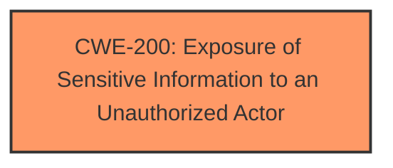

# Analysis Report for CVE-2024-57096

# Vulnerability Analysis Report: CVE-2024-57096

## Description

An issue in wps office before v.19302 allows a local attacker to obtain sensitive information via a crafted file.

## Vulnerability Description Key Phrases

- **Impact:** obtain sensitive information
- **Vector:** crafted file
- **Attacker:** local attacker
- **Product:** wps office
- **Version:** before v.19302

## Analysis (with Relationship Data)

# Summary
| CWE ID | CWE Name | Confidence | CWE Abstraction Level | CWE Vulnerability Mapping Label | CWE-Vulnerability Mapping Notes |
|---|---|---|---|---|---|
| CWE-200 | Exposure of Sensitive Information to an Unauthorized Actor | 0.7 | Class | Discouraged | The vulnerability description indicates that sensitive information is exposed to a local attacker due to a crafted file. |

## Evidence and Confidence

*   **Confidence Score:** 0.7
*   **Evidence Strength:** LOW

## Relationship Analysis
The primary relationship considered was the parent-child relationship between CWE-200 (Exposure of Sensitive Information to an Unauthorized Actor) and its potential children, as well as its peer relationships. While more specific child CWEs might exist, the provided information does not give enough details to go beyond CWE-200. CWE-200 is a Class-level CWE.



## Vulnerability Chain
The chain of events is as follows: A local attacker crafts a file, the application processes it, and this leads to the exposure of sensitive information. The root cause is the improper handling of the crafted file leading to information exposure.

## Summary of Analysis
The initial analysis focused on identifying the root cause of the vulnerability, which is the exposure of sensitive information due to a crafted file. The weakness is the **exposure of sensitive information**. The vulnerability description explicitly mentions that a local attacker can "obtain sensitive information via a crafted file."

CWE-200 (Exposure of Sensitive Information to an Unauthorized Actor) is a strong candidate, but it is a Class-level CWE and its usage is discouraged. However, without more details about the specific mechanism that allows the crafted file to expose sensitive information, it's challenging to select a more specific CWE.

I considered other CWEs from the retriever results, such as:

*   CWE-202 (Exposure of Sensitive Information Through Data Queries): This is not applicable, as the description does not mention data queries.
*   CWE-497 (Exposure of Sensitive System Information to an Unauthorized Control Sphere): This could be a good candidate, but there is no explicit mention of *system* information.
*   CWE-538 (Insertion of Sensitive Information into Externally-Accessible File or Directory): This could be a good candidate, but there is no explicit mention of a new file or directory being created.

Because the provided information is limited, I am selecting CWE-200 with a confidence of 0.7.


## CWE Relationship Analysis

Current CWEs represent these abstraction levels: .


### Vulnerability Chain Analysis

**Chain starting from CWE-202:**
- 202 (Exposure of Sensitive Information Through Data Queries) - ROOT


**Chain starting from CWE-200:**
- 200 (Exposure of Sensitive Information to an Unauthorized Actor) - ROOT


### CWE Relationship Diagram

```mermaid
graph TD
    classDef primary fill:#f96,stroke:#333,stroke-width:2px
    classDef secondary fill:#69f,stroke:#333
    classDef tertiary fill:#9e9,stroke:#333
```


*Report generated on 2025-07-14 00:07:08*
