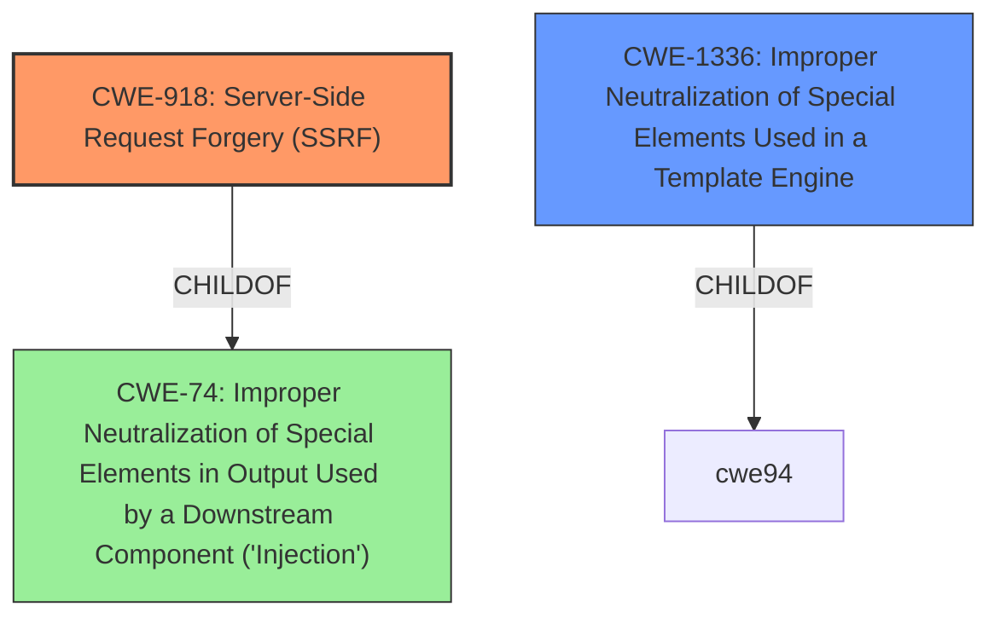

# Enhanced Analysis for CVE-2024-57177

# Summary
| CWE ID | CWE Name | Confidence | CWE Abstraction Level | CWE Vulnerability Mapping Label | CWE-Vulnerability Mapping Notes |
|---|---|---|---|---|---|
| CWE-918 | Server-Side Request Forgery (SSRF) | 0.8 | Base | Allowed | Primary CWE |
| CWE-1336 | Improper Neutralization of Special Elements Used in a Template Engine | 0.7 | Base | Allowed | Secondary Candidate |

## Evidence and Confidence

*   **Confidence Score:** 0.75
*   **Evidence Strength:** MEDIUM

## Relationship Analysis
The primary CWE is CWE-918, indicating a Server-Side Request Forgery due to the **host header injection**. The secondary CWE is CWE-1336, which captures the **improper neutralization** in the template engine. While CWE-74 is a parent of CWE-918, it is discouraged, as CWE-918 provides a more specific description of the vulnerability.



## Vulnerability Chain
The vulnerability chain starts with the **host header injection vulnerability**, leading to a server-side template injection (**SSTI**), which allows for command execution and information disclosure. The chain is as follows:

1.  **Host Header Injection (CWE-918):** The **improper validation** of the host header allows attackers to inject malicious data.
2.  **Server-Side Template Injection (CWE-1336):** The injected data is then processed by the template engine without proper neutralization.
3.  **Command Execution/Information Disclosure:** The successful exploitation of the SSTI leads to the ability to execute commands or leak sensitive information.

## Summary of Analysis
The analysis is based on the provided vulnerability description, which explicitly mentions a **host header injection vulnerability** that leads to **SSTI**.

The evidence includes:
*   "A **host header injection vulnerability** exists in the NPM package of perfood/couch-auth <= 0.21.2."
*   "By sending a specially crafted host header in the email change confirmation request, it is possible to trigger a SSTI which can be leveraged to run limited commands or leak server-side information"

CWE-918 is selected as the primary CWE because the **vulnerability** involves manipulating the host header, which leads to the server making unintended requests. CWE-1336 is a secondary factor in that the template engine is not properly neutralizing the injected input.

The selected CWEs are at the optimal level of specificity, as they accurately represent the root cause and the subsequent exploitation method. Other CWEs, such as CWE-74, are broader and less descriptive of the specific vulnerability.

Relevant CWE Information:

# Enhanced Context (25 CWEs)
The following CWEs were identified as potentially relevant to this vulnerability:

## CWE-74: Improper Neutralization of Special Elements in Output Used by a Downstream Component ('Injection')
**Abstraction Level**: Class
**Similarity Score**: 0.76
**Source**: dense

**Description**:
The product constructs all or part of a command, data structure, or record using externally-influenced input from an upstream component, but it does not neutralize or incorrectly neutralizes special elements that could modify how it is parsed or interpreted when it is sent to a downstream component.

**Mapping Guidance**:
- Usage: Discouraged
- Rationale: CWE-74 is high-level and often misused when lower-level weaknesses are more appropriate.

## CWE-1336: Improper Neutralization of Special Elements Used in a Template Engine
**Abstraction Level**: Base
**Similarity Score**: 535.40
**Source**: sparse

**Description**:
The product uses a template engine to insert or process externally-influenced input, but it does not neutralize or incorrectly neutralizes special elements or syntax that can be interpreted as template expressions or other code directives when processed by the engine.

**Mapping Guidance**:
- Usage: Allowed
- Rationale: This CWE entry is at the Base level of abstraction, which is a preferred level of abstraction for mapping to the root causes of vulnerabilities.

## CWE-918: Server-Side Request Forgery (SSRF)
**Abstraction Level**: Base
**Similarity Score**: 0.73
**Source**: dense

**Description**:
The web server receives a URL or similar request from an upstream component and retrieves the contents of this URL, but it does not sufficiently ensure that the request is being sent to the expected destination.

**Mapping Guidance**:
- Usage: Allowed
- Rationale: This CWE entry is at the Base level of abstraction, which is a preferred level of abstraction for mapping to the root causes of vulnerabilities.


## CWE Relationship Analysis

Current CWEs represent these abstraction levels: .


### Vulnerability Chain Analysis

**Chain starting from CWE-918:**
- 918 (Server-Side Request Forgery (SSRF)) - ROOT


**Chain starting from CWE-1336:**
- 1336 (Improper Neutralization of Special Elements Used in a Template Engine) - ROOT


### CWE Relationship Diagram

```mermaid
graph TD
    classDef primary fill:#f96,stroke:#333,stroke-width:2px
    classDef secondary fill:#69f,stroke:#333
    classDef tertiary fill:#9e9,stroke:#333
```