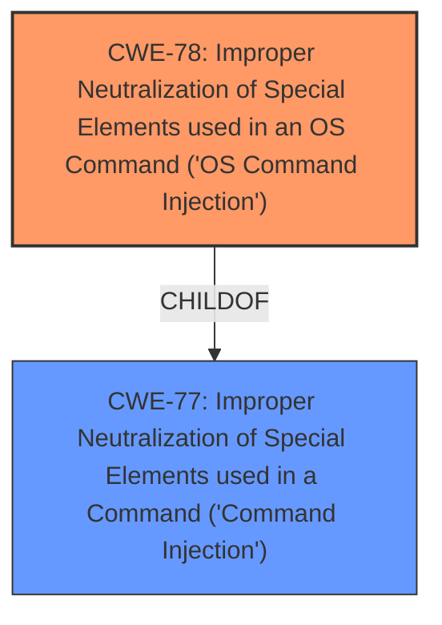

# Analysis Report for CVE-2024-57232

# Vulnerability Analysis Report: CVE-2024-57232

## Description

NETGEAR RAX5 (AX1600 WiFi Router) V1.0.2.26 was discovered to contain a **command injection vulnerability** via the ifname parameter in the apcli_wps_gen_pincode function.

## Vulnerability Description Key Phrases

- **Weakness:** command injection vulnerability
- **Product:** NETGEAR RAX5 (AX1600 WiFi Router)
- **Version:** V1.0.2.26
- **Component:** apcli_wps_gen_pincode function

## Analysis (with Relationship Data)

# Summary

| CWE ID | CWE Name | Confidence | CWE Abstraction Level | CWE Vulnerability Mapping Label | CWE-Vulnerability Mapping Notes |
|---|---|---|---|---|---|
| CWE-78 | Improper Neutralization of Special Elements used in an OS Command ('OS Command Injection') | 0.9 | Base | Allowed | Primary CWE |
| CWE-77 | Improper Neutralization of Special Elements used in a Command ('Command Injection') | 0.7 | Class | Allowed-with-Review | Secondary Candidate |

## Evidence and Confidence

*   **Confidence Score:** 0.9
*   **Evidence Strength:** MEDIUM

## Relationship Analysis

The primary relationship influencing the decision is the parent-child relationship between CWE-77 and CWE-78. CWE-78 is a more specific type of command injection, focusing on OS commands. Since the vulnerability description explicitly mentions **command injection** within the context of a network device (suggesting OS-level commands), CWE-78 is a more appropriate fit.



## Vulnerability Chain

The vulnerability chain is relatively straightforward:

1.  **Root Cause:** **Improper neutralization** of special elements in the `ifname` parameter of the `apcli_wps_gen_pincode` function.
2.  **Weakness:** This leads to **command injection**.
3.  **Impact:** Arbitrary OS commands can be executed on the device.

## Summary of Analysis

The initial analysis focused on the **command injection vulnerability** and the potential CWEs associated with it. The retriever results suggested CWE-77 as the top candidate, but CWE-78 was also a strong contender. Given the context of the vulnerability (a network device) and the explicit mention of **command injection**, CWE-78 (Improper Neutralization of Special Elements used in an OS Command) was chosen as the primary CWE because it is a more specific and accurate representation of the weakness. The evidence is derived from the vulnerability description which states "NETGEAR RAX5 (AX1600 WiFi Router) V1.0.2.26 was discovered to contain a **command injection vulnerability** via the ifname parameter in the apcli_wps_gen_pincode function."

CWE-78 is at the optimal level of specificity (Base) as it accurately captures the root cause of the vulnerability.

Relevant CWE Information:

# Enhanced Context (25 CWEs)
The following CWEs were identified as potentially relevant to this vulnerability:

## CWE-77: Improper Neutralization of Special Elements used in a Command ('Command Injection')
**Abstraction Level**: Class
**Similarity Score**: 0.76
**Source**: dense

**Description**:
The product constructs all or part of a command using externally-influenced input from an upstream component, but it does not neutralize or incorrectly neutralizes special elements that could modify the intended command when it is sent to a downstream component.

**Mapping Guidance**:
- Usage: Allowed-with-Review
- Rationale: CWE-77 is often misused when OS command injection (CWE-78) was intended instead [REF-1287].

*Technical Explanation:*

The vulnerability description states a **command injection vulnerability** exists. CWE-77 (Improper Neutralization of Special Elements used in a Command) describes a weakness where a product constructs a command using external input without proper neutralization, allowing attackers to modify the intended command.

*Security Implications:*

Successful exploitation allows attackers to execute arbitrary commands on the system.

*Relationship Analysis:*

CWE-77 is a parent of CWE-78.

*Mapping Guidance Influence:*

The "Allowed-with-Review" usage suggests careful consideration. The rationale warns about misusing CWE-77 when CWE-78 is more appropriate.

*Why Not Primary:* While relevant, CWE-77 is a more general case of command injection. Since the device is a router, OS command injection (CWE-78) is more likely and specific.

## CWE-78: Improper Neutralization of Special Elements used in an OS Command ('OS Command Injection')
**Abstraction Level**: Base
**Similarity Score**: 0.73
**Source**: dense

**Description**:
The product constructs all or part of an OS command using externally-influenced input from an upstream component, but it does not neutralize or incorrectly neutralizes special elements that could modify the intended OS command when it is sent to a downstream component.

**Mapping Guidance**:
- Usage: Allowed
- Rationale: This CWE entry is at the Base level of abstraction, which is a preferred level of abstraction for mapping to the root causes of vulnerabilities.

*Technical Explanation:*

CWE-78 (Improper Neutralization of Special Elements used in an OS Command) describes a weakness where a product constructs an OS command using external input without proper neutralization, allowing attackers to modify the intended command. This perfectly aligns with the **command injection vulnerability** described.

*Security Implications:*

Successful exploitation allows attackers to execute arbitrary OS commands on the system.

*Relationship Analysis:*

CWE-78 is a child of CWE-77. This means it's a more specific type of command injection.

*Mapping Guidance Influence:*

The "Allowed" usage indicates that this is an acceptable mapping. The rationale highlights that it is a Base level CWE which is preferred.

*Why Primary:* The vulnerability description explicitly mentions **command injection**, and given the context (a network router), OS command injection is highly likely. CWE-78 is therefore a more precise fit than the more general CWE-77.

## CWE-790: Improper Filtering of Special Elements
**Abstraction Level**: Class
**Similarity Score**: 0.72
**Source**: dense

**Description**:
The product receives data from an upstream component, but does not filter or incorrectly filters special elements before sending it to a downstream component.

**Mapping Guidance**:
- Usage: Allowed-with-Review
- Rationale: This CWE entry is a Class and might have Base-level children that would be more appropriate

*Technical Explanation:*

CWE-790 (Improper Filtering of Special Elements) describes a situation where the product doesn't properly filter special elements. While filtering might be part of the mitigation strategy for command injection, the core issue is the lack of neutralization, not necessarily filtering.

*Security Implications:*

Improper filtering can lead to various vulnerabilities, including injection flaws.

*Relationship Analysis:*

This CWE is related to injection vulnerabilities but doesn't directly capture the root cause.

*Mapping Guidance Influence:*

The "Allowed-with-Review" usage suggests careful consideration. The rationale suggests looking for more specific Base-level children.

*Why Not Used:* CWE-790 is too general. The vulnerability description points to **command injection**, which is more accurately described by CWE-78.

## CWE-74: Improper Neutralization of Special Elements in Output Used by a Downstream Component ('Injection')
**Abstraction Level**: Class
**Similarity Score**: 0.71
**Source**: dense

**Description**:
The product constructs all or part of a command, data structure, or record using externally-influenced input from an upstream component, but it does not neutralize or incorrectly neutralizes special elements that could modify how it is parsed or interpreted when it is sent to a downstream component.

**Mapping Guidance**:
- Usage: Discouraged
- Rationale: CWE-74 is high-level and often misused when lower-level weaknesses are more appropriate.

*Technical Explanation:*

CWE-74 (Improper Neutralization of Special Elements in Output Used by a Downstream Component) is a broad "Injection" category.

*Security Implications:*

Injection flaws can lead to a wide range of security problems.

*Relationship Analysis:*

CWE-74 is a parent of many injection-related CWEs, including CWE-78.

*Mapping Guidance Influence:*

The "Discouraged" usage strongly suggests avoiding this CWE if a more specific one is available.

*Why Not Used:* CWE-74 is too high-level. CWE-78 provides a much more precise description of the vulnerability.


## CWE Relationship Analysis

Current CWEs represent these abstraction levels: .


### Vulnerability Chain Analysis

**Chain starting from CWE-74:**
- 74 (Improper Neutralization of Special Elements in Output Used by a Downstream Component ('Injection')) - ROOT


**Chain starting from CWE-77:**
- 77 (Improper Neutralization of Special Elements used in a Command ('Command Injection')) - ROOT


### CWE Relationship Diagram

```mermaid
graph TD
    classDef primary fill:#f96,stroke:#333,stroke-width:2px
    classDef secondary fill:#69f,stroke:#333
    classDef tertiary fill:#9e9,stroke:#333
```


*Report generated on 2025-07-14 00:13:29*
