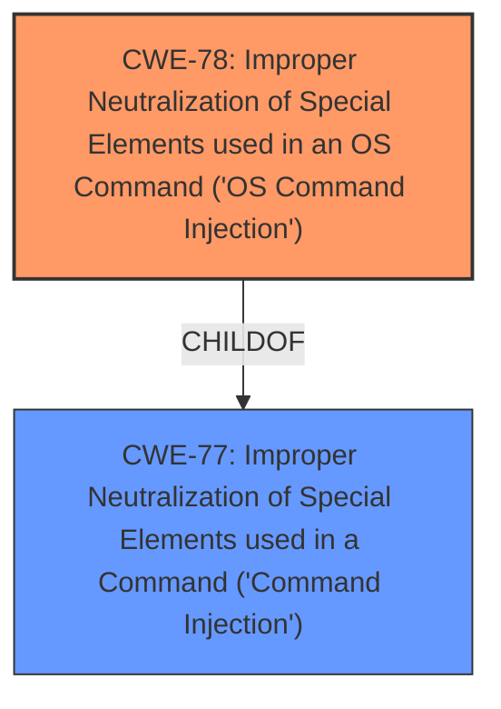

# Raw Analyzer Response for CVE-2024-57234

# Summary
| CWE ID | CWE Name | Confidence | CWE Abstraction Level | CWE Vulnerability Mapping Label | CWE-Vulnerability Mapping Notes |
|---|---|---|---|---|---|
| CWE-78 | Improper Neutralization of Special Elements used in an OS Command ('OS Command Injection') | 0.9 | Base | Primary CWE | Allowed |
| CWE-77 | Improper Neutralization of Special Elements used in a Command ('Command Injection') | 0.7 | Class | Secondary Candidate | Allowed-with-Review |

## Evidence and Confidence

*   **Confidence Score:** 0.9
*   **Evidence Strength:** MEDIUM

## Relationship Analysis
The primary relationship that influenced my decision was the ChildOf relationship between CWE-78 and CWE-77. Since the vulnerability description specifically mentions a **command injection vulnerability** related to an OS command, the more specific CWE-78 is preferred.
CWE-78 is a base level CWE, making it more specific than CWE-77, which is a class level CWE.

## Vulnerability Chain
The vulnerability chain starts with the **improper neutralization** of special elements within an OS command, leading to the ability to inject arbitrary commands.

## Summary of Analysis
The vulnerability description clearly states a **command injection vulnerability** in the `apcli_cancel_wps` function via the `ifname` parameter. The retriever results list CWE-77 and CWE-78 as top candidates. While both CWEs are relevant, CWE-78 is more specific as it explicitly refers to OS command injection, aligning perfectly with the vulnerability description.
The evidence supporting the decision is the phrase "**command injection vulnerability**" in the Vulnerability Description.

CWE-77 was considered as a broader category of command injection, but since the context points to OS commands, CWE-78 was preferred. Other CWEs like CWE-89 (SQL Injection), CWE-79 (Cross-site Scripting), and CWE-134 (Use of Externally-Controlled Format String) were not considered because they do not align with the command injection nature of the vulnerability.

Relevant CWE Information:

# Enhanced Context (25 CWEs)
The following CWEs were identified as potentially relevant to this vulnerability:

## CWE-77: Improper Neutralization of Special Elements used in a Command ('Command Injection')
**Abstraction Level**: Class
**Similarity Score**: 0.76
**Source**: dense

**Description**:
The product constructs all or part of a command using externally-influenced input from an upstream component, but it does not neutralize or incorrectly neutralizes special elements that could modify the intended command when it is sent to a downstream component.

**Mapping Guidance**:
- Usage: Allowed-with-Review
- Rationale: CWE-77 is often misused when OS command injection (CWE-78) was intended instead [REF-1287].

## CWE-78: Improper Neutralization of Special Elements used in an OS Command ('OS Command Injection')
**Abstraction Level**: Base
**Similarity Score**: 0.74
**Source**: dense

**Description**:
The product constructs all or part of an OS command using externally-influenced input from an upstream component, but it does not neutralize or incorrectly neutralizes special elements that could modify the intended OS command when it is sent to a downstream component.

**Mapping Guidance**:
- Usage: Allowed
- Rationale: This CWE entry is at the Base level of abstraction, which is a preferred level of abstraction for mapping to the root causes of vulnerabilities.