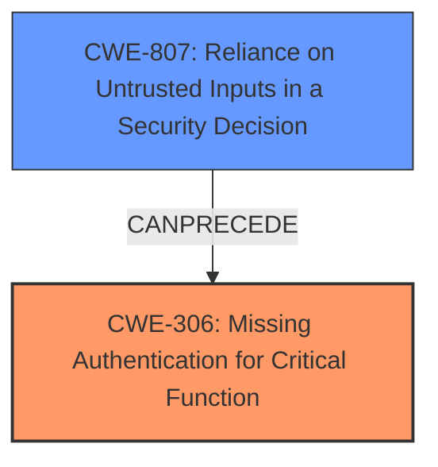

# Analysis Report for CVE-2024-57249

# Vulnerability Analysis Report: CVE-2024-57249

## Description

**Incorrect Access Control** in the Preview Function of Gleamtech FileVista 9.2.0.0 allows remote attackers to gain unauthorized access via exploiting a vulnerability in access control mechanisms by removing authentication-related HTTP headers, such as the Cookie header, in the request. This bypasses the authentication process and grants attackers access to sensitive image files without proper login credentials.

## Vulnerability Description Key Phrases

- **Rootcause:** Incorrect Access Control
- **Weakness:** Authentication bypass vulnerability
- **Impact:** gain unauthorized access
- **Vector:** removing authentication-related HTTP headers
- **Attacker:** remote attackers
- **Product:** Gleamtech FileVista
- **Version:** 9.2.0.0
- **Component:** Preview Function

## Analysis (with Relationship Data)

# Summary
| CWE ID | CWE Name | Confidence | CWE Abstraction Level | CWE Vulnerability Mapping Label | CWE-Vulnerability Mapping Notes |
|---|---|---|---|---|---|
| CWE-306 | Missing Authentication for Critical Function | 0.9 | Base | Allowed | Primary CWE: The vulnerability occurs because the system **does not perform any authentication** for a critical function. |
| CWE-807 | Reliance on Untrusted Inputs in a Security Decision | 0.7 | Base | Allowed | Secondary Candidate: The system **relies on the existence of certain HTTP headers**, which can be modified by an attacker to bypass authentication. |

## Evidence and Confidence

*   **Confidence Score:** 0.8
*   **Evidence Strength:** MEDIUM

## Relationship Analysis
The primary CWE is CWE-306, which represents the lack of authentication for a critical function. A secondary CWE to consider is CWE-807, which explains how the system relies on untrusted inputs (HTTP headers) for security decisions. This can be visualized as follows:



## Vulnerability Chain
The vulnerability chain starts with the **missing authentication** (CWE-306) for the preview function. An attacker then exploits this by **removing authentication-related HTTP headers** (CWE-807), leading to **unauthorized access** to sensitive image files.

## Summary of Analysis
The initial analysis identified CWE-306 as the primary weakness due to the **lack of authentication** for the preview function. This aligns with the vulnerability description, which states that by removing authentication-related HTTP headers, an attacker can bypass the authentication process and gain unauthorized access. The analysis also considered CWE-807 as a secondary weakness because the system's reliance on HTTP headers can be manipulated by an attacker.

The graph relationships influenced the final selection by highlighting the relationship between CWE-807 and CWE-306. The reliance on untrusted inputs (CWE-807) allows the attacker to bypass authentication (CWE-306).

The selected CWEs are at the optimal level of specificity because they accurately represent the weaknesses described in the vulnerability description. CWE-306 represents the primary **root cause**, which is the **missing authentication**, and CWE-807 represents a contributing factor, which is the **reliance on untrusted inputs**.

Relevant CWE Information:

# Enhanced Context (25 CWEs)
The following CWEs were identified as potentially relevant to this vulnerability:

## CWE Classification Guidance

The following guidance has been automatically included because relevant keywords were detected in the vulnerability description:

### Authentication vs Authorization vs Access Control Guidance

## ===Guidance===

### Level Set – Authentication vs Authorization vs Access Control

**Authentication**:
Determines *who* the actor is (identity validation). This is typically the *first step* in access control.

* Example phrases: "user must log in", "lack of login check", "bypasses login"
* CWE relevance: authentication is usually mapped to CWE-306 or its children.

  * **CWE-306**: *Missing Authentication for Critical Function* – used when no identity validation is enforced for sensitive functionality (e.g., password reset, user deletion).

**Authorization**:
Determines *what* an authenticated actor is allowed to do. It decides access *after* identity is verified.

* Example phrases: "unauthorized access", "regular user can access admin panel", "role checks are missing"
* CWE relevance: use CWEs like 862, 863, 285 for authorization errors:

  * **CWE-862**: *Missing Authorization* – the application doesn't check whether the user is authorized at all.
  * **CWE-863**: *Incorrect Authorization* – the application checks authorization, but does it incorrectly (e.g., flawed logic).
  * **CWE-285**: *Improper Authorization* – general category for any flawed authorization logic or design.

**Access Control**:
A broader term that includes both authentication and authorization. Governs how resources are protected and who can access them under what conditions.

* CWE relevance:

  * **CWE-284**: *Improper Access Control* – top-level category used when access control failure exists but root cause is unclear.
  * This should be avoided **if** a more specific child CWE like 285, 862, 863, or 306 is appropriate.

---

## Mapping Discussion – Common Misclassification Patterns

### 1. **CWE-306 vs CWE-862**:

* **306** is about lack of **authentication** (e.g., *no login required at all*).
* **862** is about lack of **authorization** *after* authentication (e.g., *admin check missing*).
* ✅ Example CWE-306: *“An unauthenticated attacker can invoke the password reset API.”*
* ✅ Example CWE-862: *“An authenticated user without admin privileges can delete any user account.”*

### 2. **CWE-285 vs CWE-284**:

* **285** is specific to authorization flaws – it's a better choice than 284 **if** the issue involves *improper or missing role checks*.
* **284** should be reserved for general access control issues when it’s unclear whether the issue lies in authn or authz.

---

## Technical Impact vs Root Cause Clarification

**Phrase like "unauthorized access" is not enough.**

* If you **cannot determine whether identity was checked**, assume it’s **authorization** and consider 862 or 863.
* If you **know no login happened**, lean toward **authentication** → CWE-306.
* If the **access control policy is unclear or inconsistently enforced**, but it's not due to missing checks, consider **CWE-284**.

---

## Good Mapping Examples

* ✅ **CWE-306**: “The endpoint `/admin/deleteUser` does not require any authentication.”
* ✅ **CWE-862**: “Any logged-in user can change any other user's email without being an admin.”
* ✅ **CWE-863**: “An admin check exists but incorrectly grants access to non-admin users.”
* ✅ **CWE-285**: “Application uses a static role check that fails when roles change dynamically.”
* ✅ **CWE-284**: “Inconsistent enforcement of access rules across services with unclear policy source.”

---

## Summary – Quick LLM Rules of Thumb

| **Indicator**                                              | **Likely CWE** |
| ---------------------------------------------------------- | -------------- |
| No identity check (no login)                               | CWE-306        |
| No role/privilege check after login                        | CWE-862        |
| Role check is present but flawed                           | CWE-863        |
| General or ambiguous authorization failure                 | CWE-285        |
| High-level access control problem with no clear root cause | CWE-284        |

**CWE-287 Improper Authentication** - This was considered but deemed less accurate than CWE-306. CWE-287 (Improper Authentication) is a more general case where the authentication process has flaws. In this case, the process is completely missing, making CWE-306 a more precise fit.
**CWE-863 Incorrect Authorization** - This was considered but not chosen as the problem is not with incorrect authorization logic, but rather the absence of authentication.
**CWE-639 Authorization Bypass Through User-Controlled Key** - This was considered but not chosen as the mechanism does not involve modifying a key value.
**CWE-425 Direct Request ('Forced Browsing')** - The web application does not adequately enforce appropriate authorization on all restricted URLs, scripts, or files. This was considered but not chosen as the vulnerability relies on removing authentication headers.


## CWE Relationship Analysis

Current CWEs represent these abstraction levels: .


### Vulnerability Chain Analysis

**Chain starting from CWE-863:**
- 863 (Incorrect Authorization) - ROOT


**Chain starting from CWE-862:**
- 862 (Missing Authorization) - ROOT


### CWE Relationship Diagram

```mermaid
graph TD
    classDef primary fill:#f96,stroke:#333,stroke-width:2px
    classDef secondary fill:#69f,stroke:#333
    classDef tertiary fill:#9e9,stroke:#333
```


*Report generated on 2025-07-14 00:14:43*
