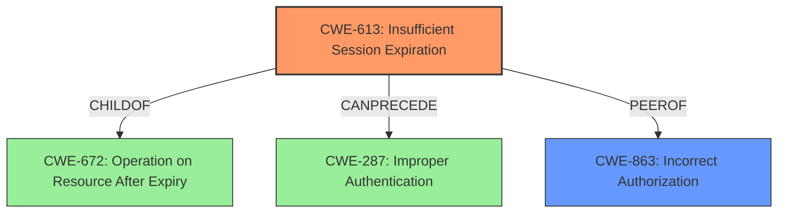

# Raw Analyzer Response for CVE-2024-57433

# Summary
| CWE ID | CWE Name | Confidence | CWE Abstraction Level | CWE Vulnerability Mapping Label | CWE-Vulnerability Mapping Notes |
|---|---|---|---|---|---|
| CWE-613 | Insufficient Session Expiration | 0.9 | Base | Primary | Allowed |
| CWE-863 | Incorrect Authorization | 0.7 | Class | Secondary | Allowed-with-Review |

## Evidence and Confidence

*   **Confidence Score:** 0.8
*   **Evidence Strength:** MEDIUM

## Relationship Analysis
The primary relationship influencing the choice of CWE-613 is its connection to authentication and authorization processes, often preceding improper authentication scenarios. CWE-613 is a child of CWE-672 (Operation on Resource After Expiry), indicating a broader category of issues related to resource management after their intended lifespan. While CWE-863 (Incorrect Authorization) is a parent and a more general case, the specific nature of the vulnerability points more directly to session expiration. I have considered the chain relationship of CANPRECEDE for CWE-613 to CWE-287, and chose CWE-613 due to the details matching to the description.

## Vulnerability Chain
The vulnerability chain starts with the user logging out, but the session not being properly invalidated (**CWE-613**). This leads to the token remaining active, which then allows an attacker to fetch information as if the user were still logged in, which could be considered **CWE-863** if the application is incorrectly authorizing requests based on the still-valid token.

## Summary of Analysis
The initial assessment identified **Incorrect Access Control** as the root cause. Based on the evidence provided, the logout function **fails to properly invalidate the user's session**, leading to the token remaining active even after logout. This allows an attacker to use the token to fetch information as if the user were still logged in.

The primary CWE selected is **CWE-613 Insufficient Session Expiration**. This is because the **root cause** of the vulnerability is the **failure to properly invalidate the session upon logout**. The vulnerability description states "After a user logs out, their token is still available and fetches information in the logged-in state."

The secondary CWE selected is **CWE-863 Incorrect Authorization**. This is because the token remains active and the system is allowing the attacker to use the token to fetch information as if the user were still logged in.

The graph relationships influenced the final selection. The relationship of CANPRECEDE for CWE-613 to CWE-287 indicates that insufficient session expiration can lead to improper authentication. The relationship of PEEROF for CWE-613 to CWE-863 indicates that insufficient session expiration can be related to incorrect authorization.

The selected CWEs are at the optimal level of specificity. CWE-613 is a Base CWE, which is a preferred level of abstraction for mapping to the root causes of vulnerabilities.

Other CWEs Considered:

*   CWE-287 (Improper Authentication): While related, this is a more general class of weakness. The specific issue is the session expiration, not the overall authentication process.
*   CWE-306 (Missing Authentication for Critical Function): This CWE is not applicable because authentication is present; the problem lies in the session management after logout.
*   CWE-639 (Authorization Bypass Through User-Controlled Key): Not applicable as the vulnerability isn't directly related to manipulating keys but rather utilizing an unexpired session token.

Relevant CWE Information:

# Enhanced Context (25 CWEs)
The following CWEs were identified as potentially relevant to this vulnerability:

## CWE-303: Incorrect Implementation of Authentication Algorithm
**Abstraction Level**: Base
**Similarity Score**: 0.74
**Source**: dense

**Description**:
The requirements for the product dictate the use of an established authentication algorithm, but the implementation of the algorithm is incorrect.

**Mapping Guidance**:
- Usage: Allowed
- Rationale: This CWE entry is at the Base level of abstraction, which is a preferred level of abstraction for mapping to the root causes of vulnerabilities.

## CWE-807: Reliance on Untrusted Inputs in a Security Decision
**Abstraction Level**: Base
**Similarity Score**: 0.73
**Source**: dense

**Description**:
The product uses a protection mechanism that relies on the existence or values of an input, but the input can be modified by an untrusted actor in a way that bypasses the protection mechanism.

**Mapping Guidance**:
- Usage: Allowed
- Rationale: This CWE entry is at the Base level of abstraction, which is a preferred level of abstraction for mapping to the root causes of vulnerabilities.

## CWE-472: External Control of Assumed-Immutable Web Parameter
**Abstraction Level**: Base
**Similarity Score**: 0.73
**Source**: dense

**Description**:
The web application does not sufficiently verify inputs that are assumed to be immutable but are actually externally controllable, such as hidden form fields.

**Mapping Guidance**:
- Usage: Allowed
- Rationale: This CWE entry is at the Base level of abstraction, which is a preferred level of abstraction for mapping to the root causes of vulnerabilities.

## CWE-1391: Use of Weak Credentials
**Abstraction Level**: Class
**Similarity Score**: 0.73
**Source**: dense

**Description**:
The product uses weak credentials (such as a default key or hard-coded password) that can be calculated, derived, reused, or guessed by an attacker.

**Mapping Guidance**:
- Usage: Allowed-with-Review
- Rationale: This CWE entry is a Class and might have Base-level children that would be more appropriate

## CWE-1390: Weak Authentication
**Abstraction Level**: Class
**Similarity Score**: 0.73
**Source**: dense

**Description**:
The product uses an authentication mechanism to restrict access to specific users or identities, but the mechanism does not sufficiently prove that the claimed identity is correct.

**Mapping Guidance**:
- Usage: Allowed-with-Review
- Rationale: This CWE entry is a Class and might have Base-level children that would be more appropriate

## CWE-204: Observable Response Discrepancy
**Abstraction Level**: Base
**Similarity Score**: 0.73
**Source**: dense

**Description**:
The product provides different responses to incoming requests in a way that reveals internal state information to an unauthorized actor outside of the intended control sphere.

**Mapping Guidance**:
- Usage: Allowed
- Rationale: This CWE entry is at the Base level of abstraction, which is a preferred level of abstraction for mapping to the root causes of vulnerabilities.

## CWE-288: Authentication Bypass Using an Alternate Path or Channel
**Abstraction Level**: Base
**Similarity Score**: 0.73
**Source**: dense

**Description**:
The product requires authentication, but the product has an alternate path or channel that does not require authentication.

**Mapping Guidance**:
- Usage: Allowed
- Rationale: This CWE entry is at the Base level of abstraction, which is a preferred level of abstraction for mapping to the root causes of vulnerabilities.

## CWE-330: Use of Insufficiently Random Values
**Abstraction Level**: Class
**Similarity Score**: 0.72
**Source**: dense

**Description**:
The product uses insufficiently random numbers or values in a security context that depends on unpredictable numbers.

**Mapping Guidance**:
- Usage: Discouraged
- Rationale: This CWE entry is a level-1 Class (i.e., a child of a Pillar). It might have lower-level children that would be more appropriate

## CWE-703: Improper Check or Handling of Exceptional Conditions
**Abstraction Level**: Pillar
**Similarity Score**: 0.72
**Source**: dense

**Description**:
The product does not properly anticipate or handle exceptional conditions that rarely occur during normal operation of the product.

**Mapping Guidance**:
- Usage: Discouraged
- Rationale: This CWE entry is extremely high-level, a Pillar.

## CWE-425: Direct Request ('Forced Browsing')
**Abstraction Level**: Base
**Similarity Score**: 0.72
**Source**: dense

**Description**:
The web application does not adequately enforce appropriate authorization on all restricted URLs, scripts, or files.

**Mapping Guidance**:
- Usage: Allowed
- Rationale: This CWE