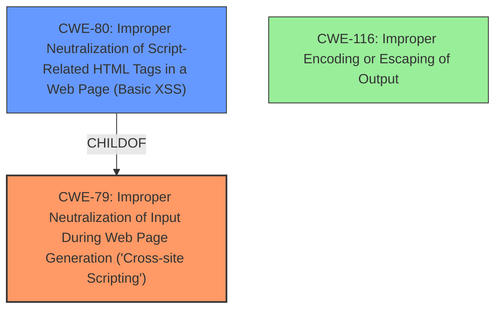

# Enhanced Analysis for CVE-2024-5744

# Summary

| CWE ID | CWE Name | Confidence | CWE Abstraction Level | CWE Vulnerability Mapping Label | CWE-Vulnerability Mapping Notes |
|---|---|---|---|---|---|
| CWE-79 | Improper Neutralization of Input During Web Page Generation ('Cross-site Scripting') | 1.0 | Base | Allowed | Primary CWE. The vulnerability description and CVE Reference Links Content Summary clearly indicate that the plugin does not properly neutralize user-controllable input before placing it in the output, leading to reflected XSS. |
| CWE-80 | Improper Neutralization of Script-Related HTML Tags in a Web Page (Basic XSS) | 0.7 | Variant | Allowed | Secondary candidate. This CWE is a more specific variant of XSS that focuses on the neutralization of script-related HTML tags. While it is relevant, CWE-79 is a more general fit as the description doesn't explicitly mention the issue is limited to HTML tags.|
| CWE-116 | Improper Encoding or Escaping of Output | 0.6 | Class | Allowed-with-Review | Secondary candidate. The vulnerability involves outputting the request URI without proper encoding/escaping. While relevant, it is a higher-level abstraction than CWE-79. |

## Evidence and Confidence

*   **Confidence Score:** 1.0
*   **Evidence Strength:** HIGH

## Relationship Analysis
The primary relationship that impacted my decision was the parent-child relationship between CWE-79 and CWE-80, where CWE-80 is a variant of CWE-79. Since the description focuses on reflected XSS due to improper neutralization of input without being specific to HTML tags, CWE-79 (the base CWE) is a better fit. CWE-116 is a class-level CWE which is a higher level of abstraction.



## Vulnerability Chain
The vulnerability chain involves:
1.  **Root Cause:** **Improper neutralization** of the `$_SERVER['REQUEST_URI']` parameter.
2.  **Weakness:** Reflected Cross-Site Scripting (XSS) due to the **lack of sanitization**.
3.  **Impact:** An attacker can inject malicious scripts that execute in the victim's browser, potentially leading to session hijacking or data theft.

## Summary of Analysis
The initial assessment, based on the vulnerability description and the CVE Reference Links Content Summary, strongly points to CWE-79 as the primary weakness. The description explicitly states that the plugin "does not escape the `$_SERVER[REQUEST_URI]` parameter before outputting it back in an attribute, which could lead to Reflected Cross-Site Scripting." The CVE Reference Links Content Summary confirms this, stating that the root cause is the "plugin does not properly sanitize or escape the `$_SERVER['REQUEST_URI']` parameter before outputting it within an HTML attribute," leading to "Reflected Cross-Site Scripting (XSS)."

The retriever results also suggest CWE-79 as a strong candidate. While other CWEs like CWE-80 and CWE-116 are relevant, they are either more specific variants or higher-level abstractions. CWE-79 is at the Base level of abstraction and directly addresses the identified weakness.
The evidence provided is sufficient to confidently assign CWE-79 as the primary CWE.
The relationship analysis confirms that choosing the base CWE is more appropriate, since the description does not narrow the scope down to just HTML tags.


## CWE Relationship Analysis

Current CWEs represent these abstraction levels: .


### Vulnerability Chain Analysis

**Chain starting from CWE-79:**
- 79 (Improper Neutralization of Input During Web Page Generation ('Cross-site Scripting')) - ROOT


**Chain starting from CWE-116:**
- 116 (Improper Encoding or Escaping of Output) - ROOT


### CWE Relationship Diagram

```mermaid
graph TD
    classDef primary fill:#f96,stroke:#333,stroke-width:2px
    classDef secondary fill:#69f,stroke:#333
    classDef tertiary fill:#9e9,stroke:#333
```