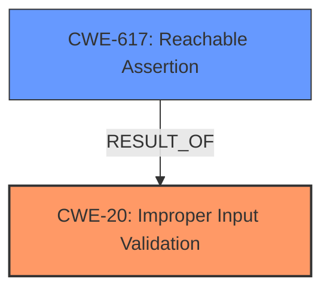

# Analysis Report for CVE-2024-57519

# Vulnerability Analysis Report: CVE-2024-57519

## Description

An issue in Open5GS v.2.7.2 allows a remote attacker to cause a denial of service via the ogs_dbi_auth_info function in lib/dbi/subscription.c file.

## Vulnerability Description Key Phrases

- **Impact:** denial of service
- **Attacker:** remote attacker
- **Product:** Open5GS
- **Version:** v.2.7.2
- **Component:** ogs_dbi_auth_info function in lib/dbi/subscription.c file

## Analysis (with Relationship Data)

# Summary
| CWE ID | CWE Name | Confidence | CWE Abstraction Level | CWE Vulnerability Mapping Label | CWE-Vulnerability Mapping Notes |
|---|---|---|---|---|---|
| CWE-20 | Improper Input Validation | 0.9 | Class | Primary | Allowed |
| CWE-617 | Reachable Assertion | 0.7 | Base | Secondary | Allowed |

## Evidence and Confidence

*   **Confidence Score:** 0.8
*   **Evidence Strength:** HIGH

## Relationship Analysis
The primary weakness is **CWE-20 (Improper Input Validation)**. The vulnerability occurs because the `ogs_dbi_auth_info` function does not properly validate the `supi_id` before using it, which is a classic example of improper input validation.

**CWE-617 (Reachable Assertion)** is a secondary weakness. The improper input leads to an assertion failure (`ogs_assert(supi_id)`), causing the UDR to crash. Thus, it is the direct result of the first weakness.

Here's the graph showing these relationships:



## Vulnerability Chain
The vulnerability chain starts with the **improper input validation** (CWE-20). Because the `supi_id` is not properly validated, a malformed input can reach the assertion. The assertion `ogs_assert(supi_id)` then fails (**CWE-617**), leading to a denial of service.

## Summary of Analysis
The analysis is heavily based on the provided evidence, especially the "CVE Reference Links Content Summary".

> Root cause of vulnerability: The vulnerability is caused by the `ogs_dbi_auth_info` function in `lib/dbi/subscription.c` not properly validating the `supi_id` before using it. Specifically, the `ogs_id_get_value` function in `lib/proto/types.c` fails to extract the `supi_id` if the input `ueId` (e.g., "imsiMALFORMED") does not contain a hyphen. This leads to a crash due to an assertion failure.

This quote directly points to the **improper input validation** as the root cause.

> Weaknesses/vulnerabilities present:
>*   Improper Input Validation: The code does not adequately validate the format of the `ueId` (SUPI), leading to unexpected behavior when the format is incorrect.
>*   Assertion Failure: The `ogs_dbi_auth_info` function contains an assertion (`ogs_assert(supi_id)`) that fails when `supi_id` is invalid, causing the UDR to crash.

This further confirms the primary and secondary weaknesses, and the assertion is a direct result of the improper validation.

The selected CWEs are at the optimal level of specificity. **CWE-20 (Improper Input Validation)** is a class-level CWE, but it accurately represents the **root cause** of the vulnerability. A more specific child CWE isn't applicable here because the core issue is the **lack of validation**. **CWE-617 (Reachable Assertion)** is a Base level and well describes the secondary weakness.

Relevant CWE Information:

# Enhanced Context (25 CWEs)
The following CWEs were identified as potentially relevant to this vulnerability:

## CWE-617: Reachable Assertion
**Abstraction Level**: Base
**Similarity Score**: 0.70
**Source**: dense

**Description**:
The product contains an assert() or similar statement that can be triggered by an attacker, which leads to an application exit or other behavior that is more severe than necessary.

**Mapping Guidance**:
- Usage: Allowed
- Rationale: This CWE entry is at the Base level of abstraction, which is a preferred level of abstraction for mapping to the root causes of vulnerabilities.

## CWE-20: Improper Input Validation
The product receives input or data, but it does not validate or incorrectly validates that the input has the properties that are required to process the data safely and correctly.

### Detailed Analysis:
**CWE-20: Improper Input Validation**
*   **How the vulnerability's details match the CWE's characteristics:** The `ogs_dbi_auth_info` function does not properly validate the `supi_id` before using it. Specifically, the `ogs_id_get_value` function fails to extract the `supi_id` if the input `ueId` does not contain a hyphen.
*   **The security implications and potential impact:** A remote attacker can cause a denial of service by sending a malformed `ueId`.
*   **Any parent-child relationships or chain patterns that influenced your mapping:** CWE-20 is the root cause, leading to CWE-617 (Reachable Assertion).
*   **Whether the weakness is primary or secondary in the vulnerability:** Primary.
*   **How the official MITRE mapping guidance influenced your decision:** Usage: Allowed. The description aligns perfectly with the root cause described in the vulnerability.

**CWE-617: Reachable Assertion**
*   **How the vulnerability's details match the CWE's characteristics:** The `ogs_dbi_auth_info` function contains an assertion (`ogs_assert(supi_id)`) that fails when `supi_id` is invalid, causing the UDR to crash.
*   **The security implications and potential impact:** The impact of this vulnerability is a denial of service (DoS) condition. The UDR (User Data Repository) crashes, making it unavailable.
*   **Any parent-child relationships or chain patterns that influenced your mapping:** It is a result of CWE-20.
*   **Whether the weakness is primary or secondary in the vulnerability:** Secondary.
*   **How the official MITRE mapping guidance influenced your decision:** Usage: Allowed. It is a Base level of abstraction.

**CWEs Considered But Not Used:**

*   **CWE-190 (Integer Overflow or Wraparound)**, **CWE-789 (Memory Allocation with Excessive Size Value)**, **CWE-122 (Heap-based Buffer Overflow)**, **CWE-130 (Improper Handling of Length Parameter Inconsistency)**, **CWE-1284 (Improper Validation of Specified Quantity in Input)**: These CWEs are related to size calculations or memory allocation issues, but the vulnerability does not involve these aspects. The core issue is the **lack of input validation**, not the specific handling of size or memory.
*   **CWE-476 (NULL Pointer Dereference)**: While an invalid `supi_id` might lead to a NULL pointer, the more direct and descriptive weakness is the **improper input validation** leading to an assertion failure.
*   **CWE-306 (Missing Authentication for Critical Function)**: The vulnerability is not about missing authentication.
*   **CWE-674 (Uncontrolled Recursion)**: This is not relevant to the vulnerability.
*   **CWE-415 (Double Free)**, **CWE-121 (Stack-based Buffer Overflow)**, **CWE-126 (Buffer Over-read)**, **CWE-1325 (Improperly Controlled Sequential Memory Allocation)**: These are memory-related issues, but the vulnerability is due to a lack of proper input validation.


## CWE Relationship Analysis

Current CWEs represent these abstraction levels: .


### Vulnerability Chain Analysis

**Chain starting from CWE-1284:**
- 1284 (Improper Validation of Specified Quantity in Input) - ROOT


**Chain starting from CWE-130:**
- 130 (Improper Handling of Length Parameter Inconsistency) - ROOT


### CWE Relationship Diagram

```mermaid
graph TD
    classDef primary fill:#f96,stroke:#333,stroke-width:2px
    classDef secondary fill:#69f,stroke:#333
    classDef tertiary fill:#9e9,stroke:#333
```


*Report generated on 2025-07-14 00:22:11*
