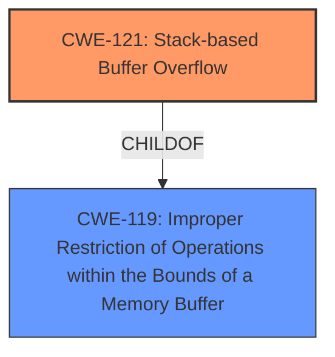

# Analysis Report for CVE-2024-57575

# Vulnerability Analysis Report: CVE-2024-57575

## Description

Tenda AC18 V15.03.05.19 was discovered to contain a **stack overflow** via the ssid parameter in the form_fast_setting_wifi_set function.

## Vulnerability Description Key Phrases

- **Weakness:** stack overflow
- **Vector:** ssid parameter
- **Product:** Tenda AC18
- **Version:** V15.03.05.19
- **Component:** form_fast_setting_wifi_set function

## Analysis (with Relationship Data)

# Summary
| CWE ID | CWE Name | Confidence | CWE Abstraction Level | CWE Vulnerability Mapping Label | CWE-Vulnerability Mapping Notes |
|---|---|---|---|---|---|
| CWE-121 | Stack-based Buffer Overflow | 1.0 | Variant | Primary | Allowed |

## Evidence and Confidence

*   **Confidence Score:** 1.0
*   **Evidence Strength:** HIGH

## Relationship Analysis
The primary relationship impacting the decision is that CWE-121 is a variant of CWE-119. The description clearly indicates a **stack overflow**, making CWE-121 a more specific and appropriate choice than the more general CWE-119.



## Vulnerability Chain
The vulnerability chain consists of the **stack overflow** due to the `ssid` parameter, leading to potential code execution or denial of service.

## Summary of Analysis
The vulnerability description explicitly states a **stack overflow** via the `ssid` parameter. The Retriever Results list CWE-121 as the top result, and the description of CWE-121 directly matches the described vulnerability. Therefore, CWE-121 is the most appropriate mapping.

Relevant CWE Information:

# Enhanced Context (25 CWEs)
The following CWEs were identified as potentially relevant to this vulnerability:

## CWE-121: Stack-based Buffer Overflow
**Abstraction Level**: Variant
**Similarity Score**: 0.71
**Source**: dense

**Description**:
A stack-based buffer overflow condition is a condition where the buffer being overwritten is allocated on the stack (i.e., is a local variable or, rarely, a parameter to a function).

**Mapping Guidance**:
- Usage: Allowed
- Rationale: This CWE entry is at the Variant level of abstraction, which is a preferred level of abstraction for mapping to the root causes of vulnerabilities.
### Detailed Analysis

1.  **Content Matching:**
    *   The vulnerability description states "**stack overflow** via the ssid parameter".
    *   CWE-121 is "Stack-based Buffer Overflow". The description of CWE-121 states: "A stack-based buffer overflow condition is a condition where the buffer being overwritten is allocated on the stack".
    *   This is a direct match to the vulnerability description.

2.  **Relationship Analysis:**
    *   CWE-121 is a Variant of CWE-119 (Improper Restriction of Operations within the Bounds of a Memory Buffer).
    *   Since the vulnerability specifically involves a **stack overflow**, CWE-121 is more specific and appropriate than the more general CWE-119.

3.  **Mapping Guidance Analysis:**
    *   The Mapping Guidance for CWE-121 states "Usage: Allowed" and "Rationale: This CWE entry is at the Variant level of abstraction, which is a preferred level of abstraction for mapping to the root causes of vulnerabilities."

4.  **Mitigation Analysis:**
    *   Mitigation would involve proper bounds checking on the `ssid` parameter to prevent writing beyond the allocated buffer on the stack.

5.  **Evidence-Based Decision Making:**
    *   The explicit mention of "**stack overflow**" is strong evidence for selecting CWE-121.
    *   The retriever lists CWE-121 as a top candidate.

### Considered but not Used:

*   CWE-119: While related, it is too general. CWE-121 is a specific type of buffer overflow.
*   CWE-120: Buffer Copy without Checking Size of Input ('Classic Buffer Overflow') - While a buffer overflow, there's no direct evidence that this is specifically a buffer copy operation. The **stack overflow** could be caused by other means as well.
*   CWE-190: Integer Overflow or Wraparound: There's no evidence of integer overflow in the description.
*   CWE-78: Improper Neutralization of Special Elements used in an OS Command ('OS Command Injection') - This would apply if the SSID was used in an OS command without sanitization, but that is not implied in the description.


## CWE Relationship Analysis

Current CWEs represent these abstraction levels: .


### Vulnerability Chain Analysis

**Chain starting from CWE-121:**
- 121 (Stack-based Buffer Overflow) - ROOT


**Chain starting from CWE-190:**
- 190 (Integer Overflow or Wraparound) - ROOT


### CWE Relationship Diagram

```mermaid
graph TD
    classDef primary fill:#f96,stroke:#333,stroke-width:2px
    classDef secondary fill:#69f,stroke:#333
    classDef tertiary fill:#9e9,stroke:#333
```


*Report generated on 2025-07-14 00:23:58*
