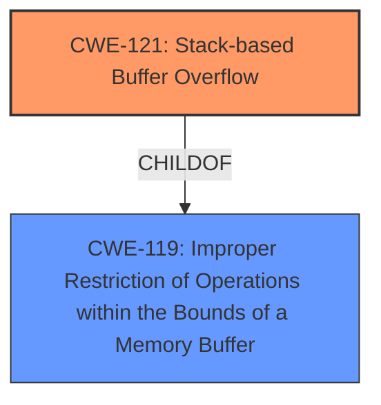

# Enhanced Analysis for CVE-2024-57578

# Summary
| CWE ID | CWE Name | Confidence | CWE Abstraction Level | CWE Vulnerability Mapping Label | CWE-Vulnerability Mapping Notes |
|---|---|---|---|---|---|
| CWE-121 | Stack-based Buffer Overflow | 1.0 | Variant | Allowed | Primary CWE |

## Evidence and Confidence

*   **Confidence Score:** 1.0
*   **Evidence Strength:** HIGH

## Relationship Analysis
The primary identified weakness is CWE-121, which is a variant of CWE-119 (Improper Restriction of Operations within the Bounds of a Memory Buffer). CWE-119 is a class-level CWE and is too general for this case. The vulnerability description specifically mentions a stack overflow, making the more specific CWE-121 a better fit.



## Vulnerability Chain
The vulnerability chain starts with a **stack overflow** in the `formSetCfm` function due to the `funcpara1` parameter. This allows an attacker to overwrite data on the stack.
  - The root cause is the **stack overflow**.

## Summary of Analysis
The vulnerability description clearly indicates a **stack overflow** in the `formSetCfm` function due to the `funcpara1` parameter. The retriever results also point to CWE-121 as the top candidate. Therefore, CWE-121 is the most appropriate choice.

Relevant CWE Information:

# Enhanced Context (25 CWEs)
The following CWEs were identified as potentially relevant to this vulnerability:

## CWE-121: Stack-based Buffer Overflow
**Abstraction Level**: Variant
**Similarity Score**: 0.73
**Source**: dense

**Description**:
A stack-based buffer overflow condition is a condition where the buffer being overwritten is allocated on the stack (i.e., is a local variable or, rarely, a parameter to a function).

**Mapping Guidance**:
- Usage: Allowed
- Rationale: This CWE entry is at the Variant level of abstraction, which is a preferred level of abstraction for mapping to the root causes of vulnerabilities.

## CWE-121: Stack-based Buffer Overflow
CWE-121 is the most appropriate CWE because the vulnerability description clearly states "**stack overflow** via the funcpara1 parameter in the formSetCfm function".
**CWE-121**: Stack-based Buffer Overflow
* Technical Explanation: The vulnerability occurs when the `funcpara1` parameter is used to write data beyond the allocated buffer on the stack.
* Security Implications: An attacker can overwrite return addresses or other critical data on the stack, potentially leading to arbitrary code execution.
* Relationship Analysis: CWE-121 is a Variant of CWE-119 (Improper Restriction of Operations within the Bounds of a Memory Buffer), which is a more general Class.
* Mapping Guidance: The MITRE mapping guidance allows for the use of CWE-121 as it is at the Variant level of abstraction.
* Confidence: 1.0

CWE-120 was considered due to its relation to buffer overflows but wasn't selected because the description specifically mentions a **stack overflow**, making CWE-121 a better fit. CWE-119 was also considered but it's a class-level CWE and less specific than CWE-121.


## CWE Relationship Analysis

Current CWEs represent these abstraction levels: .


### Vulnerability Chain Analysis

**Chain starting from CWE-119:**
- 119 (Improper Restriction of Operations within the Bounds of a Memory Buffer) - ROOT


**Chain starting from CWE-121:**
- 121 (Stack-based Buffer Overflow) - ROOT


### CWE Relationship Diagram

```mermaid
graph TD
    classDef primary fill:#f96,stroke:#333,stroke-width:2px
    classDef secondary fill:#69f,stroke:#333
    classDef tertiary fill:#9e9,stroke:#333
```