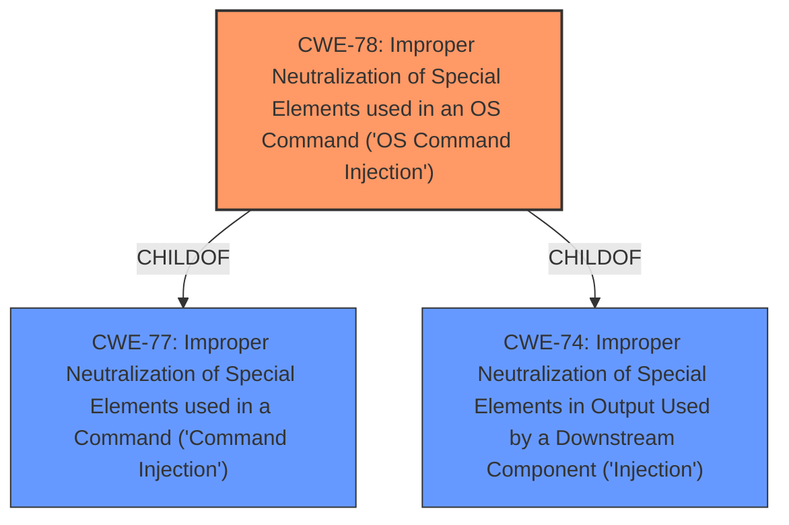

# Enhanced Analysis for CVE-2024-57583

# Summary

| CWE ID | CWE Name | Confidence | CWE Abstraction Level | CWE Vulnerability Mapping Label | CWE-Vulnerability Mapping Notes |
|---|---|---|---|---|---|
| CWE-78 | Improper Neutralization of Special Elements used in an OS Command ('OS Command Injection') | 1.0 | Base | Allowed | Primary CWE |

## Evidence and Confidence

*   **Confidence Score:** 1.0
*   **Evidence Strength:** HIGH

## Relationship Analysis
The primary CWE is CWE-78, which is a base level CWE. CWE-78 is a child of CWE-77 (Class) and CWE-74 (Class). Selecting CWE-78 provides the most specific and accurate representation of the vulnerability, as it directly addresses the **improper neutralization of special elements in an OS command**.


## Vulnerability Chain
The vulnerability chain starts with the **improper neutralization of special elements** within the `usbName` parameter. This leads to **OS command injection**, allowing an attacker to execute arbitrary commands on the system.

## Summary of Analysis
The vulnerability description clearly states that a **command injection** vulnerability exists in the Tenda AC18 router due to **improper neutralization** of the `usbName` parameter within the `formSetSambaConf` function. This aligns directly with the definition of CWE-78, "Improper Neutralization of Special Elements used in an OS Command ('OS Command Injection')." The evidence is strong, and the confidence in the mapping is high.

CWE-77 was considered but deemed less specific, as CWE-78 explicitly identifies the vulnerability as an OS command injection, which is a more accurate description. Other CWEs like CWE-79 (Cross-site Scripting) and CWE-89 (SQL Injection) were not relevant based on the vulnerability description.

Relevant CWE Information:

# Enhanced Context (25 CWEs)
The following CWEs were identified as potentially relevant to this vulnerability:

## CWE-78: Improper Neutralization of Special Elements used in an OS Command ('OS Command Injection')
**Abstraction Level**: Base
**Similarity Score**: 0.74
**Source**: dense

**Description**:
The product constructs all or part of an OS command using externally-influenced input from an upstream component, but it does not neutralize or incorrectly neutralizes special elements that could modify the intended OS command when it is sent to a downstream component.

**Mapping Guidance**:
- Usage: Allowed
- Rationale: This CWE entry is at the Base level of abstraction, which is a preferred level of abstraction for mapping to the root causes of vulnerabilities.


## CWE Relationship Analysis

Current CWEs represent these abstraction levels: .


### Vulnerability Chain Analysis

**Chain starting from CWE-89:**
- 89 (Improper Neutralization of Special Elements used in an SQL Command ('SQL Injection')) - ROOT


**Chain starting from CWE-77:**
- 77 (Improper Neutralization of Special Elements used in a Command ('Command Injection')) - ROOT


### CWE Relationship Diagram

```mermaid
graph TD
    classDef primary fill:#f96,stroke:#333,stroke-width:2px
    classDef secondary fill:#69f,stroke:#333
    classDef tertiary fill:#9e9,stroke:#333
```