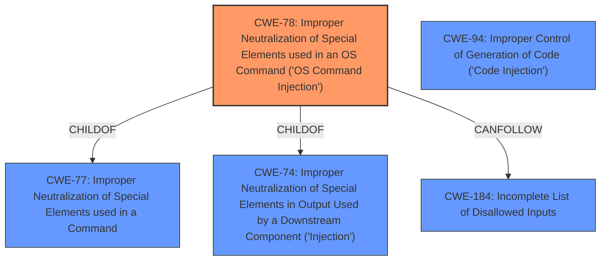

# Analysis Report for CVE-2024-57608

# Vulnerability Analysis Report: CVE-2024-57608

## Description

An issue in Via Browser 6.1.0 allows a a remote attacker to execute arbitrary code via the mark.via.Shell component.

## Vulnerability Description Key Phrases

- **Impact:** execute arbitrary code
- **Attacker:** remote attacker
- **Product:** Via Browser
- **Version:** 6.1.0
- **Component:** mark.via.Shell component

## Analysis (with Relationship Data)

# Summary
| CWE ID | CWE Name | Confidence | CWE Abstraction Level | CWE Vulnerability Mapping Label | CWE-Vulnerability Mapping Notes |
|---|---|---|---|---|---|
| CWE-78 | Improper Neutralization of Special Elements used in an OS Command ('OS Command Injection') | 0.7 | Base | Allowed | Primary CWE |
| CWE-94 | Improper Control of Generation of Code ('Code Injection') | 0.5 | Base | Allowed-with-Review | Secondary Candidate |

## Evidence and Confidence

*   **Confidence Score:** 0.7
*   **Evidence Strength:** LOW

## Relationship Analysis
The primary CWE is CWE-78, which is a base-level CWE. CWE-78 has child-of relationships to CWE-77 (Improper Neutralization of Special Elements used in a Command) and CWE-74 (Improper Neutralization of Special Elements in Output Used by a Downstream Component ('Injection')). It also has a CanFollow relationship to CWE-184 (Incomplete List of Disallowed Inputs). The abstraction levels influenced the selection by favoring the base-level CWE as the most specific and appropriate.



## Vulnerability Chain
The vulnerability chain starts with the **improper neutralization** of special elements, leading to **OS Command Injection**, and ultimately resulting in the ability to execute arbitrary code.

## Summary of Analysis
Based on the limited information, the vulnerability appears to be related to the execution of arbitrary code through the `mark.via.Shell` component in Via Browser 6.1.0.

The description highlights that a remote attacker can execute arbitrary code, suggesting a potential **injection** vulnerability. The Retriever results indicate that CWE-78 (Improper Neutralization of Special Elements used in an OS Command ('OS Command Injection')) is a strong candidate. This CWE aligns with the ability to execute arbitrary code by **injecting** commands into the operating system.

CWE-94 (Improper Control of Generation of Code ('Code Injection')) was also considered as a secondary candidate. However, given the limited details, it's less clear if the vulnerability involves directly generating code or rather **injecting** commands.

The final decision favors CWE-78 due to its specific focus on operating system command injection, which directly aligns with the attacker's ability to execute arbitrary code. Since evidence is lacking, the confidence score is decreased.

Relevant CWE Information:
*   CWE-78: The product constructs all or part of an OS command using externally-influenced input from an upstream component, but it does not neutralize or incorrectly neutralizes special elements that could modify the intended OS command when it is sent to a downstream component. This aligns with the **execution of arbitrary code** on the system.
*   CWE-94: This entry is frequently misused for vulnerabilities with a technical impact of "code execution," which does not by itself indicate a root cause weakness, since dozens of weaknesses can enable code execution.


## CWE Relationship Analysis

Current CWEs represent these abstraction levels: .


### Vulnerability Chain Analysis

**Chain starting from CWE-94:**
- 94 (Improper Control of Generation of Code ('Code Injection')) - ROOT


**Chain starting from CWE-77:**
- 77 (Improper Neutralization of Special Elements used in a Command ('Command Injection')) - ROOT


### CWE Relationship Diagram

```mermaid
graph TD
    classDef primary fill:#f96,stroke:#333,stroke-width:2px
    classDef secondary fill:#69f,stroke:#333
    classDef tertiary fill:#9e9,stroke:#333
```


*Report generated on 2025-07-14 00:27:24*
