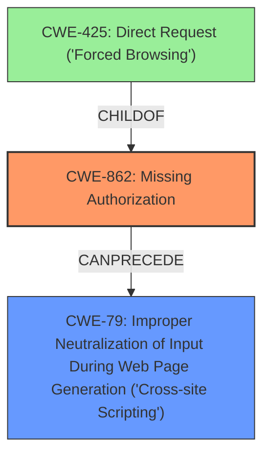

# Analysis Report for CVE-2024-5768

# Vulnerability Analysis Report: CVE-2024-5768

## Description

The MIMO Woocommerce Order Tracking plugin for WordPress is vulnerable to unauthorized modification of data due to a **missing capability check** on the mimo_update_provider function in all versions up to, and including, 1.0.2. This makes it possible for authenticated attackers, with Subscriber-level access and above, to update shipping provider information, including adding stored **cross-site scripting**.

## Vulnerability Description Key Phrases

- **Rootcause:** missing capability check
- **Weakness:** cross-site scripting
- **Impact:** unauthorized modification of data
- **Attacker:** authenticated attackers with Subscriber-level access and above
- **Product:** MIMO Woocommerce Order Tracking plugin for WordPress
- **Version:** up to and including 1.0.2
- **Component:** mimo_update_provider function

## Analysis (with Relationship Data)

# Summary
| CWE ID | CWE Name | Confidence | CWE Abstraction Level | CWE Vulnerability Mapping Label | CWE-Vulnerability Mapping Notes |
|---|---|---|---|---|---|
| CWE-862 | Missing Authorization | 1.0 | Class | Primary | Allowed-with-Review |
| CWE-79 | Improper Neutralization of Input During Web Page Generation ('Cross-site Scripting') | 0.9 | Base | Secondary | Allowed |

## Evidence and Confidence

*   **Confidence Score:** 0.95
*   **Evidence Strength:** HIGH

## Relationship Analysis
The primary weakness is **CWE-862: Missing Authorization**, a class-level CWE, which is part of a hierarchy. The description states that the vulnerability is due to a **missing capability check** on a specific function, allowing unauthorized users to modify data. This leads directly to the ability to inject a **cross-site scripting** payload (CWE-79). Thus, CWE-862 CanPrecede CWE-79. CWE-862 has child CWEs that are more specific such as CWE-425: Direct Request ('Forced Browsing'). However, CWE-862 at the class level is more suitable since the vulnerability is not about direct request, but more generally about the missing authorization.



## Vulnerability Chain
The vulnerability chain starts with the **missing authorization** check (CWE-862). This allows an attacker to modify shipping provider information, including adding stored **cross-site scripting** (CWE-79).

`Missing Authorization (CWE-862) -> Improper Neutralization of Input During Web Page Generation ('Cross-site Scripting') (CWE-79)`

## Summary of Analysis
The analysis is based on the provided evidence, which includes the vulnerability description and CVE reference links content summary. The vulnerability description clearly states that the root cause is a **missing capability check** on the `mimo_update_provider` function, leading to unauthorized modification of data. The CVE reference links content summary confirms this, stating that the plugin lacks proper authorization checks and allows for the injection of malicious JavaScript code.

The graph relationships influenced the selection by highlighting the connection between **missing authorization** (CWE-862) and **cross-site scripting** (CWE-79). The analysis also considered the abstraction levels of the CWEs, selecting CWE-862 at the Class level as the primary weakness because the description indicates a general **missing authorization** issue, not a specific type of authorization failure.

The selected CWEs are at the optimal level of specificity because they accurately represent the root cause and impact of the vulnerability. CWE-862 captures the **missing authorization** check, while CWE-79 captures the resulting **cross-site scripting** vulnerability.

Relevant CWE Information:

# Enhanced Context (25 CWEs)
The following CWEs were identified as potentially relevant to this vulnerability:

## CWE-352: Cross-Site Request Forgery (CSRF)
**Abstraction Level**: Compound
**Similarity Score**: 0.74
**Source**: dense

**Description**:
The web application does not, or can not, sufficiently verify whether a well-formed, valid, consistent request was intentionally provided by the user who submitted the request.

**Mapping Guidance**:
- Usage: Allowed
- Rationale: This is a well-known Composite of multiple weaknesses that must all occur simultaneously, although it is attack-oriented in nature.

*Not Selected*: CSRF is not indicated in the description.

## CWE-472: External Control of Assumed-Immutable Web Parameter
**Abstraction Level**: Base
**Similarity Score**: 0.71
**Source**: dense

**Description**:
The web application does not sufficiently verify inputs that are assumed to be immutable but are actually externally controllable, such as hidden form fields.

**Mapping Guidance**:
- Usage: Allowed
- Rationale: This CWE entry is at the Base level of abstraction, which is a preferred level of abstraction for mapping to the root causes of vulnerabilities.

*Not Selected*: While the injected XSS could be seen as controlling a parameter, the **missing authorization** is more direct.

## CWE-425: Direct Request ('Forced Browsing')
**Abstraction Level**: Base
**Similarity Score**: 0.71
**Source**: dense

**Description**:
The web application does not adequately enforce appropriate authorization on all restricted URLs, scripts, or files.

**Mapping Guidance**:
- Usage: Allowed
- Rationale: This CWE entry is at the Base level of abstraction, which is a preferred level of abstraction for mapping to the root causes of vulnerabilities.

*Not Selected*: While related to missing authorization, CWE-862 is a better fit as a general **missing authorization** issue.

## CWE-639: Authorization Bypass Through User-Controlled Key
**Abstraction Level**: Base
**Similarity Score**: 0.68
**Source**: dense

**Description**:
The system's authorization functionality does not prevent one user from gaining access to another user's data or record by modifying the key value identifying the data.

**Mapping Guidance**:
- Usage: Allowed
- Rationale: This CWE entry is at the Base level of abstraction, which is a preferred level of abstraction for mapping to the root causes of vulnerabilities.

*Not Selected*: Not related to using a key to bypass authorization.

## CWE-862: Missing Authorization
**Abstraction Level**: Class
**Similarity Score**: 0.68
**Source**: dense

**Description**:
The product does not perform an authorization check when an actor attempts to access a resource or perform an action.

**Mapping Guidance**:
- Usage: Allowed-with-Review
- Rationale: This CWE entry is a Class and might have Base-level children that would be more appropriate

*Selected as Primary CWE*: The description explicitly states a **missing capability check**.

## CWE-116: Improper Encoding or Escaping of Output
**Abstraction Level**: Class
**Similarity Score**: 0.68
**Source**: dense

**Description**:
The product prepares a structured message for communication with another component, but encoding or escaping of the data is either missing or done incorrectly. As a result, the intended structure of the message is not preserved.

**Mapping Guidance**:
- Usage: Allowed-with-Review
- Rationale: This CWE entry is a Class and might have Base-level children that would be more appropriate

*Not Selected*: While there is a resulting XSS, the root cause is the **missing authorization**, not encoding.

## CWE-208: Observable Timing Discrepancy
**Abstraction Level**: Base
**Similarity Score**: 0.68
**Source**: dense

**Description**:
Two separate operations in a product require different amounts of time to complete, in a way that is observable to an actor and reveals security-relevant information about the state of the product, such as whether a particular operation was successful or not.

**Mapping Guidance**:
- Usage: Allowed
- Rationale: This CWE entry is at the Base level of abstraction, which is a preferred level of abstraction for mapping to the root causes of vulnerabilities.

*Not Selected*: Timing discrepancy is not indicated in the description.

## CWE-79: Improper Neutralization of Input During Web Page Generation ('Cross-site Scripting')
**Abstraction Level**: Base
**Similarity Score**: 0.67
**Source**: dense

**Description**:
The product does not neutralize or incorrectly neutralizes user-controllable input before it is placed in output that is used as a web page that is served to other users.

**Mapping Guidance**:
- Usage: Allowed
- Rationale: This CWE entry is at the Base level of abstraction, which is a preferred level of abstraction for mapping to the root causes of vulnerabilities.

*Selected as Secondary CWE*: The description indicates the ability to inject a stored XSS payload.

## CWE-434: Unrestricted Upload of File with Dangerous Type
**Abstraction Level**: Base
**Similarity Score**: 0.67
**Source**: dense

**Description**:
The product allows the upload or transfer of dangerous file types that are automatically processed within its environment.

**Mapping Guidance**:
- Usage: Allowed
- Rationale: This CWE entry is at the Base level of abstraction, which is a preferred level of abstraction for mapping to the root causes of vulnerabilities.

*Not Selected*: File upload is not indicated in the description.

## CWE-319: Cleartext Transmission of Sensitive Information
**Abstraction Level**: Base
**Similarity Score**: 0.67
**Source


## CWE Relationship Analysis

Current CWEs represent these abstraction levels: .


### Vulnerability Chain Analysis

**Chain starting from CWE-116:**
- 116 (Improper Encoding or Escaping of Output) - ROOT


**Chain starting from CWE-862:**
- 862 (Missing Authorization) - ROOT


### CWE Relationship Diagram

```mermaid
graph TD
    classDef primary fill:#f96,stroke:#333,stroke-width:2px
    classDef secondary fill:#69f,stroke:#333
    classDef tertiary fill:#9e9,stroke:#333
```


*Report generated on 2025-07-14 00:28:39*
