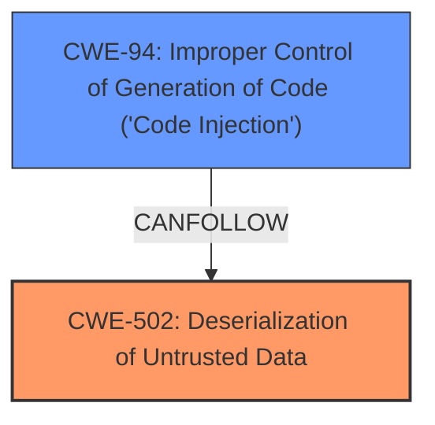

# Analysis for CVE-2024-57685

# Summary
| CWE ID | CWE Name | Confidence | CWE Abstraction Level | CWE Vulnerability Mapping Label | CWE-Vulnerability Mapping Notes |
|---|---|---|---|---|---|
| CWE-502 | Deserialization of Untrusted Data | 0.9 | Base | Allowed | Primary CWE |
| CWE-94 | Improper Control of Generation of Code ('Code Injection') | 0.6 | Base | Allowed-with-Review | Secondary Candidate |

## Evidence and Confidence

*   **Confidence Score:** 0.8
*   **Evidence Strength:** MEDIUM

## Relationship Analysis
The primary relationship influencing my decision is that CWE-502 (Deserialization of Untrusted Data) can lead to CWE-94 (Improper Control of Generation of Code ('Code Injection')). The abstraction levels are appropriate, with CWE-502 being a Base level weakness and CWE-94 a Base level weakness.

## Vulnerability Chain
The vulnerability chain starts with the **deserialization of untrusted data (CWE-502)**, which leads to the **improper control of code generation (CWE-94)**, ultimately resulting in arbitrary code execution.

## Summary of Analysis
The vulnerability description indicates that a remote attacker can execute arbitrary code via a crafted phar file. This strongly suggests **deserialization of untrusted data (CWE-502)** as the root cause. Phar files are often deserialized, and if the application does not properly validate the data during deserialization, it can lead to code execution. The retriever results also list CWE-502 as a possible match.

CWE-94 is added as a secondary because the deserialization leads to code injection. While code injection is the impact, the root cause is the insecure deserialization.

The decision to map CWE-502 as the primary weakness is based on the evidence of using a "crafted phar file" to achieve remote code execution, a common attack vector exploiting deserialization vulnerabilities.

Relevant CWE Information:

# Enhanced Context (25 CWEs)
The following CWEs were identified as potentially relevant to this vulnerability:

## CWE-502: Deserialization of Untrusted Data
**Abstraction Level**: Base
**Similarity Score**: 0.73
**Source**: dense

**Description**:
The product deserializes untrusted data without sufficiently ensuring that the resulting data will be valid.

**Mapping Guidance**:
- Usage: Allowed
- Rationale: This CWE entry is at the Base level of abstraction, which is a preferred level of abstraction for mapping to the root causes of vulnerabilities.

## CWE-94: Improper Control of Generation of Code ('Code Injection')
**Abstraction Level**: base
**Similarity Score**: 2.28
**Source**: graph

**Description**:
CWE-94: Improper Control of Generation of Code ('Code Injection')

**Mapping Guidance**:
- Usage: Allowed-with-Review
- Rationale: This entry is frequently misused for vulnerabilities with a technical impact of "code execution," which does not by itself indicate a root cause weakness, since dozens of weaknesses can enable code execution.

**Relationships**:
- CANFOLLOW -> CWE-98
- PARENTOF -> CWE-96
- PARENTOF -> CWE-95
- PARENTOF -> CWE-1336
- CHILDOF -> CWE-913