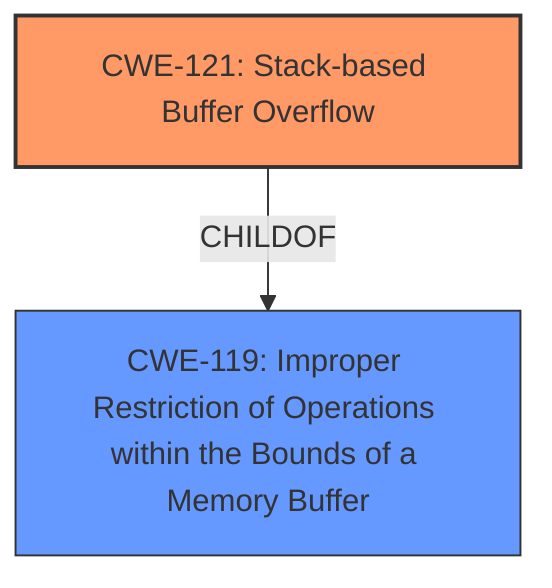

# Analysis for CVE-2024-57703

# Summary
| CWE ID | CWE Name | Confidence | CWE Abstraction Level | CWE Vulnerability Mapping Label | CWE-Vulnerability Mapping Notes |
|---|---|---|---|---|---|
| CWE-121 | Stack-based Buffer Overflow | 1.0 | Variant | Allowed | Primary CWE. The vulnerability description explicitly states a stack-based buffer overflow. |
| CWE-119 | Improper Restriction of Operations within the Bounds of a Memory Buffer | 0.7 | Class | Discouraged | Secondary CWE. CWE-119 is a parent of CWE-121 and represents the more general class of memory buffer errors. |

## Evidence and Confidence

*   **Confidence Score:** 0.9
*   **Evidence Strength:** HIGH

## Relationship Analysis
The primary relationship that influenced the decision was the parent-child relationship between CWE-119 and CWE-121. CWE-121 is a variant of CWE-119, which means it's more specific. Since the description explicitly mentions "stack-based buffer overflow," CWE-121 is the more appropriate choice.

## Vulnerability Chain
The vulnerability chain is relatively simple:

1.  **Root Cause:** Stack-based Buffer Overflow (CWE-121) due to manipulation of the argument schedEndTime.
2.  **Impact:** Potentially arbitrary code execution or denial of service.

## Summary of Analysis
The vulnerability description clearly states that the Tenda AC8v4 V16.03.34.06 router has a **stack overflow** vulnerability in the `setSchedWifi` function of the `/goform/openSchedWifi` file. The **manipulation of the argument schedEndTime leads to stack-based buffer overflow**.

The retriever results identify CWE-121 (Stack-based Buffer Overflow) as the top candidate, and the description matches the provided information.

CWE-119 (Improper Restriction of Operations within the Bounds of a Memory Buffer) was considered because it is a parent of CWE-121. However, since the description explicitly states "stack-based buffer overflow," CWE-121 is more specific and therefore more appropriate.

The selection of CWE-121 is at the optimal level of specificity because it directly reflects the vulnerability described in the text.

Relevant CWE Information:

# Enhanced Context (25 CWEs)

## CWE-121: Stack-based Buffer Overflow
**Abstraction Level**: Variant
**Similarity Score**: 0.73
**Source**: dense

**Description**:
A stack-based buffer overflow condition is a condition where the buffer being overwritten is allocated on the stack (i.e., is a local variable or, rarely, a parameter to a function).

**Mapping Guidance**:
- Usage: Allowed
- Rationale: This CWE entry is at the Variant level of abstraction, which is a preferred level of abstraction for mapping to the root causes of vulnerabilities.

**Explanation**: The vulnerability description clearly states "stack-based buffer overflow" making this CWE an exact match.

## CWE-119: Improper Restriction of Operations within the Bounds of a Memory Buffer
**Abstraction Level**: Class
**Similarity Score**: 0.80
**Source**: alternate_terms

**Description**: The software performs an operation that reads or writes to a memory buffer, but it does not properly restrict the operation to prevent the read or write from occurring outside of the bounds of the buffer.

**Mapping Guidance**: N/A

**Explanation**: CWE-119 is a broader class of buffer errors, where operations are not correctly bounded within the memory buffer.

## CWE-190: Integer Overflow or Wraparound
**Abstraction Level**: Base
**Similarity Score**: 0.80
**Source**: alternate_terms

**Description**: The product performs a calculation that can produce an integer overflow or wraparound when the logic assumes that the resulting value will always be larger than the original value. This occurs when an integer value is incremented to a value that is too large to store in the associated representation. When this occurs, the value may become a very small or negative number.

**Mapping Guidance**: N/A

**Explanation**: This CWE is not directly related to the vulnerability description, which focuses on a stack-based buffer overflow, not an integer overflow.

## CWE-120: Buffer Copy without Checking Size of Input ('Classic Buffer Overflow')
**Abstraction Level**: Base
**Similarity Score**: 0.274
**Source**: sparse

**Description**: The product copies an input buffer to an output buffer without verifying that the size of the input buffer is less than the size of the output buffer, leading to a buffer overflow.

**Mapping Guidance**:
- Usage: Allowed-with-Review
- Rationale: There are some indications that this CWE ID might be misused and selected simply because it mentions "buffer overflow" - an increasingly vague term. This CWE entry is only appropriate for "Buffer Copy" operations (not buffer reads), in which where there is no "Checking [the] Size of Input", and (by implication of the copy) writing past the end of the buffer.

**Explanation**: While related to buffer overflows, CWE-120 is specifically about copying buffers without checking size. The description doesn't provide enough information to determine if a buffer copy operation is involved, so CWE-121 is more appropriate.

## CWE-193: Off-by-one Error
**Abstraction Level**: Base
**Similarity Score**: 0.237
**Source**: sparse

**Description**: A product calculates or uses an incorrect maximum or minimum value that is 1 more, or 1 less, than the correct value.

**Mapping Guidance**: N/A

**Explanation**: There's no indication of an off-by-one error in the vulnerability description.

## CWE-674: Uncontrolled Recursion
**Abstraction Level**: Class
**Similarity Score**: 0.235
**Source**: sparse

**Description**: The software contains a function that calls itself, and this recursion is not properly controlled, which could lead to a stack overflow.

**Mapping Guidance**: N/A

**Explanation**: While uncontrolled recursion *can* lead to stack overflows, the description explicitly mentions a stack-based buffer overflow due to argument manipulation. Thus, CWE-121 is a more direct and accurate mapping.

## CWE-125: Out-of-bounds Read
**Abstraction Level**: Base
**Similarity Score**: 0.234
**Source**: sparse

**Description**: The product reads data past the end, or before the beginning, of the intended buffer.

**Mapping Guidance**: N/A

**Explanation**: The vulnerability is a buffer overflow (write), not a read.

## CWE-681: Incorrect Conversion between Numeric Types
**Abstraction Level**: Base
**Similarity Score**: 0.233
**Source**: sparse

**Description**: The product performs an incorrect conversion from one numeric type to another, which leads to an unexpected or dangerous result.

**Mapping Guidance**: N/A

**Explanation**: No evidence of numeric type conversion issues.

## CWE-78: Improper Neutralization of Special Elements used in an OS Command ('OS Command Injection')
**Abstraction Level**: Base
**Similarity Score**: 0.564
**Source**: dense

**Description**: The product constructs all or part of an OS command using externally-influenced input from an upstream component, but it does not neutralize or incorrectly neutralizes special elements that could modify the intended OS command when it is sent to a downstream component.

**Mapping Guidance**: N/A

**Explanation**: This CWE is related to command injection vulnerabilities which is not the case.

## CWE-128: Wrap-around Error
**Abstraction Level**: base
**Similarity Score**: 0.003
**Source**: graph

**Description**:
CWE-128: Wrap-around Error

**Mapping Guidance**: N/A

**Explanation**: There is no evidence of wrap-around error.