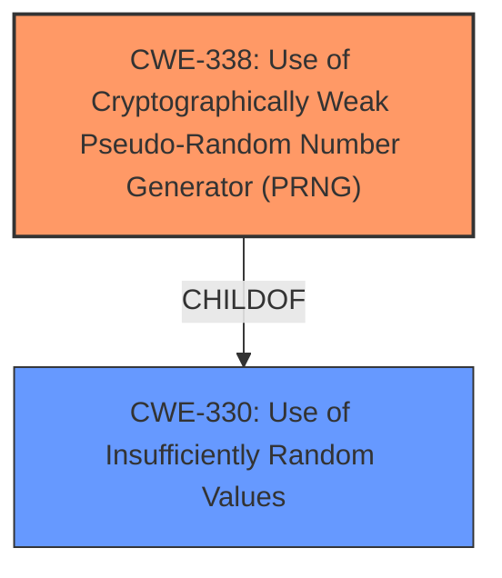

# Analysis for CVE-2024-57868

# Summary
| CWE ID | CWE Name | Confidence | CWE Abstraction Level | CWE Vulnerability Mapping Label | CWE-Vulnerability Mapping Notes |
|---|---|---|---|---|---|
| CWE-338 | Use of Cryptographically Weak Pseudo-Random Number Generator (PRNG) | 1.0 | Base | Primary | Allowed |
| CWE-330 | Use of Insufficiently Random Values | 0.7 | Class | Secondary | Discouraged |

## Evidence and Confidence

*   **Confidence Score:** 0.9
*   **Evidence Strength:** HIGH

## Relationship Analysis
The primary CWE is CWE-338, a base-level CWE which is a child of CWE-330. CWE-330 is a class-level CWE. The vulnerability description indicates the use of a weak PRNG, making CWE-338 the more specific and appropriate choice.

## Vulnerability Chain
The vulnerability chain starts with the **use of a cryptographically weak PRNG** (CWE-338). This leads to the use of insufficiently random values (CWE-330) in cryptographic functions, ultimately resulting in potential compromise of the cryptographic security.

## Summary of Analysis
The vulnerability description clearly states that the WebAPI uses the rand() function as the default source of entropy, which is **not cryptographically secure**, for cryptographic functions. This aligns perfectly with CWE-338 (Use of Cryptographically Weak Pseudo-Random Number Generator (PRNG)). The description also mentions the DataRandom library, which explicitly states it is useful mostly for test programs and uses the rand() function.

The retriever results also list CWE-338 as the top candidate.

CWE-330 (Use of Insufficiently Random Values) is a parent of CWE-338, and could also be considered. However, since the description specifies a cryptographically weak PRNG, CWE-338 is a more specific and accurate classification.

Relevant CWE Information:

# Enhanced Context (25 CWEs)
The following CWEs were identified as potentially relevant to this vulnerability:

## CWE-338: Use of Cryptographically Weak Pseudo-Random Number Generator (PRNG)
**Abstraction Level**: Base
**Similarity Score**: 0.81
**Source**: dense

**Description**:
The product uses a Pseudo-Random Number Generator (PRNG) in a security context, but the PRNG's algorithm is not cryptographically strong.

**Mapping Guidance**:
- Usage: Allowed
- Rationale: This CWE entry is at the Base level of abstraction, which is a preferred level of abstraction for mapping to the root causes of vulnerabilities.
## CWE-330: Use of Insufficiently Random Values
**Abstraction Level**: Class
**Similarity Score**: 0.78
**Source**: dense

**Description**:
The product uses insufficiently random numbers or values in a security context that depends on unpredictable numbers.

**Mapping Guidance**:
- Usage: Discouraged
- Rationale: This CWE entry is a level-1 Class (i.e., a child of a Pillar). It might have lower-level children that would be more appropriate

## CWE Details

**CWE-338: Use of Cryptographically Weak Pseudo-Random Number Generator (PRNG)**

*   **Description:** The product uses a Pseudo-Random Number Generator (PRNG) in a security context, but the PRNG's algorithm is **not cryptographically strong**.
*   **Technical Explanation:** The use of `rand()` function is flagged as **not cryptographically secure**.
*   **Security Implications:** The predictable nature of the PRNG can compromise cryptographic operations.
*   **Relationship Analysis:** Child of CWE-330 (Use of Insufficiently Random Values).
*   **Mapping Guidance:** Usage: Allowed; Rationale: Base level of abstraction is preferred.

**CWE-330: Use of Insufficiently Random Values**

*   **Description:** The product uses insufficiently random numbers or values in a security context that depends on unpredictable numbers.
*   **Technical Explanation:** The `rand()` function doesn't provide sufficient randomness for cryptographic purposes.
*   **Security Implications:** Predictable values can undermine security mechanisms relying on randomness.
*   **Relationship Analysis:** Parent of CWE-338 (Use of Cryptographically Weak Pseudo-Random Number Generator (PRNG)).
*   **Mapping Guidance:** Usage: Discouraged; Rationale: Class level, consider more specific children.

**CWEs Considered but Not Used:**

*   CWE-335, CWE-337, CWE-1204, CWE-327, CWE-1391, CWE-347, CWE-1241, CWE-804: These CWEs are related to PRNGs or cryptographic issues, but they are not as directly relevant as CWE-338 because the vulnerability description explicitly points out the use of a **weak** PRNG algorithm (rand()).