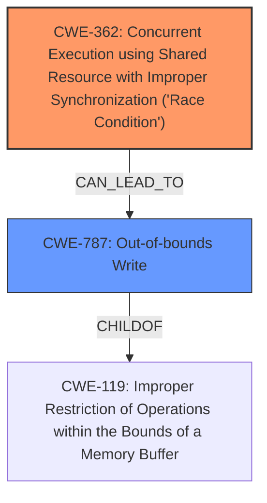

# Analysis for CVE-2024-57876

# Summary
| CWE ID | CWE Name | Confidence | CWE Abstraction Level | CWE Vulnerability Mapping Label | CWE-Vulnerability Mapping Notes |
|---|---|---|---|---|---|
| CWE-362 | Concurrent Execution using Shared Resource with Improper Synchronization ('Race Condition') | 0.8 | Class | Primary CWE | Allowed-with-Review |
| CWE-787 | Out-of-bounds Write | 0.7 | Base | Secondary Candidate | Allowed |

## Evidence and Confidence

*   **Confidence Score:** 0.75
*   **Evidence Strength:** MEDIUM

## Relationship Analysis
The primary weakness is a race condition (CWE-362) due to concurrent access of a shared resource without proper synchronization. This can lead to **memory corruption**, specifically an out-of-bounds write (CWE-787). CWE-362 is a Class-level CWE, while CWE-787 is a Base-level CWE. The "CanPrecede" and "CanFollow" relationships are not directly applicable here, but the hierarchical relationship is useful: CWE-787 is a potential consequence of CWE-362 when the race condition leads to writing outside of allocated memory. The abstraction levels influenced the decision to select CWE-362 as the primary because the description highlights the concurrency issue as the root cause, and the memory corruption is a potential outcome of the race condition.

## Vulnerability Chain
The vulnerability chain starts with concurrent access to a shared resource without proper synchronization (CWE-362). This race condition can lead to **memory corruption**, specifically an out-of-bounds write (CWE-787).

CWE-362 (Race Condition) -> CWE-787 (Out-of-bounds Write)

## Summary of Analysis
The initial analysis considered the **memory corruption** as a potential direct cause, potentially leading to CWE-787. However, further review of the description revealed that the root cause is the race condition due to the lack of proper locking mechanisms. The vulnerability description states that "the drm_dp_mst_topology_mgrup_req_recv/down_rep_recv states could be reset from one thread via drm_dp_mst_topology_mgr_set_mst(false), racing with the reading/parsing of the message from another thread via drm_dp_mst_handle_down_rep() or drm_dp_mst_handle_up_req(). The race is possible since the reader/parser doesnt hold any lock while accessing the reception state." This clearly points to a concurrency issue.

The provided evidence supports classifying this vulnerability as CWE-362 (Concurrent Execution using Shared Resource with Improper Synchronization ('Race Condition')). The race condition can then manifest as a **memory corruption**, specifically an out-of-bounds write (CWE-787). CWE-362 is at the Class level, and CWE-787 is at the Base level. Since the description explicitly mentions the race condition as the root cause, CWE-362 is selected as the primary CWE. The fix implemented also points to this, where the message reception state is reset before parsing the message to avoid the race.

Relevant CWE Information:

# Enhanced Context (25 CWEs)
The following CWEs were identified as potentially relevant to this vulnerability:

## CWE-667: Improper Locking
**Abstraction Level**: Class
**Similarity Score**: 0.74
**Source**: dense

**Description**:
The product does not properly acquire or release a lock on a resource, leading to unexpected resource state changes and behaviors.

**Mapping Guidance**:
- Usage: Allowed-with-Review
- Rationale: This CWE entry is a Class and might have Base-level children that would be more appropriate

*Not Used:* Though related, CWE-667 is a more general case. CWE-362 more accurately describes the concurrent execution leading to the vulnerability.

## CWE-131: Incorrect Calculation of Buffer Size
**Abstraction Level**: Base
**Similarity Score**: 0.73
**Source**: dense

**Description**:
The product does not correctly calculate the size to be used when allocating a buffer, which could lead to a buffer overflow.

**Mapping Guidance**:
- Usage: Allowed
- Rationale: This CWE entry is at the Base level of abstraction, which is a preferred level of abstraction for mapping to the root causes of vulnerabilities.

*Not Used:* Not applicable as the vulnerability is caused by a race condition and not by incorrect buffer size calculation.

## CWE-362: Concurrent Execution using Shared Resource with Improper Synchronization ('Race Condition')
**Abstraction Level**: Class
**Similarity Score**: 0.73
**Source**: dense

**Description**:
The product contains a concurrent code sequence that requires temporary, exclusive access to a shared resource, but a timing window exists in which the shared resource can be modified by another code sequence operating concurrently.

**Mapping Guidance**:
- Usage: Allowed-with-Review
- Rationale: This CWE entry is a Class and might have Base-level children that would be more appropriate

*Used:* This accurately describes the root cause of the vulnerability, which involves concurrent access to shared resources without proper synchronization.

## CWE-1285: Improper Validation of Specified Index, Position, or Offset in Input
**Abstraction Level**: Base
**Similarity Score**: 0.73
**Source**: dense

**Description**:
The product receives input that is expected to specify an index, position, or offset into an indexable resource such as a buffer or file, but it does not validate or incorrectly validates that the specified index/position/offset has the required properties.

**Mapping Guidance**:
- Usage: Allowed
- Rationale: This CWE entry is at the Base level of abstraction, which is a preferred level of abstraction for mapping to the root causes of vulnerabilities.

*Not Used:* This is not relevant since the vulnerability is not directly related to improper validation of input indices or offsets.

## CWE-367: Time-of-check Time-of-use (TOCTOU) Race Condition
**Abstraction Level**: Base
**Similarity Score**: 0.73
**Source**: dense

**Description**:
The product checks the state of a resource before using that resource, but the resource's state can change between the check and the use in a way that invalidates the results of the check. This can cause the product to perform invalid actions when the resource is in an unexpected state.

**Mapping Guidance**:
- Usage: Allowed
- Rationale: This CWE entry is at the Base level of abstraction, which is a preferred level of abstraction for mapping to the root causes of vulnerabilities.

*Not Used:* While a race condition exists, it's not explicitly a TOCTOU issue.

## CWE-119: Improper Restriction of Operations within the Bounds of a Memory Buffer
**Abstraction Level**: Class
**Similarity Score**: 0.72
**Source**: dense

**Description**:
The product performs operations on a memory buffer, but it reads from or writes to a memory location outside the buffer's intended boundary. This may result in read or write operations on unexpected memory locations that could be linked to other variables, data structures, or internal program data.

**Mapping Guidance**:
- Usage: Discouraged
- Rationale: CWE-119 is commonly misused in low-information vulnerability reports when lower-level CWEs could be used instead, or when more details about the vulnerability are available.

*Not Used:* While out-of-bounds write is a consequence, the root cause is the race condition.

## CWE-191: Integer Underflow (Wrap or Wraparound)
**Abstraction Level**: Base
**Similarity Score**: 0.72
**Source**: dense

**Description**:
The product subtracts one value from another, such that the result is less than the minimum allowable integer value, which produces a value that is not equal to the correct result.

**Mapping Guidance**:
- Usage: Allowed
- Rationale: This CWE entry is at the Base level of abstraction, which is a preferred level of abstraction for mapping to the root causes of vulnerabilities.

*Not Used:* Not relevant, as the vulnerability is not caused by integer underflow.

## CWE-824: Access of Uninitialized Pointer
**Abstraction Level**: Base
**Similarity Score**: 0.72
**Source**: dense

**Description**:
The product accesses or uses a pointer that has not been initialized.

**Mapping Guidance**:
- Usage: Allowed
- Rationale: This CWE entry is at the Base level of abstraction, which is a preferred level of abstraction for mapping to