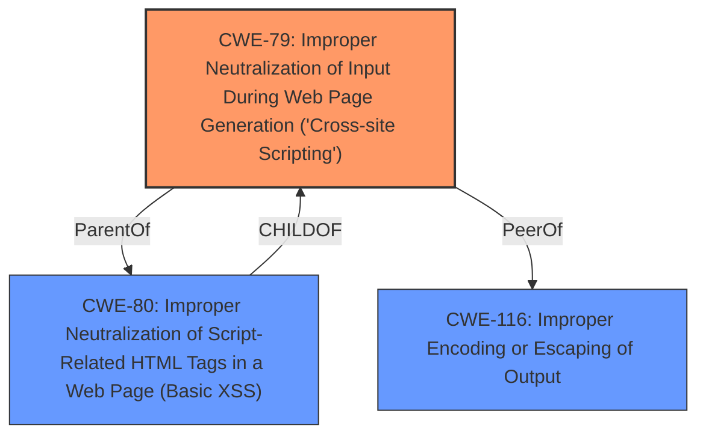

# Enhanced Analysis for CVE-2024-5788

# Summary
| CWE ID | CWE Name | Confidence | CWE Abstraction Level | CWE Vulnerability Mapping Label | CWE-Vulnerability Mapping Notes |
|---|---|---|---|---|---|
| CWE-79 | Improper Neutralization of Input During Web Page Generation ('Cross-site Scripting') | 1.0 | Base | Allowed | Primary CWE. The vulnerability is a stored XSS due to **insufficient input sanitization and output escaping** of the link attribute in the themes Button shortcode. |

## Evidence and Confidence

*   **Confidence Score:** 1.0
*   **Evidence Strength:** HIGH

## Relationship Analysis
The primary CWE is CWE-79, which is a Base level CWE. There are several related CWEs. CWE-80 is a Variant of CWE-79, representing a more specific case of XSS involving script-related HTML tags. CWE-116 is a Class-level CWE describing improper encoding or escaping of output, which is a broader category that includes XSS. The choice of CWE-79 is based on the vulnerability description which specifically describes XSS.



## Vulnerability Chain
The vulnerability chain starts with **insufficient input sanitization and output escaping**, leading to stored cross-site scripting. An authenticated attacker with Contributor-level access can inject arbitrary web scripts into pages. When a user accesses the injected page, the script executes.

## Summary of Analysis
The primary weakness is the **insufficient input sanitization and output escaping** leading to stored cross-site scripting. The evidence is strong, based on the description of the vulnerability and the provided content summary. The vulnerability description clearly states that the theme is vulnerable to Stored Cross-Site Scripting via the link attribute due to **insufficient input sanitization and output escaping**. This directly aligns with the characteristics of CWE-79. The "CVE Reference Links Content Summary" confirms that the root cause is **insufficient input sanitization** of the `link` attribute and that the `esc_attr()` function does not prevent the execution of javascript URIs. The retriever results and similar CVE descriptions also point to CWE-79 as the primary candidate.

CWE-80 was considered, but it's a variant of CWE-79 and more specific to script-related HTML tags. While the vulnerability involves script injection, the broader CWE-79 is more appropriate as it encompasses the general issue of improper neutralization of input during web page generation. CWE-116 was also considered, but it's a more general class related to improper encoding or escaping of output, whereas CWE-79 is specific to XSS.


## CWE Relationship Analysis

Current CWEs represent these abstraction levels: .


### Vulnerability Chain Analysis

**Chain starting from CWE-79:**
- 79 (Improper Neutralization of Input During Web Page Generation ('Cross-site Scripting')) - ROOT


**Chain starting from CWE-116:**
- 116 (Improper Encoding or Escaping of Output) - ROOT


### CWE Relationship Diagram

```mermaid
graph TD
    classDef primary fill:#f96,stroke:#333,stroke-width:2px
    classDef secondary fill:#69f,stroke:#333
    classDef tertiary fill:#9e9,stroke:#333
```