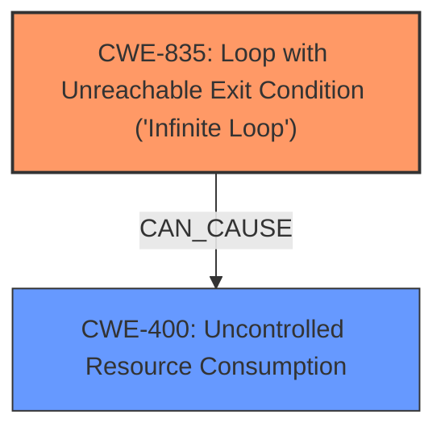

# Analysis Report for CVE-2024-57884

# Vulnerability Analysis Report: CVE-2024-57884

## Description

In the Linux kernel, the following vulnerability has been resolved mm vmscan account for free pages to prevent infinite Loop in throttle_direct_reclaim() The task sometimes continues looping in throttle_direct_reclaim() because allow_direct_reclaim(pgdat) keeps returning false. #0 [ffff80002cb6f8d0] __switch_to at ffff8000080095ac #1 [ffff80002cb6f900] __schedule at ffff800008abbd1c #2 [ffff80002cb6f990] schedule at ffff800008abc50c #3 [ffff80002cb6f9b0] throttle_direct_reclaim at ffff800008273550 #4 [ffff80002cb6fa20] try_to_free_pages at ffff800008277b68 #5 [ffff80002cb6fae0] __alloc_pages_nodemask at ffff8000082c4660 #6 [ffff80002cb6fc50] alloc_pages_vma at ffff8000082e4a98 #7 [ffff80002cb6fca0] do_anonymous_page at ffff80000829f5a8 #8 [ffff80002cb6fce0] __handle_mm_fault at ffff8000082a5974 #9 [ffff80002cb6fd90] handle_mm_fault at ffff8000082a5bd4 At this point, the pgdat contains the following two zones NODE 4 ZONE 0 ADDR ffff00817fffe540 NAME DMA32 SIZE 20480 MIN/LOW/HIGH 11/28/45 VM_STAT NR_FREE_PAGES 359 NR_ZONE_INACTIVE_ANON 18813 NR_ZONE_ACTIVE_ANON 0 NR_ZONE_INACTIVE_FILE 50 NR_ZONE_ACTIVE_FILE 0 NR_ZONE_UNEVICTABLE 0 NR_ZONE_WRITE_PENDING 0 NR_MLOCK 0 NR_BOUNCE 0 NR_ZSPAGES 0 NR_FREE_CMA_PAGES 0 NODE 4 ZONE 1 ADDR ffff00817fffec00 NAME Normal SIZE 8454144 PRESENT 98304 MIN/LOW/HIGH 68/166/264 VM_STAT NR_FREE_PAGES 146 NR_ZONE_INACTIVE_ANON 94668 NR_ZONE_ACTIVE_ANON 3 NR_ZONE_INACTIVE_FILE 735 NR_ZONE_ACTIVE_FILE 78 NR_ZONE_UNEVICTABLE 0 NR_ZONE_WRITE_PENDING 0 NR_MLOCK 0 NR_BOUNCE 0 NR_ZSPAGES 0 NR_FREE_CMA_PAGES 0 In allow_direct_reclaim(), while processing ZONE_DMA32, the sum of inactive/active file-backed pages calculated in zone_reclaimable_pages() based on the result of zone_page_state_snapshot() is zero. Additionally, since this system lacks swap, the calculation of inactive/ active anonymous pages is skipped. crash> p nr_swap_pages nr_swap_pages = $1937 = { counter = 0 } As a result, ZONE_DMA32 is deemed unreclaimable and skipped, moving on to the processing of the next zone, ZONE_NORMAL, despite ZONE_DMA32 having free pages significantly exceeding the high watermark. The problem is that the pgdat->kswapd_failures hasnt been incremented. crash> px ((struct pglist_data *) 0xffff00817fffe540)->kswapd_failures $1935 = 0x0 This is because the node deemed balanced. The node balancing logic in balance_pgdat() evaluates all zones collectively. If one or more zones (e.g., ZONE_DMA32) have enough free pages to meet their watermarks, the entire node is deemed balanced. This causes balance_pgdat() to exit early before incrementing the kswapd_failures, as it considers the overall memory state acceptable, even though some zones (like ZONE_NORMAL) remain under significant pressure. The patch ensures that zone_reclaimable_pages() includes free pages (NR_FREE_PAGES) in its calculation when no other reclaimable pages are available (e.g., file-backed or anonymous pages). This change prevents zones like ZONE_DMA32, which have sufficient free pages, from being mistakenly deemed unreclaimable. By doing so, the patch ensures proper node balancing, avoids masking pressure on other zones like ZONE_NORMAL, and prevents infinite loops in throttle_direct_reclaim() caused by allow_direct_reclaim(pgdat) repeatedly returning false. The kernel hangs due to a task stuck in throttle_direct_reclaim(), caused by a node being incorrectly deemed balanced despite pressure in certain zones, such as ZONE_NORMAL. This issue arises from zone_reclaimable_pages ---truncated---

## Vulnerability Description Key Phrases

- **Component:** mm vmscan
- **Product:** Linux kernel
- **Impact:** hang, infinite loop

## Analysis (with Relationship Data)

# Summary

| CWE ID | CWE Name | Confidence | CWE Abstraction Level | CWE Vulnerability Mapping Label | CWE-Vulnerability Mapping Notes |
|---|---|---|---|---|---|
| CWE-835 | Loop with Unreachable Exit Condition ('Infinite Loop') | 0.8 | Base | Allowed | Primary CWE - Addresses the root cause of the **infinite loop**. |
| CWE-400 | Uncontrolled Resource Consumption | 0.6 | Class | Allowed | Secondary CWE - The infinite loop leads to **resource consumption**. |

## Evidence and Confidence

*   **Confidence Score:** 0.7
*   **Evidence Strength:** MEDIUM

## Relationship Analysis
The primary weakness is CWE-835 (Loop with Unreachable Exit Condition). This leads directly to CWE-400 (Uncontrolled Resource Consumption) as the loop continues indefinitely, consuming resources. CWE-835 is a Base level CWE, while CWE-400 is a Class level CWE. The choice of CWE-835 is preferred due to its specific description of the **infinite loop** condition described in the vulnerability.



## Vulnerability Chain
The vulnerability chain begins with an incorrect calculation of reclaimable pages leading to incorrect node balancing. This incorrect node balancing then leads to an infinite loop within the `throttle_direct_reclaim()` function which results in a kernel hang due to **uncontrolled resource consumption**.

Incorrect calculation of reclaimable pages -> Incorrect Node Balancing -> CWE-835 Loop with Unreachable Exit Condition -> CWE-400 Uncontrolled Resource Consumption

## Summary of Analysis
The analysis focused on identifying the root cause and subsequent impacts described in the vulnerability. The primary CWE, CWE-835, directly addresses the **infinite loop** caused by a task stuck in `throttle_direct_reclaim()`. Supporting evidence includes the vulnerability description indicating that the task "sometimes continues looping". This loop condition directly leads to a denial-of-service condition through **uncontrolled resource consumption**, which is represented by the secondary CWE, CWE-400.

The graph relationships highlight the progression from the initial flaw (incorrect calculation) to the final impact (**uncontrolled resource consumption**). The selected CWEs are at an appropriate level of specificity, with CWE-835 being a base-level CWE that accurately represents the **looping condition**, and CWE-400 being a class-level CWE that describes the resulting impact.

Relevant CWE Information:

# Enhanced Context (25 CWEs)
The following CWEs were identified as potentially relevant to this vulnerability:

## CWE-667: Improper Locking
**Abstraction Level**: Class
**Similarity Score**: 0.77
**Source**: dense

**Description**:
The product does not properly acquire or release a lock on a resource, leading to unexpected resource state changes and behaviors.

**Mapping Guidance**:
- Usage: Allowed-with-Review
- Rationale: This CWE entry is a Class and might have Base-level children that would be more appropriate

## CWE-362: Concurrent Execution using Shared Resource with Improper Synchronization ('Race Condition')
**Abstraction Level**: Class
**Similarity Score**: 0.76
**Source**: dense

**Description**:
The product contains a concurrent code sequence that requires temporary, exclusive access to a shared resource, but a timing window exists in which the shared resource can be modified by another code sequence operating concurrently.

**Mapping Guidance**:
- Usage: Allowed-with-Review
- Rationale: This CWE entry is a Class and might have Base-level children that would be more appropriate

## CWE-909: Missing Initialization of Resource
**Abstraction Level**: Class
**Similarity Score**: 0.75
**Source**: dense

**Description**:
The product does not initialize a critical resource.

**Mapping Guidance**:
- Usage: Allowed-with-Review
- Rationale: This CWE entry is a Class and might have Base-level children that would be more appropriate

## CWE-835: Loop with Unreachable Exit Condition ('Infinite Loop')
**Abstraction Level**: Base
**Similarity Score**: 0.74
**Source**: dense

**Description**:
The product contains an iteration or loop with an exit condition that cannot be reached, i.e., an **infinite loop**.

**Mapping Guidance**:
- Usage: Allowed
- Rationale: This CWE entry is at the Base level of abstraction, which is a preferred level of abstraction for mapping to the root causes of vulnerabilities.

## CWE-789: Memory Allocation with Excessive Size Value
**Abstraction Level**: Variant
**Similarity Score**: 0.74
**Source**: dense

**Description**:
The product allocates memory based on an untrusted, large size value, but it does not ensure that the size is within expected limits, allowing arbitrary amounts of memory to be allocated.

**Mapping Guidance**:
- Usage: Allowed
- Rationale: This CWE entry is at the Variant level of abstraction, which is a preferred level of abstraction for mapping to the root causes of vulnerabilities.

## CWE-833: Deadlock
**Abstraction Level**: Base
**Similarity Score**: 0.74
**Source**: dense

**Description**:
The product contains multiple threads or executable segments that are waiting for each other to release a necessary lock, resulting in deadlock.

**Mapping Guidance**:
- Usage: Allowed
- Rationale: This CWE entry is at the Base level of abstraction, which is a preferred level of abstraction for mapping to the root causes of vulnerabilities.

## CWE-617: Reachable Assertion
**Abstraction Level**: Base
**Similarity Score**: 0.74
**Source**: dense

**Description**:
The product contains an assert() or similar statement that can be triggered by an attacker, which leads to an application exit or other behavior that is more severe than necessary.

**Mapping Guidance**:
- Usage: Allowed
- Rationale: This CWE entry is at the Base level of abstraction, which is a preferred level of abstraction for mapping to the root causes of vulnerabilities.

## CWE-131: Incorrect Calculation of Buffer Size
**Abstraction Level**: Base
**Similarity Score**: 0.73
**Source**: dense

**Description**:
The product does not correctly calculate the size to be used when allocating a buffer, which could lead to a buffer overflow.

**Mapping Guidance**:
- Usage: Allowed
- Rationale: This CWE entry is at the Base level of abstraction, which is a preferred level of abstraction for mapping to the root causes of vulnerabilities.

## CWE-367: Time-of-check Time-of-use (TOCTOU) Race Condition
**Abstraction Level**: Base
**Similarity Score**: 0.73
**Source**: dense

**Description**:
The product checks the state of a resource before using that resource, but the resource's state can change between the check and the use in a way that invalidates the results of the check. This can cause the product to perform invalid actions when the resource is in an unexpected state.

**Mapping Guidance**:
- Usage: Allowed
- Rationale: This CWE entry is at the Base level of abstraction, which is a preferred level of abstraction for mapping to the root causes of vulnerabilities.

## CWE-755: Improper Handling of Exceptional Conditions
**Abstraction Level**: Class
**Similarity Score**: 0.73
**Source**: dense

**Description**:
The product does not handle or incorrectly handles an exceptional condition.

**Mapping Guidance**:
- Usage: Discouraged
- Rationale: This CWE entry is a level-1 Class (i.e., a child of a Pillar). It might have lower-level children that would be more appropriate

## CWE-362: Concurrent Execution using Shared Resource with Improper Synchronization ('Race Condition')
**Abstraction Level**: Class
**Similarity Score**: 727.30
**Source**: sparse

**Description**:
The product contains a concurrent code sequence that requires temporary, exclusive access to a shared resource, but a timing window exists in which the shared resource can be modified by another code sequence operating concurrently.

**Mapping Guidance**:
- Usage: Allowed-with-Review
- Rationale: This CWE entry is a Class and might have Base-level children that would be more appropriate

## CWE-1284: Improper Validation of Specified Quantity in Input
**Abstraction Level**: Base
**Similarity Score**: 725.47
**Source**: sparse

**Description**:
The product receives input that is expected to specify a quantity (such as size or length), but it does not validate or incorrectly validates that the quantity has the required properties.

**Mapping Guidance**:
- Usage: Allowed
- Rationale: This CWE entry is at the Base level of abstraction, which is a preferred level of abstraction for mapping to the root causes of vulnerabilities.

## CWE-1390: Weak Authentication
**Abstraction Level**: Class
**Similarity Score**: 698.09
**Source**: sparse


## CWE Relationship Analysis

Current CWEs represent these abstraction levels: .


### Vulnerability Chain Analysis

**Chain starting from CWE-1390:**
- 1390 (Weak Authentication) - ROOT


**Chain starting from CWE-1284:**
- 1284 (Improper Validation of Specified Quantity in Input) - ROOT


### CWE Relationship Diagram

```mermaid
graph TD
    classDef primary fill:#f96,stroke:#333,stroke-width:2px
    classDef secondary fill:#69f,stroke:#333
    classDef tertiary fill:#9e9,stroke:#333
```


*Report generated on 2025-07-14 00:33:53*
