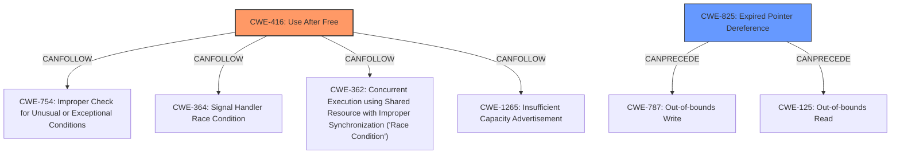

# Analysis for CVE-2024-57892

# Summary
| CWE ID | CWE Name | Confidence | CWE Abstraction Level | CWE Vulnerability Mapping Label | CWE-Vulnerability Mapping Notes |
|---|---|---|---|---|---|
| CWE-416 | Use After Free | 1.0 | Variant | Primary | Allowed |
| CWE-825 | Expired Pointer Dereference | 0.7 | Base | Secondary | Allowed |

## Evidence and Confidence

*   **Confidence Score:** 0.9
*   **Evidence Strength:** HIGH

## Relationship Analysis
The primary CWE is CWE-416, which is a variant of a Use-After-Free vulnerability. CWE-825 (Expired Pointer Dereference) is a base-level CWE that describes the scenario where a pointer is dereferenced after it has expired. CWE-825 can precede CWE-787 (Out-of-bounds Write) or CWE-125 (Out-of-bounds Read). CWE-416 can follow CWE-754, CWE-364, CWE-362, and CWE-1265.

## Vulnerability Chain
The vulnerability chain starts with the **dangling pointer** `dqi_priv` that is freed during the remounting process but not set to NULL. Subsequently, this **dangling pointer** is accessed, leading to a **use-after-free** condition. The lack of a check for `DQUOT_SUSPENDED` exacerbates the issue. Therefore, the chain is: **Dangling Pointer** -> **Use-After-Free**.

## Summary of Analysis
The vulnerability description clearly indicates a **use-after-free** condition due to a **dangling pointer**. The `dqi_priv` pointer is freed but not nulled out, and then later accessed. This aligns perfectly with CWE-416 (Use After Free), which is a variant-level CWE and the best fit. The description also mentions that `sb_dqinfo(sb, type)->dqi_priv` is the **dangling pointer**, supporting the "expired pointer dereference" aspect, making CWE-825 (Expired Pointer Dereference) a reasonable secondary CWE. The high retriever score for CWE-416 and the explicit mention of "slab-use-after-free" and "use-after-free" in the key phrases section further solidify this choice.

CWE-362 (Concurrent Execution using Shared Resource with Improper Synchronization ('Race Condition')), CWE-364 (Signal Handler Race Condition), CWE-476 (NULL Pointer Dereference), CWE-415 (Double Free), CWE-401 (Missing Release of Memory after Effective Lifetime), CWE-88 (Improper Neutralization of Argument Delimiters in a Command ('Argument Injection')), CWE-909 (Missing Initialization of Resource), and CWE-908 (Use of Uninitialized Resource) were considered but not used. They did not accurately describe the **rootcause** of the vulnerability. The vulnerability is not related to concurrency or race conditions (excluding CWE-362 and CWE-364). There is no evidence of a double free (excluding CWE-415). A null pointer dereference (CWE-476) is not the primary issue, but a consequence of using freed memory. There's no indication of missing memory release in general (excluding CWE-401). There is no indication of argument injection (excluding CWE-88). The vulnerability is not related to an improper initialization of a resource (excluding CWE-909). There is no evidence of use of uninitialized resource (excluding CWE-908).