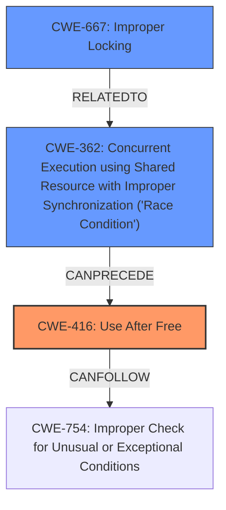

# Analysis for CVE-2024-57900

# Summary
| CWE ID | CWE Name | Confidence | CWE Abstraction Level | CWE Vulnerability Mapping Label | CWE-Vulnerability Mapping Notes |
|---|---|---|---|---|---|
| CWE-416 | Use After Free | 1.0 | Variant |  Primary | Allowed |
| CWE-362 | Concurrent Execution using Shared Resource with Improper Synchronization ('Race Condition') | 0.7 | Class | Secondary | Allowed-with-Review |
| CWE-667 | Improper Locking | 0.6 | Class | Secondary | Allowed-with-Review |

## Evidence and Confidence

*   **Confidence Score:** 0.9
*   **Evidence Strength:** HIGH

## Relationship Analysis
The primary weakness is a **Use After Free (CWE-416)**, which is a variant of a more general class of memory corruption issues. This can occur because of a **Race Condition (CWE-362)** where multiple threads access the same resource concurrently, leading to unexpected behavior. The fix implemented involves adding a mutex, which directly relates to **Improper Locking (CWE-667)**, as the original code lacked proper synchronization mechanisms.

## Vulnerability Chain
The vulnerability chain starts with a **Race Condition (CWE-362)**, which leads to a **Use After Free (CWE-416)**. The root cause is the lack of proper locking mechanisms, represented by **Improper Locking (CWE-667)**.

## Summary of Analysis
The primary vulnerability is a **Use After Free (CWE-416)**, as indicated by the "Vulnerability Description Key Phrases" which lists **use-after-free**. This is further supported by the KASAN report showing a **slab-use-after-free**. The fix implemented involves adding a mutex, which strongly suggests that a **Race Condition (CWE-362)** was present, leading to the memory corruption. The lack of a mutex is indicative of **Improper Locking (CWE-667)**, further solidifying this classification.

The retriever results also highly ranked CWE-416, further supporting this classification.

Other CWEs considered but not used:

*   CWE-909: Missing Initialization of Resource - While possible, the evidence more strongly points to a use-after-free scenario rather than a missing initialization.
*   CWE-415: Double Free - There is no evidence to suggest a double free condition.
*   CWE-911: Improper Update of Reference Count - This is not directly supported by the evidence.

Based on the evidence, relationship analysis, and retriever results, the selected CWEs are at the optimal level of specificity.