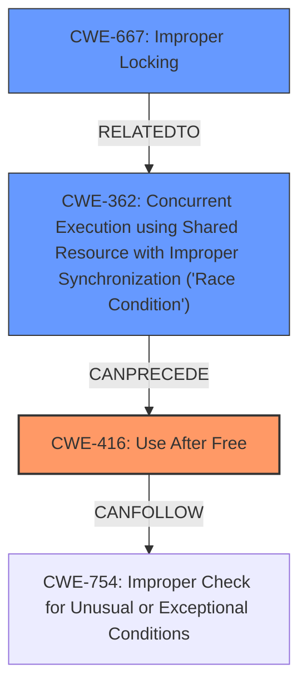

# Analysis Report for CVE-2024-57900

# Vulnerability Analysis Report: CVE-2024-57900

## Description

In the Linux kernel, the following vulnerability has been resolved ila serialize calls to nf_register_net_hooks() syzbot found a race in ila_add_mapping() [1] commit 031ae72825ce (ila call nf_unregister_net_hooks() sooner) attempted to fix a similar issue. Looking at the syzbot repro, we have concurrent ILA_CMD_ADD commands. Add a mutex to make sure at most one thread is calling nf_register_net_hooks(). [1] BUG KASAN slab-use-after-free in rht_key_hashfn include/linux/rhashtable.h159 [inline] BUG KASAN slab-use-after-free in __rhashtable_lookup.constprop.0+0x426/0x550 include/linux/rhashtable.h604 Read of size 4 at addr ffff888028f40008 by task dhcpcd/5501 CPU 1 UID 0 PID 5501 Comm dhcpcd Not tainted 6.13.0-rc4-syzkaller-00054-gd6ef8b40d075 #0 Hardware name Google Google Compute Engine/Google Compute Engine, BIOS Google 09/13/2024 Call Trace __dump_stack lib/dump_stack.c94 [inline] dump_stack_lvl+0x116/0x1f0 lib/dump_stack.c120 print_address_description mm/kasan/report.c378 [inline] print_report+0xc3/0x620 mm/kasan/report.c489 kasan_report+0xd9/0x110 mm/kasan/report.c602 rht_key_hashfn include/linux/rhashtable.h159 [inline] __rhashtable_lookup.constprop.0+0x426/0x550 include/linux/rhashtable.h604 rhashtable_lookup include/linux/rhashtable.h646 [inline] rhashtable_lookup_fast include/linux/rhashtable.h672 [inline] ila_lookup_wildcards net/ipv6/ila/ila_xlat.c127 [inline] ila_xlat_addr net/ipv6/ila/ila_xlat.c652 [inline] ila_nf_input+0x1ee/0x620 net/ipv6/ila/ila_xlat.c185 nf_hook_entry_hookfn include/linux/netfilter.h154 [inline] nf_hook_slow+0xbb/0x200 net/netfilter/core.c626 nf_hook.constprop.0+0x42e/0x750 include/linux/netfilter.h269 NF_HOOK include/linux/netfilter.h312 [inline] ipv6_rcv+0xa4/0x680 net/ipv6/ip6_input.c309 __netif_receive_skb_one_core+0x12e/0x1e0 net/core/dev.c5672 __netif_receive_skb+0x1d/0x160 net/core/dev.c5785 process_backlog+0x443/0x15f0 net/core/dev.c6117 __napi_poll.constprop.0+0xb7/0x550 net/core/dev.c6883 napi_poll net/core/dev.c6952 [inline] net_rx_action+0xa94/0x1010 net/core/dev.c7074 handle_softirqs+0x213/0x8f0 kernel/softirq.c561 __do_softirq kernel/softirq.c595 [inline] invoke_softirq kernel/softirq.c435 [inline] __irq_exit_rcu+0x109/0x170 kernel/softirq.c662 irq_exit_rcu+0x9/0x30 kernel/softirq.c678 instr_sysvec_apic_timer_interrupt arch/x86/kernel/apic/apic.c1049 [inline] sysvec_apic_timer_interrupt+0xa4/0xc0 arch/x86/kernel/apic/apic.c1049

## Vulnerability Description Key Phrases

- **Weakness:** slab-use-after-free, use-after-free
- **Product:** Linux kernel
- **Version:** 6.13.0-rc4-syzkaller-00054-gd6ef8b40d075

## Analysis (with Relationship Data)

# Summary
| CWE ID | CWE Name | Confidence | CWE Abstraction Level | CWE Vulnerability Mapping Label | CWE-Vulnerability Mapping Notes |
|---|---|---|---|---|---|
| CWE-416 | Use After Free | 1.0 | Variant |  Primary | Allowed |
| CWE-362 | Concurrent Execution using Shared Resource with Improper Synchronization ('Race Condition') | 0.7 | Class | Secondary | Allowed-with-Review |
| CWE-667 | Improper Locking | 0.6 | Class | Secondary | Allowed-with-Review |

## Evidence and Confidence

*   **Confidence Score:** 0.9
*   **Evidence Strength:** HIGH

## Relationship Analysis
The primary weakness is a **Use After Free (CWE-416)**, which is a variant of a more general class of memory corruption issues. This can occur because of a **Race Condition (CWE-362)** where multiple threads access the same resource concurrently, leading to unexpected behavior. The fix implemented involves adding a mutex, which directly relates to **Improper Locking (CWE-667)**, as the original code lacked proper synchronization mechanisms.



## Vulnerability Chain
The vulnerability chain starts with a **Race Condition (CWE-362)**, which leads to a **Use After Free (CWE-416)**. The root cause is the lack of proper locking mechanisms, represented by **Improper Locking (CWE-667)**.

## Summary of Analysis
The primary vulnerability is a **Use After Free (CWE-416)**, as indicated by the "Vulnerability Description Key Phrases" which lists **use-after-free**. This is further supported by the KASAN report showing a **slab-use-after-free**. The fix implemented involves adding a mutex, which strongly suggests that a **Race Condition (CWE-362)** was present, leading to the memory corruption. The lack of a mutex is indicative of **Improper Locking (CWE-667)**, further solidifying this classification.

The retriever results also highly ranked CWE-416, further supporting this classification.

Other CWEs considered but not used:

*   CWE-909: Missing Initialization of Resource - While possible, the evidence more strongly points to a use-after-free scenario rather than a missing initialization.
*   CWE-415: Double Free - There is no evidence to suggest a double free condition.
*   CWE-911: Improper Update of Reference Count - This is not directly supported by the evidence.

Based on the evidence, relationship analysis, and retriever results, the selected CWEs are at the optimal level of specificity.


## CWE Relationship Analysis

Current CWEs represent these abstraction levels: .


### Vulnerability Chain Analysis

**Chain starting from CWE-416:**
- 416 (Use After Free) - ROOT


**Chain starting from CWE-911:**
- 911 (Improper Update of Reference Count) - ROOT


### CWE Relationship Diagram

```mermaid
graph TD
    classDef primary fill:#f96,stroke:#333,stroke-width:2px
    classDef secondary fill:#69f,stroke:#333
    classDef tertiary fill:#9e9,stroke:#333
```


*Report generated on 2025-07-14 00:35:02*
