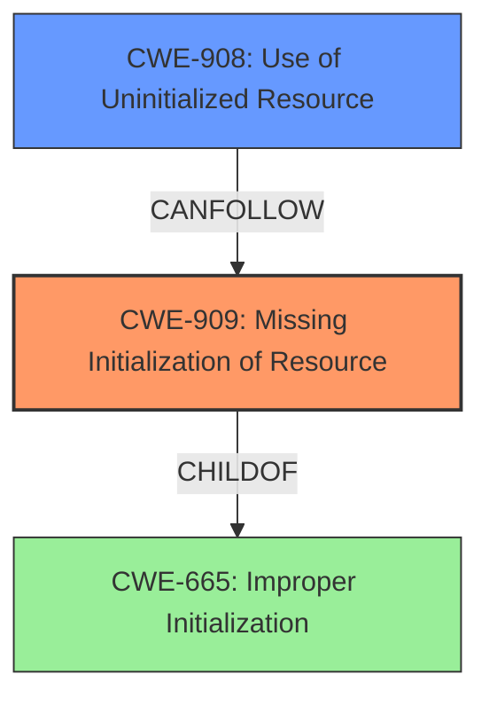

# Enhanced Analysis for CVE-2024-57943

# Summary

| CWE ID | CWE Name | Confidence | CWE Abstraction Level | CWE Vulnerability Mapping Label | CWE-Vulnerability Mapping Notes |
|---|---|---|---|---|---|
| CWE-909 | Missing Initialization of Resource | 0.8 | Class | Allowed-with-Review | Primary CWE |
| CWE-908 | Use of Uninitialized Resource | 0.7 | Base | Allowed | Secondary Candidate |

## Evidence and Confidence

*   **Confidence Score:** 0.75
*   **Evidence Strength:** MEDIUM

## Relationship Analysis
The primary relationship influencing the decision is the parent-child relationship between CWE-665 (Improper Initialization), CWE-909 (Missing Initialization of Resource), and CWE-908 (Use of Uninitialized Resource). CWE-909 is a child of CWE-665, and CWE-908 can result from CWE-909. The vulnerability description points to a **missing initialization**, leading to the use of **uninitialized data**. Therefore, CWE-909 is the most appropriate starting point.



## Vulnerability Chain
The vulnerability chain starts with a **missing initialization** of a resource (CWE-909). This leads to the use of **uninitialized data** (CWE-908), which is then written to the page cache, potentially leading to information disclosure or unpredictable behavior.

## Summary of Analysis
The analysis indicates that the root cause of the vulnerability is the **missing initialization** of a buffer before it is written to. The evidence for this is the phrase "**uninitialized data** in the page cache will be written" and "Before writing, if a buffer_head marked as new, its data must be zeroed". This directly corresponds to CWE-909 (Missing Initialization of Resource). While CWE-908 (Use of Uninitialized Resource) is also relevant as a consequence of the missing initialization, CWE-909 better represents the root cause.

The retriever results also point to CWE-909, CWE-457, and CWE-908 as potential candidates. Given that the description highlights that the buffer was not zeroed *before writing*, CWE-909 is more directly applicable. The relationships confirm this, as CWE-909 can lead to CWE-908.

CWE-457 (Use of Uninitialized Variable) was considered but deemed less appropriate. While variables can be part of the resource, CWE-909 is a more encompassing and accurate representation of the **missing initialization** of the buffer.

Relevant CWE Information:

# Enhanced Context (25 CWEs)
The following CWEs were identified as potentially relevant to this vulnerability:

## CWE-909: Missing Initialization of Resource
**Abstraction Level**: Class
**Similarity Score**: 0.74
**Source**: dense

**Description**:
The product does not initialize a critical resource.

**Mapping Guidance**:
- Usage: Allowed-with-Review
- Rationale: This CWE entry is a Class and might have Base-level children that would be more appropriate

## CWE-908: Use of Uninitialized Resource
**Abstraction Level**: Base
**Similarity Score**: 0.72
**Source**: dense

**Description**:
The product uses or accesses a resource that has not been initialized.

**Mapping Guidance**:
- Usage: Allowed
- Rationale: This CWE entry is at the Base level of abstraction, which is a preferred level of abstraction for mapping to the root causes of vulnerabilities.

## CWE-457: Use of Uninitialized Variable
**Abstraction Level**: Variant
**Similarity Score**: 0.71
**Source**: dense

**Description**:
The code uses a variable that has not been initialized, leading to unpredictable or unintended results.

**Mapping Guidance**:
- Usage: Allowed
- Rationale: This CWE entry is at the Variant level of abstraction, which is a preferred level of abstraction for mapping to the root causes of vulnerabilities.

## CWE-456: Missing Initialization of a Variable
**Abstraction Level**: variant
**Similarity Score**: 3.88
**Source**: graph

**Description**:
CWE-456: Missing Initialization of a Variable

**Mapping Guidance**:
- Usage: Allowed
- Rationale: This CWE entry is at the Variant level of abstraction, which is a preferred level of abstraction for mapping to the root causes of vulnerabilities.

**Relationships**:
- CANPRECEDE -> CWE-457
- CANPRECEDE -> CWE-98
- CANPRECEDE -> CWE-120
- CANPRECEDE -> CWE-89
- CHILDOF -> CWE-665

## CWE-787: Out-of-bounds Write
**Abstraction Level**: base
**Similarity Score**: 2.72
**Source**: graph

**Description**:
CWE-787: Out-of-bounds Write

**Mapping Guidance**:
- Usage: Allowed
- Rationale: This CWE entry is at the Base level of abstraction, which is a preferred level of abstraction for mapping to the root causes of vulnerabilities.

**Relationships**:
- CANFOLLOW -> CWE-825
- CANFOLLOW -> CWE-824
- CANFOLLOW -> CWE-823
- CANFOLLOW -> CWE-822
- PARENTOF -> CWE-124

CWE-787 (Out-of-bounds Write) was considered but not selected, because the primary issue isn't about writing beyond buffer boundaries, but rather that the data being written is **uninitialized**.

*   **CWE-909: Missing Initialization of Resource**
    *   Technical Explanation: The vulnerability arises because the buffer is not initialized (zeroed) before being written to the page cache. This means that the buffer may contain stale or **uninitialized data** from previous operations, which is then inadvertently written to storage.
    *   Security Implications: This can lead to information leakage if the **uninitialized data** contains sensitive information. It can also lead to unpredictable behavior if the **uninitialized data** affects program logic or data structures.
    *   Relationship Analysis: CWE-909 is a child of CWE-665 (Improper Initialization) and can precede CWE-908 (Use of Uninitialized Resource).
    *   Usage: Allowed-with-Review, given that this is a Class-level CWE, but it is the most specific Class for **missing initialization**.
    *   Primary Weakness
    *   Confidence: 0.8
*   **CWE-908: Use of Uninitialized Resource**
    *   Technical Explanation: As a consequence of the missing initialization, the system ends up using data from a resource (the buffer) that hasn't been properly set up.
    *   Security Implications: This can result in unpredictable program behavior, data corruption, or information leakage, depending on how the **uninitialized data** is used.
    *   Relationship Analysis: CWE-908 is a Base level CWE and a potential consequence of CWE-909.
    *   Usage: Allowed
    *   Secondary Candidate
    *   Confidence: 0.7


## CWE Relationship Analysis

Current CWEs represent these abstraction levels: .


### Vulnerability Chain Analysis

**Chain starting from CWE-665:**
- 665 (Improper Initialization) - ROOT


**Chain starting from CWE-89:**
- 89 (Improper Neutralization of Special Elements used in an SQL Command ('SQL Injection')) - ROOT


### CWE Relationship Diagram

```mermaid
graph TD
    classDef primary fill:#f96,stroke:#333,stroke-width:2px
    classDef secondary fill:#69f,stroke:#333
    classDef tertiary fill:#9e9,stroke:#333
```