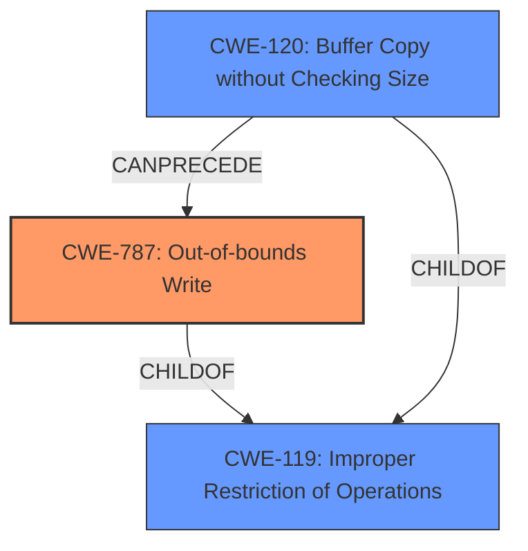

# Analysis Report for CVE-2024-57955

# Vulnerability Analysis Report: CVE-2024-57955

## Description

**Arbitrary write vulnerability** in the Gallery module Impact Successful exploitation of this vulnerability may affect service confidentiality.

## Vulnerability Description Key Phrases

- **Weakness:** Arbitrary write vulnerability
- **Impact:** affect service confidentiality
- **Component:** Gallery module

## Analysis (with Relationship Data)

# Summary
| CWE ID | CWE Name | Confidence | CWE Abstraction Level | CWE Vulnerability Mapping Label | CWE-Vulnerability Mapping Notes |
|---|---|---|---|---|---|
| CWE-787 | Out-of-bounds Write | 0.9 | Base | Primary | Allowed |

## Evidence and Confidence

*   **Confidence Score:** 0.9
*   **Evidence Strength:** MEDIUM

## Relationship Analysis
The primary relationship is the direct match of the vulnerability description to CWE-787. CWE-787 is a base level CWE, providing a good level of specificity. The other CWEs considered were either too general (CWE-119), or not directly related to the **arbitrary write vulnerability**.



## Vulnerability Chain
The vulnerability chain is straightforward. The **arbitrary write vulnerability** (CWE-787) leads to a potential compromise of service confidentiality.

## Summary of Analysis
The primary weakness identified is an **arbitrary write vulnerability**. This directly maps to CWE-787 (Out-of-bounds Write). The evidence for this is the "Vulnerability Description Key Phrases" which identifies the **weakness** as an "**Arbitrary write vulnerability**". The "Analysis of CVE-2024-57955 Content" also states "**Root cause of vulnerability:** The document states "**Arbitrary write vulnerability** in the Gallery module"". The impact of this vulnerability, as stated in both the vulnerability description and the CVE content summary, is that it "may affect service confidentiality."

CWE-787 is the most specific and appropriate CWE for this vulnerability. While CWE-119 (Improper Restriction of Operations within the Bounds of a Memory Buffer) is a parent of CWE-787, it is less specific.

Relevant CWE Information:

# Enhanced Context (25 CWEs)
The following CWEs were identified as potentially relevant to this vulnerability:

## CWE-434: Unrestricted Upload of File with Dangerous Type
**Abstraction Level**: Base
**Similarity Score**: 0.71

This CWE is not relevant, as it pertains to file uploads.

## CWE-209: Generation of Error Message Containing Sensitive Information
**Abstraction Level**: Base
**Similarity Score**: 0.69

This CWE is not relevant, as it pertains to error messages revealing sensitive information.

## CWE-639: Authorization Bypass Through User-Controlled Key
**Abstraction Level**: Base
**Similarity Score**: 0.69

This CWE is not relevant, as it pertains to authorization bypass.

## CWE-116: Improper Encoding or Escaping of Output
**Abstraction Level**: Class
**Similarity Score**: 0.69

This CWE is not relevant, as it pertains to encoding or escaping of output.

## CWE-267: Privilege Defined With Unsafe Actions
**Abstraction Level**: Base
**Similarity Score**: 0.68

This CWE is not relevant, as it pertains to privilege management.

## CWE-129: Improper Validation of Array Index
**Abstraction Level**: Variant
**Similarity Score**: 0.68

This CWE is not relevant, as the root cause is an **arbitrary write vulnerability** not related to improper validation of array index.

## CWE-789: Memory Allocation with Excessive Size Value
**Abstraction Level**: Variant
**Similarity Score**: 0.68

This CWE is not relevant, as the root cause is an **arbitrary write vulnerability** not related to memory allocation.

## CWE-88: Improper Neutralization of Argument Delimiters in a Command ('Argument Injection')
**Abstraction Level**: Base
**Similarity Score**: 0.68

This CWE is not relevant, as it pertains to argument injection.

## CWE-125: Out-of-bounds Read
**Abstraction Level**: Base
**Similarity Score**: 0.68

This CWE is not relevant, as the vulnerability is an **arbitrary write vulnerability**, not an out-of-bounds read.

## CWE-755: Improper Handling of Exceptional Conditions
**Abstraction Level**: Class
**Similarity Score**: 0.68

This CWE is not relevant, as it pertains to exception handling.

## CWE-125: Out-of-bounds Read
**Abstraction Level**: Base
**Similarity Score**: 583.19

This CWE is not relevant, as the vulnerability is an **arbitrary write vulnerability**, not an out-of-bounds read.

## CWE-190: Integer Overflow or Wraparound
**Abstraction Level**: Base
**Similarity Score**: 582.90

This CWE is not relevant, as the root cause is an **arbitrary write vulnerability** not related to integer overflows.

## CWE-787: Out-of-bounds Write
**Abstraction Level**: Base
**Similarity Score**: 579.83

This is the selected CWE, as it aligns with the **arbitrary write vulnerability**.

## CWE-119: Improper Restriction of Operations within the Bounds of a Memory Buffer
**Abstraction Level**: Class
**Similarity Score**: 574.45

This CWE is too general. CWE-787 is more specific and accurate.

## CWE-122: Heap-based Buffer Overflow
**Abstraction Level**: Variant
**Similarity Score**: 573.67

While this relates to memory corruption, the description lacks details to confirm whether the overflow is heap-based. CWE-787 is a more appropriate general term.

## CWE-190: Integer Overflow or Wraparound
**Abstraction Level**: base
**Similarity Score**: 4.33

This CWE is not relevant, as the root cause is an **arbitrary write vulnerability** not related to integer overflows.

## CWE-825: Expired Pointer Dereference
**Abstraction Level**: base
**Similarity Score**: 4.33

This CWE is not relevant, as it is not related to pointer dereferencing.

## CWE-787: Out-of-bounds Write
**Abstraction Level**: base
**Similarity Score**: 4.33

This is the selected CWE, as it aligns with the **arbitrary write vulnerability**.

## CWE-131: Incorrect Calculation of Buffer Size
**Abstraction Level**: base
**Similarity Score**: 4.33

This CWE is not relevant, as the root cause is an **arbitrary write vulnerability** not related to buffer size calculation.

## CWE-94: Improper Control of Generation of Code ('Code Injection')
**Abstraction Level**: base
**Similarity Score**: 3.07

This CWE is not relevant because the vulnerability is related to an **arbitrary write**, not code injection.

## CWE-128: Wrap-around Error
**Abstraction Level**: base
**Similarity Score**: 2.91

This CWE is not relevant, as the root cause is an **arbitrary write vulnerability** not related to wrap-around errors.

## CWE-1339: Insufficient Precision or Accuracy of a Real Number
**Abstraction Level**: base
**Similarity Score**: 2.91

This CWE is not relevant, as the root cause is an **arbitrary write vulnerability** not related to real number precision.

## CWE-125: Out-of-bounds Read
**Abstraction Level**: Base
**Similarity Score**: 2.88

This CWE is not relevant, as the vulnerability is an **arbitrary write vulnerability**, not an out-of-bounds read.

## CWE-73: External Control of File Name or Path
**Abstraction Level**: base
**Similarity Score**: 2.87

This CWE is not relevant because the vulnerability is related to an **arbitrary write**, not external control of filenames or paths.

## CWE-824: Access of Uninitialized Pointer
**Abstraction Level**: base
**Similarity Score**: 2.87

This CWE is not relevant, as it is not related to pointer dereferencing.


## CWE Relationship Analysis

Current CWEs represent these abstraction levels: .


### Vulnerability Chain Analysis

**Chain starting from CWE-94:**
- 94 (Improper Control of Generation of Code ('Code Injection')) - ROOT


**Chain starting from CWE-639:**
- 639 (Authorization Bypass Through User-Controlled Key) - ROOT


### CWE Relationship Diagram

```mermaid
graph TD
    classDef primary fill:#f96,stroke:#333,stroke-width:2px
    classDef secondary fill:#69f,stroke:#333
    classDef tertiary fill:#9e9,stroke:#333
```


*Report generated on 2025-07-14 00:38:46*
