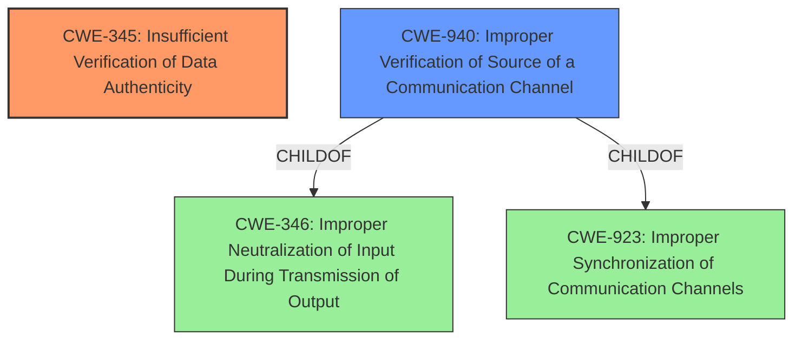

# Enhanced Analysis for CVE-2024-57962

# Summary
| CWE ID | CWE Name | Confidence | CWE Abstraction Level | CWE Vulnerability Mapping Label | CWE-Vulnerability Mapping Notes |
|---|---|---|---|---|---|
| CWE-345 | Insufficient Verification of Data Authenticity | 0.8 | Class | Primary CWE | Allowed-with-Review |
| CWE-940 | Improper Verification of Source of a Communication Channel | 0.6 | Base | Secondary Candidate | Allowed |

## Evidence and Confidence

*   **Confidence Score:** 0.7
*   **Evidence Strength:** MEDIUM

## Relationship Analysis
The primary relationship considered was the parent-child relationship. CWE-345 is a Class-level CWE, and CWE-940 is a Base-level CWE and a ChildOf CWE-346 and CWE-923. While both relate to verification issues, CWE-345 is a broader category. Given the specific context of a VPN service module, which inherently involves communication channels, CWE-940 could also be a relevant consideration. However, the description focuses on the general lack of verification, making CWE-345 more directly applicable as the primary classification, although it is a class and could have more specific base level children.



## Vulnerability Chain
The vulnerability chain starts with **incomplete verification information**, leading to a potential impact on availability.
  - The **root cause** is the **incomplete verification information**.
  - The impact is that successful exploitation may affect availability.
  - The missing link is the specific exploitation vector, i.e., how the **incomplete verification** leads to an availability issue.

## Summary of Analysis
The initial analysis focused on identifying the **root cause** and impact from the vulnerability description. The description explicitly mentions **"incomplete verification information"** as the **root cause**, which directly aligns with CWE-345. The CVE Reference Links Content Summary section confirms this understanding.

The Retriever Results provided several candidate CWEs, including CWE-297, CWE-347, CWE-119, and CWE-125. While these CWEs are related to security vulnerabilities, they are not as directly relevant as CWE-345. For example, CWE-297 (Improper Validation of Certificate with Host Mismatch) is specific to certificate validation, while the vulnerability description is more general. Similarly, CWE-119 (Improper Restriction of Operations within the Bounds of a Memory Buffer) and CWE-125 (Out-of-bounds Read) relate to memory management issues, which are not mentioned in the vulnerability description.

CWE-940 (Improper Verification of Source of a Communication Channel) was also considered, given that the vulnerability is in the VPN service module. However, since the description doesn't specify the communication channel, CWE-345 is more suitable as the primary CWE.

The final decision is based on the available evidence, which points to **incomplete verification information** as the **root cause** of the vulnerability. CWE-345 is the most appropriate CWE to capture this weakness.

Relevant CWE Information:

# Enhanced Context (25 CWEs)
The following CWEs were identified as potentially relevant to this vulnerability:

## CWE-755: Improper Handling of Exceptional Conditions
**Abstraction Level**: Class
**Similarity Score**: 0.72
**Source**: dense

**Description**:
The product does not handle or incorrectly handles an exceptional condition.

**Mapping Guidance**:
- Usage: Discouraged
- Rationale: This CWE entry is a level-1 Class (i.e., a child of a Pillar). It might have lower-level children that would be more appropriate
- *Not Selected*: This CWE is too general and does not directly address the **root cause** of **incomplete verification information**.

## CWE-345: Insufficient Verification of Data Authenticity
**Abstraction Level**: Class
**Similarity Score**: 0.71
**Source**: dense

**Description**:
The product does not sufficiently verify the origin or authenticity of data, in a way that causes it to accept invalid data.

**Mapping Guidance**:
- Usage: Discouraged
- Rationale: This CWE entry is a level-1 Class (i.e., a child of a Pillar). It might have lower-level children that would be more appropriate
- *Selected*: This CWE directly matches the vulnerability description's **root cause** of **"incomplete verification information"**.

## CWE-203: Observable Discrepancy
**Abstraction Level**: Base
**Similarity Score**: 0.71
**Source**: dense

**Description**:
The product behaves differently or sends different responses under different circumstances in a way that is observable to an unauthorized actor, which exposes security-relevant information about the state of the product, such as whether a particular operation was successful or not.

**Mapping Guidance**:
- Usage: Allowed
- Rationale: This CWE entry is at the Base level of abstraction, which is a preferred level of abstraction for mapping to the root causes of vulnerabilities.
- *Not Selected*: This CWE relates to observable discrepancies, which is not directly related to the **root cause** of **incomplete verification**.

## CWE-303: Incorrect Implementation of Authentication Algorithm
**Abstraction Level**: Base
**Similarity Score**: 0.71
**Source**: dense

**Description**:
The requirements for the product dictate the use of an established authentication algorithm, but the implementation of the algorithm is incorrect.

**Mapping Guidance**:
- Usage: Allowed
- Rationale: This CWE entry is at the Base level of abstraction, which is a preferred level of abstraction for mapping to the root causes of vulnerabilities.
- *Not Selected*: This CWE relates to authentication algorithm implementation, which is not specified in the vulnerability description.

## CWE-297: Improper Validation of Certificate with Host Mismatch
**Abstraction Level**: Variant
**Similarity Score**: 0.71
**Source**: dense

**Description**:
The product communicates with a host that provides a certificate, but the product does not properly ensure that the certificate is actually associated with that host.

**Mapping Guidance**:
- Usage: Allowed
- Rationale: This CWE entry is at the Variant level of abstraction, which is a preferred level of abstraction for mapping to the root causes of vulnerabilities.
- *Not Selected*: This CWE is specific to certificate validation, while the vulnerability description is more general.

## CWE-347: Improper Verification of Cryptographic Signature
**Abstraction Level**: Base
**Similarity Score**: 0.71
**Source**: dense

**Description**:
The product does not verify, or incorrectly verifies, the cryptographic signature for data.

**Mapping Guidance**:
- Usage: Allowed
- Rationale: This CWE entry is at the Base level of abstraction, which is a preferred level of abstraction for mapping to the root causes of vulnerabilities.
- *Not Selected*: This CWE is specific to cryptographic signature verification, while the vulnerability description is more general.

## CWE-295: Improper Certificate Validation
**Abstraction Level**: Base
**Similarity Score**: 0.70
**Source**: dense

**Description**:
The product does not validate, or incorrectly validates, a certificate.

**Mapping Guidance**:
- Usage: Allowed
- Rationale: This CWE entry is at the Base level of abstraction, which is a preferred level of abstraction for mapping to the root causes of vulnerabilities.
- *Not Selected*: This CWE is specific to certificate validation, while the vulnerability description is more general.

## CWE-1391: Use of Weak Credentials
**Abstraction Level**: Class
**Similarity Score**: 0.70
**Source**: dense

**Description**:
The product uses weak credentials (such as a default key or hard-coded password) that can be calculated, derived, reused, or guessed by an attacker.

**Mapping Guidance**:
- Usage: Allowed-with-Review
- Rationale: This CWE entry is a Class and might have Base-level children that would be more appropriate
- *Not Selected*: This CWE relates to weak credentials, which is not mentioned in the vulnerability description.

## CWE-288: Authentication Bypass Using an Alternate Path or Channel
**Abstraction Level**: Base
**Similarity Score**: 0.69
**Source**: dense

**Description**:
The product requires authentication, but the product has an alternate path or channel that does not require authentication.

**Mapping Guidance**:
- Usage: Allowed
- Rationale: This CWE entry is at the Base level of abstraction, which is a preferred


## CWE Relationship Analysis

Current CWEs represent these abstraction levels: .


### Vulnerability Chain Analysis

**Chain starting from CWE-288:**
- 288 (Authentication Bypass Using an Alternate Path or Channel) - ROOT


**Chain starting from CWE-1391:**
- 1391 (Use of Weak Credentials) - ROOT


### CWE Relationship Diagram

```mermaid
graph TD
    classDef primary fill:#f96,stroke:#333,stroke-width:2px
    classDef secondary fill:#69f,stroke:#333
    classDef tertiary fill:#9e9,stroke:#333
```