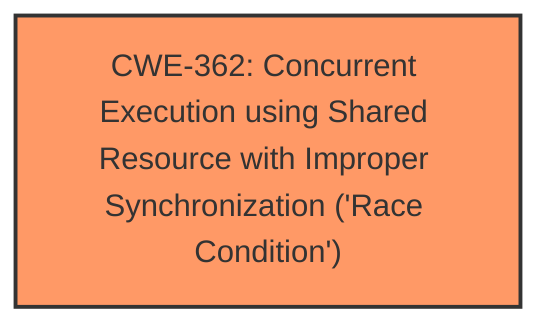

# Analysis Report for CVE-2024-57974

# Vulnerability Analysis Report: CVE-2024-57974

## Description

In the Linux kernel, the following vulnerability has been resolved udp Deal with race between UDP socket address change and rehash If a UDP socket changes its local address while its receiving datagrams, as a result of connect(), there is a period during which a lookup operation might fail to find it, after the address is changed but before the secondary hash (port and address) and the four-tuple hash (local and remote ports and addresses) are updated. Secondary hash chains were introduced by commit 30fff9231fad (udp bind() optimisation) and, as a result, a rehash operation became needed to make a bound socket reachable again after a connect(). This operation was introduced by commit 719f835853a9 (udp add rehash on connect()) which isnt however a complete fix the socket will be found once the rehashing completes, but not while its pending. This is noticeable with a socat(1) server in UDP4-LISTEN mode, and a client sending datagrams to it. After the server receives the first datagram (cf. _xioopen_ipdgram_listen()), it issues a connect() to the address of the sender, in order to set up a directed flow. Now, if the client, running on a different CPU thread, happens to send a (subsequent) datagram while the servers socket changes its address, but is not rehashed yet, this will result in a failed lookup and a port unreachable error delivered to the client, as apparent from the following reproducer LEN=$(($(cat /proc/sys/net/core/wmem_default) / 4)) dd if=/dev/urandom bs=1 count=${LEN} of=tmp.in while do taskset -c 1 socat UDP4-LISTEN1337,null-eof OPENtmp.out,create,trunc & sleep 0.1 || sleep 1 taskset -c 2 socat OPENtmp.in UDP4localhost1337,shut-null wait done where the client will eventually get ECONNREFUSED on a write() (typically the second or third one of a given iteration) 2024/11/13 212823 socat[46901] E write(6, 0x556db2e3c000, 8192) Connection refused This issue was first observed as a seldom failure in Podmans tests checking UDP functionality while using pasta(1) to connect the containers network namespace, which leads us to a reproducer with the lookup error resulting in an ICMP packet on a tap device LOCAL_ADDR=$(ip -j -4 addr show|jq -rM .[] | .addr_info[0] | select(.scope == global).local) while do ./pasta --config-net -p pasta.pcap -u 1337 socat UDP4-LISTEN1337,null-eof OPENtmp.out,create,trunc & sleep 0.2 || sleep 1 socat OPENtmp.in UDP4${LOCAL_ADDR}1337,shut-null wait cmp tmp.in tmp.out done Once this fails tmp.in tmp.out differ char 8193, line 29 we can finally have a look at whats going on $ tshark -r pasta.pcap 1 0.000000 ? ff0216 ICMPv6 110 Multicast Listener Report Message v2 2 0.168690 88.198.0.161 ? 88.198.0.164 UDP 8234 60260 ? 1337 Len=8192 3 0.168767 88.198.0.161 ? 88.198.0.164 UDP 8234 60260 ? 1337 Len=8192 4 0.168806 88.198.0.161 ? 88.198.0.164 UDP 8234 60260 ? 1337 Len=8192 5 0.168827 c647058ddc04 ? Broadcast ARP 42 Who has 88.198.0.161? Tell 88.198.0.164 6 0.168851 9a559a559a55 ? c647058ddc04 ARP 42 88.198.0.161 is at 9a559a559a55 7 0.168875 88.198.0.161 ? 88.198.0.164 UDP 8234 60260 ? 1337 Len=8192 8 0.168896 88.198.0.164 ? 88.198.0.161 ICMP 590 Destination unreachable (Port unreachable) 9 0.168926 88.198.0.161 ? 88.198.0.164 UDP 8234 60260 ? 1337 Len=8192 10 0.168959 88.198.0.161 ? 88.198.0.164 UDP 8234 60260 ? 1337 Len=8192 11 0.168989 88.198.0.161 ? 88.198.0.164 UDP 4138 60260 ? 1337 Len=4096 12 0.169010 88.198.0.161 ? 88.198.0.164 UDP 42 60260 ? 1337 Len=0 On the third datagram received, the network namespace of the container initiates an ARP lookup to deliver the ICMP message. In another variant of this reproducer, starting the client with strace -f pasta --config-net -u 1337 socat UDP4-LISTEN1337,null-eof OPENtmp.out,create,tru ---truncated---

## Vulnerability Description Key Phrases

- **Component:** udp
- **Rootcause:** race condition
- **Product:** Linux kernel
- **Impact:** failed lookup, port unreachable error delivered to the client

## Analysis (with Relationship Data)

# Summary
| CWE ID | CWE Name | Confidence | CWE Abstraction Level | CWE Vulnerability Mapping Label | CWE-Vulnerability Mapping Notes |
|---|---|---|---|---|---|
| CWE-362 | Concurrent Execution using Shared Resource with Improper Synchronization ('Race Condition') | 1.0 | Class | Allowed-with-Review | Primary CWE |

## Evidence and Confidence

*   **Confidence Score:** 1.0
*   **Evidence Strength:** HIGH

## Relationship Analysis
The primary identified CWE is CWE-362, which is a Class-level CWE. While it is a Class, the description of the vulnerability aligns directly with it. There may be more specific Base level CWEs that apply but the description provided doesn't specify which shared resource is improperly synchronized so it's difficult to choose a CWE without more information.



## Vulnerability Chain
The vulnerability chain starts with a **race condition** (CWE-362) in the UDP socket address change and rehash process. This leads to a failed lookup, ultimately resulting in a port unreachable error delivered to the client.

## Summary of Analysis
The analysis is based on the provided evidence, specifically the "Vulnerability Description Key Phrases" which explicitly mentions "**race condition**" as the root cause. The description details a scenario where a UDP socket changes its local address, creating a timing window where lookups can fail due to incomplete rehashing. This directly aligns with CWE-362, which describes concurrent execution accessing a shared resource without proper synchronization.

The retriever results also support this, listing CWE-362 as the top combined result with a score of 1.000.

Therefore, CWE-362 is the most appropriate mapping, and it is at the optimal level of specificity given the available information.

Relevant CWE Information:

# Enhanced Context (25 CWEs)
The following CWEs were identified as potentially relevant to this vulnerability:

## CWE-362: Concurrent Execution using Shared Resource with Improper Synchronization ('Race Condition')
**Abstraction Level**: Class
**Similarity Score**: 0.78
**Source**: dense

**Description**:
The product contains a concurrent code sequence that requires temporary, exclusive access to a shared resource, but a timing window exists in which the shared resource can be modified by another code sequence operating concurrently.

**Mapping Guidance**:
- Usage: Allowed-with-Review
- Rationale: This CWE entry is a Class and might have Base-level children that would be more appropriate

## CWE-667: Improper Locking
**Abstraction Level**: Class
**Similarity Score**: 0.77
**Source**: dense

**Description**:
The product does not properly acquire or release a lock on a resource, leading to unexpected resource state changes and behaviors.

**Mapping Guidance**:
- Usage: Allowed-with-Review
- Rationale: This CWE entry is a Class and might have Base-level children that would be more appropriate

## CWE-617: Reachable Assertion
**Abstraction Level**: Base
**Similarity Score**: 0.76
**Source**: dense

**Description**:
The product contains an assert() or similar statement that can be triggered by an attacker, which leads to an application exit or other behavior that is more severe than necessary.

**Mapping Guidance**:
- Usage: Allowed
- Rationale: This CWE entry is at the Base level of abstraction, which is a preferred level of abstraction for mapping to the root causes of vulnerabilities.

## CWE-754: Improper Check for Unusual or Exceptional Conditions
**Abstraction Level**: Class
**Similarity Score**: 0.76
**Source**: dense

**Description**:
The product does not check or incorrectly checks for unusual or exceptional conditions that are not expected to occur frequently during day to day operation of the product.

**Mapping Guidance**:
- Usage: Allowed-with-Review
- Rationale: This CWE entry is a Class and might have Base-level children that would be more appropriate

## CWE-367: Time-of-check Time-of-use (TOCTOU) Race Condition
**Abstraction Level**: Base
**Similarity Score**: 0.76
**Source**: dense

**Description**:
The product checks the state of a resource before using that resource, but the resource's state can change between the check and the use in a way that invalidates the results of the check. This can cause the product to perform invalid actions when the resource is in an unexpected state.

**Mapping Guidance**:
- Usage: Allowed
- Rationale: This CWE entry is at the Base level of abstraction, which is a preferred level of abstraction for mapping to the root causes of vulnerabilities.

## CWE-755: Improper Handling of Exceptional Conditions
**Abstraction Level**: Class
**Similarity Score**: 0.76
**Source**: dense

**Description**:
The product does not handle or incorrectly handles an exceptional condition.

**Mapping Guidance**:
- Usage: Discouraged
- Rationale: This CWE entry is a level-1 Class (i.e., a child of a Pillar). It might have lower-level children that would be more appropriate

## CWE-476: NULL Pointer Dereference
**Abstraction Level**: Base
**Similarity Score**: 0.75
**Source**: dense

**Description**:
The product dereferences a pointer that it expects to be valid but is NULL.

**Mapping Guidance**:
- Usage: Allowed
- Rationale: This CWE entry is at the Base level of abstraction, which is a preferred level of abstraction for mapping to the root causes of vulnerabilities.

## CWE-346: Origin Validation Error
**Abstraction Level**: Class
**Similarity Score**: 0.75
**Source**: dense

**Description**:
The product does not properly verify that the source of data or communication is valid.

**Mapping Guidance**:
- Usage: Allowed-with-Review
- Rationale: This CWE entry is a Class and might have Base-level children that would be more appropriate

## CWE-404: Improper Resource Shutdown or Release
**Abstraction Level**: Class
**Similarity Score**: 0.75
**Source**: dense

**Description**:
The product does not release or incorrectly releases a resource before it is made available for re-use.

**Mapping Guidance**:
- Usage: Allowed-with-Review
- Rationale: This CWE entry is a Class and might have Base-level children that would be more appropriate

## CWE-193: Off-by-one Error
**Abstraction Level**: Base
**Similarity Score**: 0.75
**Source**: dense

**Description**:
A product calculates or uses an incorrect maximum or minimum value that is 1 more, or 1 less, than the correct value.

**Mapping Guidance**:
- Usage: Allowed
- Rationale: This CWE entry is at the Base level of abstraction, which is a preferred level of abstraction for mapping to the root causes of vulnerabilities.

## CWE-835: Loop with Unreachable Exit Condition ('Infinite Loop')
**Abstraction Level**: Base
**Similarity Score**: 1067.91
**Source**: sparse

**Description**:
The product contains an iteration or loop with an exit condition that cannot be reached, i.e., an infinite loop.

**Mapping Guidance**:
- Usage: Allowed
- Rationale: This CWE entry is at the Base level of abstraction, which is a preferred level of abstraction for mapping to the root causes of vulnerabilities.

## CWE-789: Memory Allocation with Excessive Size Value
**Abstraction Level**: Variant
**Similarity Score**: 1066.72
**Source**: sparse

**Description**:
The product allocates memory based on an untrusted, large size value, but it does not ensure that the size is within expected limits, allowing arbitrary amounts of memory to be allocated.

**Mapping Guidance**:
- Usage: Allowed
- Rationale: This CWE entry is at the Variant level of abstraction, which is a preferred level of abstraction for mapping to the root causes of vulnerabilities.

## CWE-362: Concurrent Execution using Shared Resource with Improper Synchronization ('Race Condition')
**Abstraction Level**: Class
**Similarity Score**: 1042.56
**Source**: sparse

**Description**:
The product contains a concurrent code sequence that requires temporary, exclusive access to a shared resource, but a timing window exists in which the shared resource can be modified by another code sequence operating concurrently.

**Mapping Guidance**:
- Usage: Allowed-with-Review
- Rationale: This CWE entry is a Class and might have Base-level children that would be more appropriate

## CWE-476: NULL Pointer Dereference
**Abstraction Level**: Base
**Similarity Score**: 1038.83
**Source**: sparse

**Description**:
The product dereferences a pointer that it expects to be valid but is NULL.

**Mapping Guidance**:
- Usage: Allowed
- Rationale: This CWE entry is at the Base level of abstraction, which is a preferred level of abstraction for mapping to the root causes of vulnerabilities.

## CWE-190: Integer Overflow or Wraparound
**Abstraction Level**: Base
**Similarity Score**: 1034.24
**Source**: sparse


## CWE Relationship Analysis

Current CWEs represent these abstraction levels: .


### Vulnerability Chain Analysis

**Chain starting from CWE-476:**
- 476 (NULL Pointer Dereference) - ROOT


**Chain starting from CWE-346:**
- 346 (Origin Validation Error) - ROOT


### CWE Relationship Diagram

```mermaid
graph TD
    classDef primary fill:#f96,stroke:#333,stroke-width:2px
    classDef secondary fill:#69f,stroke:#333
    classDef tertiary fill:#9e9,stroke:#333
```


*Report generated on 2025-07-14 00:40:07*
