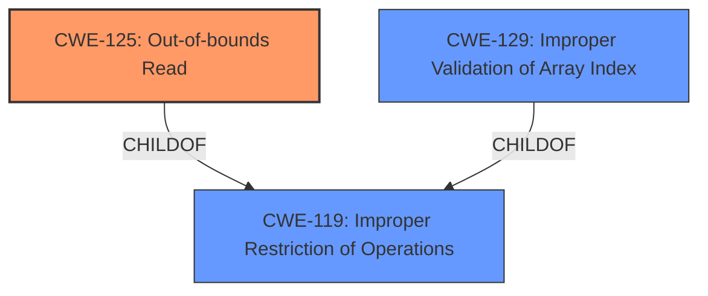

# Raw Analyzer Response for CVE-2024-57998

# Summary
| CWE ID | CWE Name | Confidence | CWE Abstraction Level | CWE Vulnerability Mapping Label | CWE-Vulnerability Mapping Notes |
|---|---|---|---|---|---|
| CWE-125 | Out-of-bounds Read | 0.8 | Base | Primary CWE | Allowed |
| CWE-129 | Improper Validation of Array Index | 0.7 | Variant | Secondary Candidate | Allowed |
| CWE-119 | Improper Restriction of Operations within the Bounds of a Memory Buffer | 0.5 | Class | Secondary Candidate | Discouraged |

## Evidence and Confidence

*   **Confidence Score:** 0.7
*   **Evidence Strength:** MEDIUM

## Relationship Analysis
The primary relationship that influenced the decision was the hierarchical relationship between CWE-119, CWE-125, and CWE-129. CWE-125 (Out-of-bounds Read) and CWE-129 (Improper Validation of Array Index) are both children of CWE-119 (Improper Restriction of Operations within the Bounds of a Memory Buffer). The description indicates that the vulnerability involves reading data past the end of a buffer, which aligns with CWE-125. Furthermore, the added index check to prevent the **buffer overflow** suggests a problem with array index validation which aligns with CWE-129. Selecting CWE-125 and CWE-129 provides a more specific and accurate representation of the weakness than the more general CWE-119.

## Vulnerability Chain
The vulnerability chain starts with a potential **improper** or **missing** index validation, leading to an out-of-bounds read in the `_read_freq()` function.

## Summary of Analysis
The primary weakness is identified as CWE-125 (Out-of-bounds Read) because the core issue revolves around reading data beyond the intended buffer limits. The vulnerability description states that a **buffer overflow** could occur in the `_read_freq()` function if an out-of-bounds read happens. The added index check to the assert function confirms this. While CWE-119 (Improper Restriction of Operations within the Bounds of a Memory Buffer) is a broader category, CWE-125 specifically addresses the read operation. CWE-129 (Improper Validation of Array Index) is included as a secondary candidate because the fix involves adding index checks, suggesting that the root cause might stem from **improper** validation of array indices. The choice of CWE-125 is supported by the retriever results, which lists it as a potentially relevant CWE. The evidence from the description directly supports this classification, as it mentions the possibility of reading a frequency out of the `opp->rates[]` table.

CWEs considered but not used:

*   CWE-119: While this is a parent of CWE-125 and listed as the top combined result by the retriever, it is too general. The vulnerability is specifically about reading out of bounds.
*   CWE-190 and CWE-191: These relate to integer overflow and underflow, but there's no evidence in the description to suggest these are involved.
*   CWE-120: This relates to buffer copies without checking size, but the vulnerability is specifically about reading out of bounds, not writing.
*   CWE-617: This relates to reachable assertions, but the assertion is being added as a mitigation, not as the cause of the vulnerability.
*   CWE-1284 and CWE-1285: These relate to improper validation of specified quantity and index, but the specific issue is with an array index, making CWE-129 a better fit.
*   CWE-122: This relates to heap-based buffer overflows, but the description doesn't specify where the buffer is allocated, making CWE-125 a more general and applicable choice.