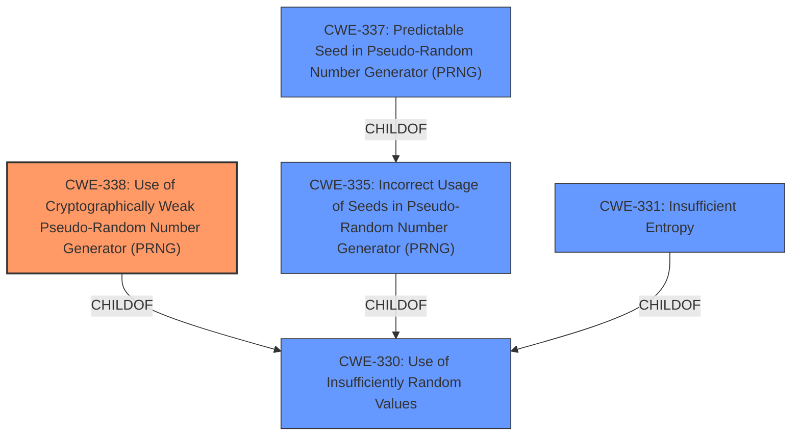

# Analysis Report for CVE-2024-58036

# Vulnerability Analysis Report: CVE-2024-58036

## Description

NetDropboxAPI 1.9 and earlier for Perl **uses the rand() function as the default source of entropy**, which is not cryptographically secure, for cryptographic functions. Specifically NetDropboxAPI uses the DataRandom library which specifically states that it is Useful mostly for test programs. DataRandom uses the rand() function.

## Vulnerability Description Key Phrases

- **Rootcause:** uses the rand() function as the default source of entropy
- **Impact:** entropy not cryptographically secure
- **Product:** NetDropboxAPI
- **Version:** 1.9 and earlier

## Analysis (with Relationship Data)

# Summary
| CWE ID | CWE Name | Confidence | CWE Abstraction Level | CWE Vulnerability Mapping Label | CWE-Vulnerability Mapping Notes |
|---|---|---|---|---|---|
| CWE-338 | Use of Cryptographically Weak Pseudo-Random Number Generator (PRNG) | 1.0 | Base | Primary | Allowed |

## Evidence and Confidence

*   **Confidence Score:** 1.0
*   **Evidence Strength:** HIGH

## Relationship Analysis
The primary CWE selected is CWE-338, which is a Base level CWE. The retriever results included several other CWEs related to random number generation, such as CWE-335, CWE-330, CWE-331, and CWE-337. These CWEs are either parents, children, or peers of CWE-338, indicating a strong relationship within the domain of random number generation vulnerabilities. The choice of CWE-338 is based on its direct relevance to the vulnerability description, which explicitly mentions the use of a cryptographically weak PRNG.



## Vulnerability Chain
The vulnerability chain starts with the **use of the `rand()` function as the default source of entropy**, which is cryptographically weak (CWE-338). This leads to the generation of predictable random numbers, which can then be exploited to compromise cryptographic functions.

## Summary of Analysis
The analysis is based on the vulnerability description and the information provided in the CVE reference links content summary. The vulnerability description clearly states that the product **uses the `rand()` function as the default source of entropy**, which is not cryptographically secure. The CVE reference links content summary confirms that the `rand()` function in Perl is **not fit for security purposes** because it is seeded by only 32 bits and its output is easily predictable. This directly matches the description of CWE-338, which is the **use of a cryptographically weak pseudo-random number generator (PRNG)**. The selection of CWE-338 is at the optimal level of specificity, as it accurately represents the root cause of the vulnerability.

Relevant CWE Information:

# Enhanced Context (25 CWEs)
The following CWEs were identified as potentially relevant to this vulnerability:

## CWE-338: Use of Cryptographically Weak Pseudo-Random Number Generator (PRNG)
**Abstraction Level**: Base
**Similarity Score**: 0.82
**Source**: dense

**Description**:
The product uses a Pseudo-Random Number Generator (PRNG) in a security context, but the PRNG's algorithm is not cryptographically strong.

**Mapping Guidance**:
- Usage: Allowed
- Rationale: This CWE entry is at the Base level of abstraction, which is a preferred level of abstraction for mapping to the root causes of vulnerabilities.

## Technical Explanation for CWE-338:

*   **How the vulnerability's details match the CWE's characteristics:** The vulnerability description states that the application uses the `rand()` function as a source of entropy, which is known to be cryptographically weak. This aligns directly with CWE-338, which describes the use of a PRNG that is not cryptographically strong.
*   **The security implications and potential impact:** Using a cryptographically weak PRNG can lead to the generation of predictable random numbers, which can be exploited to compromise cryptographic functions, such as key generation, session ID generation, and other security-sensitive operations. This can lead to unauthorized access, data breaches, and other security incidents.
*   **Any parent-child relationships or chain patterns that influenced your mapping:** CWE-338 is a child of CWE-330 (Use of Insufficiently Random Values). This relationship indicates that the use of a cryptographically weak PRNG is a specific case of using insufficiently random values.
*   **Whether the weakness is primary or secondary in the vulnerability:** The weakness is primary, as the **use of the `rand()` function as a source of entropy** is the root cause of the vulnerability.
*   **How the official MITRE mapping guidance influenced your decision:** The MITRE mapping guidance for CWE-338 states that it is at the Base level of abstraction, which is a preferred level of abstraction for mapping to the root causes of vulnerabilities, and its usage is "Allowed".

### CWEs Considered But Not Used:

*   **CWE-330: Use of Insufficiently Random Values:** This CWE is a class-level CWE and is too general for this vulnerability. While the vulnerability does involve the use of insufficiently random values, CWE-338 is a more specific and accurate representation of the weakness.
*   **CWE-335: Incorrect Usage of Seeds in Pseudo-Random Number Generator (PRNG):** This CWE is related to the incorrect usage of seeds in PRNGs. While the `rand()` function uses a seed, the primary issue is that the PRNG itself is cryptographically weak, not that the seed is being used incorrectly.
*   **CWE-331: Insufficient Entropy:** This CWE is related to the use of algorithms or schemes that produce insufficient entropy. While the `rand()` function may produce insufficient entropy, the primary issue is that it is a cryptographically weak PRNG.
*   **CWE-337: Predictable Seed in Pseudo-Random Number Generator (PRNG):** This CWE is related to the use of predictable seeds in PRNGs. While the `rand()` function uses a predictable seed, the primary issue is that the PRNG itself is cryptographically weak, not just the seed.
*   **CWE-1204: Generation of Weak Initialization Vector (IV):** This CWE relates to the generation of weak initialization vectors, which is not the primary issue in this vulnerability.
*   **CWE-1240: Use of a Cryptographic Primitive with a Risky Implementation:** This CWE relates to the implementation of cryptographic algorithms using non-standard or unproven methods. While using `rand()` might be considered risky, the core issue is the weakness of the PRNG itself, not necessarily the implementation.
*   **CWE-332: Insufficient Entropy in PRNG:** This is similar to CWE-331, but specific to PRNGs. CWE-338 is still a better fit as it directly addresses the use of a cryptographically weak PRNG.
*   **CWE-804: Guessable CAPTCHA:** This CWE is not relevant to the vulnerability description.


## CWE Relationship Analysis

Current CWEs represent these abstraction levels: .


### Vulnerability Chain Analysis

**Chain starting from CWE-338:**
- 338 (Use of Cryptographically Weak Pseudo-Random Number Generator (PRNG)) - ROOT


**Chain starting from CWE-335:**
- 335 (Incorrect Usage of Seeds in Pseudo-Random Number Generator (PRNG)) - ROOT


### CWE Relationship Diagram

```mermaid
graph TD
    classDef primary fill:#f96,stroke:#333,stroke-width:2px
    classDef secondary fill:#69f,stroke:#333
    classDef tertiary fill:#9e9,stroke:#333
```


*Report generated on 2025-07-14 00:43:23*
