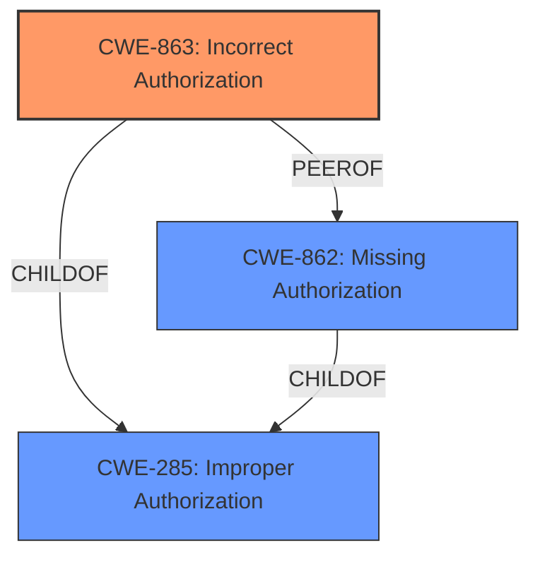

# Enhanced Analysis for CVE-2024-58044

# Summary
| CWE ID    | CWE Name                                                                 | Confidence | CWE Abstraction Level | CWE Vulnerability Mapping Label | CWE-Vulnerability Mapping Notes |
| :-------- | :----------------------------------------------------------------------- | :--------- | :-------------------- | :------------------------------ | :------------------------------ |
| CWE-863   | Incorrect Authorization                                                 | 0.9        | Class                 |                               | Allowed-with-Review           |
| CWE-862   | Missing Authorization                                                   | 0.7        | Class                 |                               | Allowed-with-Review           |
| CWE-285   | Improper Authorization                                                  | 0.6        | Class                 |                               | Discouraged                   |

- The Primary CWE should be first and noted as the Primary CWEs
- The secondary candidate CWEs should be next and noted as secondary candidates.
- The confidence is a confidence score 0 to 1 to rate your confidence in your assessment for that CWE.
- The CWE Abstraction Level as one of these values: Base, Variant, Pillar, Class, Compound
- The Mapping Notes Usage as one of these values: Allowed, Allowed-with-Review, Prohibited, Discouraged

## Evidence and Confidence

*   **Confidence Score:** 0.8
*   **Evidence Strength:** HIGH

## Relationship Analysis

The analysis focuses on authorization-related CWEs, specifically distinguishing between missing and incorrect authorization. The primary selection is CWE-863, Incorrect Authorization, as the description explicitly states a "**permission verification bypass vulnerability**". While CWE-862, Missing Authorization, is considered, the presence of a bypass suggests that authorization mechanisms exist but are flawed. CWE-285, Improper Authorization, is also considered, but it's a discouraged, higher-level class.



## Vulnerability Chain

The vulnerability chain begins with a **permission verification bypass** in the notification module, leading to a potential impact on system availability.

*   **Root Cause:** **Permission verification bypass**
*   **Impact:** Affect availability

## Summary of Analysis

The initial assessment focused on identifying the root cause of the vulnerability, which is a **permission verification bypass** in the notification module. The presence of the word 'bypass' suggests an attempt to verify permissions which was not correct. Therefore, CWE-863 (Incorrect Authorization) is chosen as the primary CWE.

CWE-862 (Missing Authorization) was considered because a bypass could imply that authorization checks are effectively absent in certain scenarios. However, since a "bypass" exists, it means there was an attempt to check.

CWE-285 (Improper Authorization) was also considered, but it's a broader class that encompasses both missing and incorrect authorization. Given the specific nature of the vulnerability, CWE-863 is a better fit and more specific.

The graph relationships highlighted the hierarchical connection between CWE-285 and both CWE-862 and CWE-863, reinforcing the focus on authorization-related weaknesses.

Ultimately, the decision to prioritize CWE-863 is based on the direct evidence of "**permission verification bypass**", which indicates an existing but flawed authorization mechanism. This selection provides the optimal level of specificity, accurately capturing the nature of the vulnerability.

Relevant CWE Information:

# Enhanced Context (25 CWEs)
The following CWEs were identified as potentially relevant to this vulnerability:

## CWE-266: Incorrect Privilege Assignment
**Abstraction Level**: Base
**Similarity Score**: 0.77
**Source**: dense

**Description**:
A product incorrectly assigns a privilege to a particular actor, creating an unintended sphere of control for that actor.

**Mapping Guidance**:
- Usage: Allowed
- Rationale: This CWE entry is at the Base level of abstraction, which is a preferred level of abstraction for mapping to the root causes of vulnerabilities.

*NOT USED:* This CWE deals with the incorrect assignment of privileges, rather than the bypass of permission checks. The vulnerability description focuses on a bypass, which implies a permission check exists but is flawed.

## CWE-267: Privilege Defined With Unsafe Actions
**Abstraction Level**: Base
**Similarity Score**: 0.77
**Source**: dense

**Description**:
A particular privilege, role, capability, or right can be used to perform unsafe actions that were not intended, even when it is assigned to the correct entity.

**Mapping Guidance**:
- Usage: Allowed
- Rationale: This CWE entry is at the Base level of abstraction, which is a preferred level of abstraction for mapping to the root causes of vulnerabilities.

*NOT USED:* This CWE relates to unsafe actions being possible due to how privileges are defined. The current vulnerability description does not explicitly state this.

## CWE-280: Improper Handling of Insufficient Permissions or Privileges 
**Abstraction Level**: Base
**Similarity Score**: 0.77
**Source**: dense

**Description**:
The product does not handle or incorrectly handles when it has insufficient privileges to access resources or functionality as specified by their permissions. This may cause it to follow unexpected code paths that may leave the product in an invalid state.

**Mapping Guidance**:
- Usage: Allowed
- Rationale: This CWE entry is at the Base level of abstraction, which is a preferred level of abstraction for mapping to the root causes of vulnerabilities.

*NOT USED:* This CWE deals with the improper handling of insufficient privileges. The current vulnerability is about bypassing permission verification, not handling insufficient privileges.

## CWE-274: Improper Handling of Insufficient Privileges
**Abstraction Level**: Base
**Similarity Score**: 0.76
**Source**: dense

**Description**:
The product does not handle or incorrectly handles when it has insufficient privileges to perform an operation, leading to resultant weaknesses.

**Mapping Guidance**:
- Usage: Discouraged
- Rationale: This CWE entry could be deprecated in a future version of CWE.

*NOT USED:* Similar to CWE-280. It deals with improper handling of insufficient privileges, and not bypassing a permission check.

## CWE-668: Exposure of Resource to Wrong Sphere
**Abstraction Level**: Class
**Similarity Score**: 0.75
**Source**: dense

**Description**:
The product exposes a resource to the wrong control sphere, providing unintended actors with inappropriate access to the resource.

**Mapping Guidance**:
- Usage: Discouraged
- Rationale: CWE-668 is high-level and is often misused as a catch-all when lower-level CWE IDs might be applicable. It is sometimes used for low-information vulnerability reports [REF-1287]. It is a level-1 Class (i.e., a child of a Pillar). It is not useful for trend analysis.

*NOT USED:* This CWE is a high-level class and is not as specific as other authorization-related CWEs. The vulnerability is clearly about a permission verification bypass.

## CWE-754: Improper Check for Unusual or Exceptional Conditions
**Abstraction Level**: Class
**Similarity Score**: 0.74
**Source**: dense

**Description**:
The product does not check or incorrectly checks for unusual or exceptional conditions that are not expected to occur frequently during day to day operation of the product.

**Mapping Guidance**:
- Usage: Allowed-with-Review
- Rationale: This CWE entry is a Class and might have Base-level children that would be more appropriate

*NOT USED:* This CWE is related to checks for unusual conditions. The current vulnerability is about a general permission verification bypass, not specifically related to unusual conditions.

## CWE-472: External Control of Assumed-Immutable Web Parameter
**Abstraction Level**: Base
**Similarity Score**: 0.74
**Source**: dense

**Description**:
The web application does not sufficiently verify inputs that are assumed to be immutable but are actually externally controllable, such as hidden form fields.

**Mapping Guidance**:
- Usage: Allowed
- Rationale: This CWE entry is at the Base level of abstraction, which is a preferred level of abstraction for mapping to the root causes of vulnerabilities.

*NOT USED:* This CWE relates to web parameters and is not applicable to the given vulnerability description, which does not provide enough information to suggest this.

## CWE-451: User Interface (UI) Misrepresentation of Critical Information
**Abstraction Level**: Class
**Similarity Score**: 0.74
**Source**: dense

**Description**:
The user interface (UI) does not properly represent critical information to the user, allowing the information - or its source - to be obscured or spoofed. This is often a component in phishing attacks.

**Mapping Guidance**:
- Usage: Allowed-with-Review


## CWE Relationship Analysis

Current CWEs represent these abstraction levels: .


### Vulnerability Chain Analysis

**Chain starting from CWE-274:**
- 274 (Improper Handling of Insufficient Privileges) - ROOT


**Chain starting from CWE-863:**
- 863 (Incorrect Authorization) - ROOT


### CWE Relationship Diagram

```mermaid
graph TD
    classDef primary fill:#f96,stroke:#333,stroke-width:2px
    classDef secondary fill:#69f,stroke:#333
    classDef tertiary fill:#9e9,stroke:#333
```