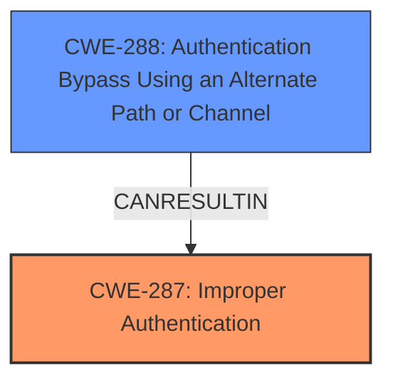

# Analysis for CVE-2024-5805

```markdown
# Summary
| CWE ID | CWE Name | Confidence | CWE Abstraction Level | CWE Vulnerability Mapping Label | CWE-Vulnerability Mapping Notes |
|---|---|---|---|---|---|
| CWE-287 | Improper Authentication | 0.8 | Class | Allowed-with-Review | Primary CWE. The vulnerability description states "**Improper Authentication vulnerability**" which aligns with CWE-287. |
| CWE-288 | Authentication Bypass Using an Alternate Path or Channel | 0.6 | Base | Allowed | Secondary candidate. The vulnerability leads to "Authentication Bypass" which aligns with CWE-288. |

## Evidence and Confidence

*   **Confidence Score:** 0.7
*   **Evidence Strength:** MEDIUM

## Relationship Analysis
The primary relationship that influenced my decision was the parent-child relationship between CWE-287 (Improper Authentication) and its potential children. While the description mentions "Authentication Bypass", it's a consequence of the **improper authentication**. The classification guidance also points to considering CWE-306 if no identity check is performed. However, since the description only indicates "Improper Authentication," a broader Class-level CWE like CWE-287 seems more appropriate as the root cause. CWE-288 (Authentication Bypass Using an Alternate Path or Channel) is a related weakness and may be a consequence of the Improper Authentication, but CWE-287 represents the root cause.



## Vulnerability Chain
The vulnerability chain starts with **Improper Authentication** (CWE-287), which then leads to the impact of Authentication Bypass (CWE-288).

## Summary of Analysis
The initial analysis focused on the provided vulnerability description, particularly the phrase "**Improper Authentication vulnerability**". This phrase strongly suggests CWE-287 (Improper Authentication) as the primary weakness. The retriever results also listed CWE-287 as the top candidate. The subsequent "Authentication Bypass" can be seen as a consequence or impact of the improper authentication, pointing to CWE-288 as a secondary candidate.

The relationship graph highlights how CWE-288 is a potential outcome of CWE-287. Given the limited information in the description, choosing a more specific Base CWE for the root cause is difficult. Therefore, the Class-level CWE-287 is the most appropriate, with CWE-288 representing a direct consequence.

The final selection emphasizes the importance of identifying the root cause. While Authentication Bypass is a critical impact, the underlying **improper authentication** is the fundamental flaw that needs to be addressed.
```