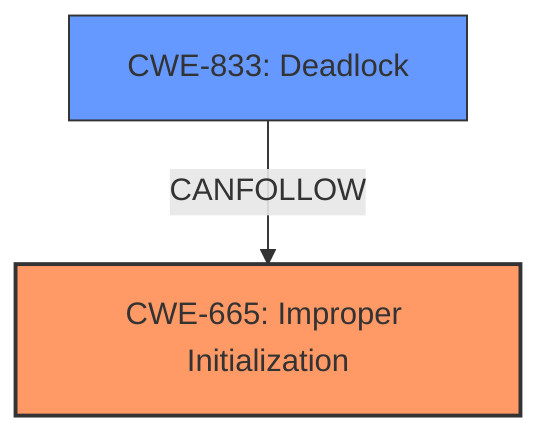

# Enhanced Analysis for CVE-2024-58059

# Summary

| CWE ID  | CWE Name   | Confidence | CWE Abstraction Level | CWE Vulnerability Mapping Label | CWE-Vulnerability Mapping Notes |
|--------------|-----------------------------------------------------------------------------------------------------------------------------------|------------|-----------------------|-----------------------------------|------------------------------------------------------------------|
| CWE-665 | Improper Initialization | 0.75 | Class | Allowed-with-Review | Primary CWE: The root cause is that `uvc_status_init()` may not be called before `uvc_status_unregister()`. |
| CWE-833 | Deadlock | 0.65 | Base | Allowed | Secondary CWE: The impact of the vulnerability is a deadlock. |

## Evidence and Confidence

*   **Confidence Score:** 0.70
*   **Evidence Strength:** MEDIUM

## Relationship Analysis

The primary weakness is **CWE-665 Improper Initialization**, because the `uvc_status_init()` function may not be called which sets the state. The impact is **CWE-833 Deadlock**, because `uvc_status_unregister()` might be called before the `uvc_status_init()` function is called, leading to a deadlock.


## Vulnerability Chain

The vulnerability chain starts with the **improper initialization** of `dev->status` and leads to a **deadlock** if `uvc_status_unregister()` is called before initialization.
- **Root Cause:** **CWE-665 Improper Initialization**
- **Impact:** **CWE-833 Deadlock**

## Summary of Analysis

The analysis is based on the provided evidence, which highlights the root cause and impact of the vulnerability. The vulnerability description states that "**If uvc_probe() fails, it can end up calling uvc_status_unregister() before uvc_status_init() is called**". This indicates that the initialization of `dev->status` is not guaranteed before it is potentially un-registered.

The primary CWE is **CWE-665 Improper Initialization** because the root cause of the vulnerability is the potential for `uvc_status_unregister()` to be called before `uvc_status_init()`. This indicates a **missing initialization** issue. The retriever results also suggest **CWE-909 Missing Initialization of Resource** which is similar, but **CWE-665 Improper Initialization** is chosen because it is a broader class which is appropriate given the limited evidence.

The secondary CWE is **CWE-833 Deadlock** because the impact of the vulnerability is a **deadlock**. The vulnerability description clearly states that it can lead to a deadlock.

Other CWEs considered but not used:
- **CWE-362 Concurrent Execution using Shared Resource with Improper Synchronization ('Race Condition')** - While concurrency is involved, the core issue is the order of operations (initialization vs. unregistration), not necessarily a race condition.
- **CWE-476 NULL Pointer Dereference** - While a NULL pointer dereference might be a possible outcome, the root cause is the missing initialization, not the dereference itself.

The selected CWEs are at the optimal level of specificity because they accurately represent the root cause and impact of the vulnerability based on the available evidence.


## CWE Relationship Analysis

Current CWEs represent these abstraction levels: .


### Vulnerability Chain Analysis

**Chain starting from CWE-476:**
- 476 (NULL Pointer Dereference) - ROOT


**Chain starting from CWE-833:**
- 833 (Deadlock) - ROOT


### CWE Relationship Diagram

```mermaid
graph TD
    classDef primary fill:#f96,stroke:#333,stroke-width:2px
    classDef secondary fill:#69f,stroke:#333
    classDef tertiary fill:#9e9,stroke:#333
```