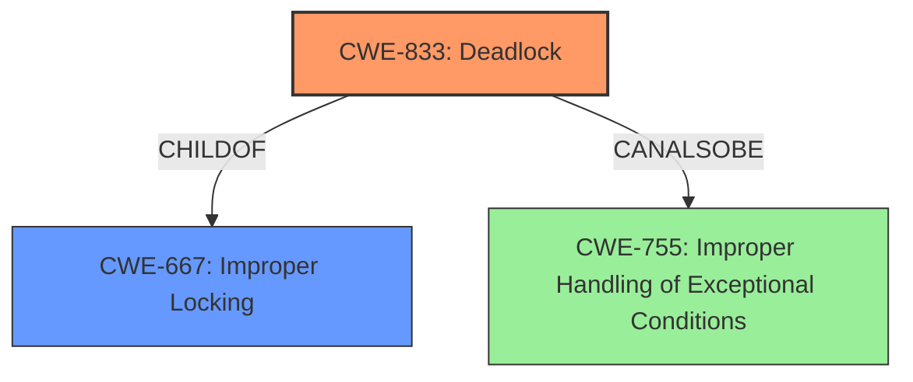

# Enhanced Analysis for CVE-2024-58071

# Summary

| CWE ID  | CWE Name                                                                                       | Confidence | CWE Abstraction Level | CWE Vulnerability Mapping Label | CWE-Vulnerability Mapping Notes |
| :-------- | :--------------------------------------------------------------------------------------------- | :---------- | :---------------------- | :------------------------------ | :------------------------------ |
| CWE-833   | Deadlock                                                                                         | 0.85        | Base                    | Primary                         | Allowed                         |
| CWE-667   | Improper Locking                                                                                 | 0.75        | Class                   | Secondary                       | Allowed-with-Review           |

## Evidence and Confidence

*   **Confidence Score:** 0.80
*   **Evidence Strength:** MEDIUM

## Relationship Analysis

The primary relationship that influenced the decision was the hierarchical relationship between CWE-667 (Improper Locking) and CWE-833 (Deadlock). CWE-833 is a base-level CWE that directly describes the deadlock condition, while CWE-667 is a class-level CWE that describes the broader category of improper locking. Because the vulnerability description explicitly mentions a deadlock, CWE-833 was chosen as the primary CWE. The relationship between CWE-755 (Improper Handling of Exceptional Conditions) and CWE-833 (Deadlock) was also considered, as deadlocks can be seen as exceptional conditions. However, the description focuses more on the locking issue itself rather than the handling of the resulting exceptional condition.



## Vulnerability Chain

The vulnerability chain starts with an **unsafe locking scenario** due to a potential missing lock nesting notation, leading to a deadlock.

## Summary of Analysis

The analysis is based on the provided vulnerability description, which points to a deadlock caused by an **unsafe locking scenario**. The description includes a stack trace and a warning about a possible recursive locking detected, providing strong evidence for the deadlock.

The retriever results also indicated CWE-667 (Improper Locking) as a high-scoring candidate. While improper locking is a contributing factor, the ultimate outcome is a deadlock, making CWE-833 a more specific and accurate classification.

The selection of CWE-833 is at the optimal level of specificity because it directly represents the vulnerability's outcome (a deadlock). CWE-667 (Improper Locking) is a related weakness but is more general.
The evidence from the vulnerability description:
- **rootcause:** **unsafe locking scenario**
- **impact:** deadlock
- WARNING possible recursive locking detected

Relevant CWE Information:

*   **CWE-833: Deadlock** - The product contains multiple threads or executable segments that are waiting for each other to release a necessary lock, resulting in deadlock.
*   **CWE-667: Improper Locking** - The product does not properly acquire or release a lock on a resource, leading to unexpected resource state changes and behaviors.

CWEs Considered but Not Used:

*   CWE-362 (Concurrent Execution using Shared Resource with Improper Synchronization ('Race Condition')): While concurrency is involved, the issue is specifically a deadlock, not a race condition.
*   CWE-413 (Improper Resource Locking): Similar to CWE-667, this is a contributing factor but not the direct outcome.
*   CWE-755 (Improper Handling of Exceptional Conditions): The focus is on the locking issue, not the handling of the exceptional condition.
*   CWE-787 (Out-of-bounds Write), CWE-401 (Missing Release of Memory after Effective Lifetime), CWE-476 (NULL Pointer Dereference): There is no evidence to support any of these.

# Detailed CWE Analysis

### CWE-833: Deadlock

*   **Technical Explanation:** The vulnerability involves a situation where multiple processes or threads are blocked indefinitely, waiting for each other to release locks. In this specific case, the `ip` process attempts to acquire a lock (`team->team_lock_key`) that it already holds, leading to a deadlock.
*   **Security Implications and Potential Impact:** A deadlock can cause the system to become unresponsive or crash, leading to a denial-of-service (DoS) condition.
*   **Relationship Analysis:** CWE-833 is a child of CWE-667 (Improper Locking) and can also be considered a form of CWE-755 (Improper Handling of Exceptional Conditions).
*   **Mapping Guidance Influence:** The "Allowed" usage for CWE-833, along with its Base level of abstraction, makes it a suitable choice for mapping this vulnerability.
*   **Primary/Secondary:** Primary
*   **Confidence:** 0.85

### CWE-667: Improper Locking

*   **Technical Explanation:** The vulnerability arises from the incorrect use of locking mechanisms. The system fails to properly manage the acquisition and release of a lock, leading to the deadlock situation.
*   **Security Implications and Potential Impact:** Improper locking can lead to race conditions, deadlocks, and other concurrency-related issues, potentially resulting in data corruption or denial of service.
*   **Relationship Analysis:** CWE-667 is a parent of CWE-833 (Deadlock).
*   **Mapping Guidance Influence:** The "Allowed-with-Review" usage for CWE-667 suggests that a more specific CWE may be appropriate, which in this case is CWE-833.
*   **Primary/Secondary:** Secondary
*   **Confidence:** 0.75


## CWE Relationship Analysis

Current CWEs represent these abstraction levels: .


### Vulnerability Chain Analysis

**Chain starting from CWE-476:**
- 476 (NULL Pointer Dereference) - ROOT


**Chain starting from CWE-667:**
- 667 (Improper Locking) - ROOT


### CWE Relationship Diagram

```mermaid
graph TD
    classDef primary fill:#f96,stroke:#333,stroke-width:2px
    classDef secondary fill:#69f,stroke:#333
    classDef tertiary fill:#9e9,stroke:#333
```