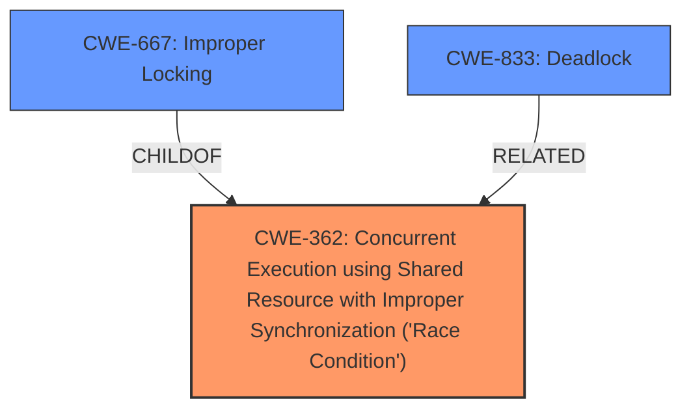

# Analysis Report for CVE-2024-58089

# Vulnerability Analysis Report: CVE-2024-58089

## Description

In the Linux kernel, the following vulnerability has been resolved btrfs fix double accounting race when btrfs_run_delalloc_range() failed [BUG] When running btrfs with block size (4K) smaller than page size (64K, aarch64), there is a very high chance to crash the kernel at generic/750, with the following messages (before the call traces, there are 3 extra debug messages added) BTRFS warning (device dm-3) read-write for sector size 4096 with page size 65536 is experimental BTRFS info (device dm-3) checking UUID tree hrtimer interrupt took 5451385 ns BTRFS error (device dm-3) cow_file_range failed, root=4957 inode=257 start=1605632 len=69632 -28 BTRFS error (device dm-3) run_delalloc_nocow failed, root=4957 inode=257 start=1605632 len=69632 -28 BTRFS error (device dm-3) failed to run delalloc range, root=4957 ino=257 folio=1572864 submit_bitmap=8-15 start=1605632 len=69632 -28 ------------[ cut here ]------------ WARNING CPU 2 PID 3020984 at ordered-data.c360 can_finish_ordered_extent+0x370/0x3b8 [btrfs] CPU 2 UID 0 PID 3020984 Comm kworker/u241 Tainted G OE 6.13.0-rc1-custom+ #89 Tainted [O]=OOT_MODULE, [E]=UNSIGNED_MODULE Hardware name QEMU KVM Virtual Machine, BIOS unknown 2/2/2022 Workqueue events_unbound btrfs_async_reclaim_data_space [btrfs] pc can_finish_ordered_extent+0x370/0x3b8 [btrfs] lr can_finish_ordered_extent+0x1ec/0x3b8 [btrfs] Call trace can_finish_ordered_extent+0x370/0x3b8 [btrfs] (P) can_finish_ordered_extent+0x1ec/0x3b8 [btrfs] (L) btrfs_mark_ordered_io_finished+0x130/0x2b8 [btrfs] extent_writepage+0x10c/0x3b8 [btrfs] extent_write_cache_pages+0x21c/0x4e8 [btrfs] btrfs_writepages+0x94/0x160 [btrfs] do_writepages+0x74/0x190 filemap_fdatawrite_wbc+0x74/0xa0 start_delalloc_inodes+0x17c/0x3b0 [btrfs] btrfs_start_delalloc_roots+0x17c/0x288 [btrfs] shrink_delalloc+0x11c/0x280 [btrfs] flush_space+0x288/0x328 [btrfs] btrfs_async_reclaim_data_space+0x180/0x228 [btrfs] process_one_work+0x228/0x680 worker_thread+0x1bc/0x360 kthread+0x100/0x118 ret_from_fork+0x10/0x20 ---[ end trace 0000000000000000 ]--- BTRFS critical (device dm-3) bad ordered extent accounting, root=4957 ino=257 OE offset=1605632 OE len=16384 to_dec=16384 left=0 BTRFS critical (device dm-3) bad ordered extent accounting, root=4957 ino=257 OE offset=1622016 OE len=12288 to_dec=12288 left=0 Unable to handle kernel NULL pointer dereference at virtual address 0000000000000008 BTRFS critical (device dm-3) bad ordered extent accounting, root=4957 ino=257 OE offset=1634304 OE len=8192 to_dec=4096 left=0 CPU 1 UID 0 PID 3286940 Comm kworker/u243 Tainted G W OE 6.13.0-rc1-custom+ #89 Hardware name QEMU KVM Virtual Machine, BIOS unknown 2/2/2022 Workqueue btrfs_work_helper [btrfs] (btrfs-endio-write) pstate 404000c5 (nZcv daIF +PAN -UAO -TCO -DIT -SSBS BTYPE=--) pc process_one_work+0x110/0x680 lr worker_thread+0x1bc/0x360 Call trace process_one_work+0x110/0x680 (P) worker_thread+0x1bc/0x360 (L) worker_thread+0x1bc/0x360 kthread+0x100/0x118 ret_from_fork+0x10/0x20 Code f84086a1 f9000fe1 53041c21 b9003361 (f9400661) ---[ end trace 0000000000000000 ]--- Kernel panic - not syncing Oops Fatal exception SMP stopping secondary CPUs SMP failed to stop secondary CPUs 2-3 Dumping ftrace buffer (ftrace buffer empty) Kernel Offset 0x275bb9540000 from 0xffff800080000000 PHYS_OFFSET 0xffff8fbba0000000 CPU features 0x100,00000070,00801250,8201720b [CAUSE] The above warning is triggered immediately after the delalloc range failure, this happens in the following sequence - Range [1568K, 1636K) is dirty 1536K 1568K 1600K 1636K 1664K | |/////////|////////| | Where 1536K, 1600K and 1664K are page boundaries (64K page size) - Enter extent_writepage() for page 1536K - Enter run_delalloc_nocow() with locke ---truncated---

## Vulnerability Description Key Phrases

- **Impact:** ['crash the kernel', 'Kernel panic', 'Oops']
- **Product:** Linux kernel
- **Version:** 6.13.0-rc1-custom+
- **Component:** btrfs

## Analysis (with Relationship Data)

# Summary
| CWE ID | CWE Name | Confidence | CWE Abstraction Level | CWE Vulnerability Mapping Label | CWE-Vulnerability Mapping Notes |
|---|---|---|---|---|---|
| CWE-362 | Concurrent Execution using Shared Resource with Improper Synchronization ('**Race Condition**') | 0.8 | Class | Allowed-with-Review | Primary CWE |
| CWE-667 | Improper Locking | 0.6 | Class | Allowed-with-Review | Secondary Candidate |
| CWE-833 | Deadlock | 0.5 | Base | Allowed | Secondary Candidate |

## Evidence and Confidence

*   **Confidence Score:** 0.7
*   **Evidence Strength:** MEDIUM

## Relationship Analysis
The primary CWE identified is CWE-362, a Class-level weakness describing a **race condition** due to concurrent execution and improper synchronization. CWE-667, Improper Locking, is a related Class-level weakness that could be a contributing factor to the **race condition**. CWE-833, Deadlock, is another related Base-level weakness that could arise from improper locking. The selection of CWE-362 as the primary CWE is based on the vulnerability description highlighting the concurrency issue and the **race condition**, while the others are considered secondary because they could be potential causes or consequences of the primary issue.



## Vulnerability Chain
The vulnerability chain starts with a **race condition** (CWE-362) in the btrfs filesystem code due to concurrent access to shared resources without proper synchronization. This leads to incorrect accounting and eventually a kernel panic. Improper locking (CWE-667) could be a contributing factor to the **race condition**, and in some cases, a deadlock (CWE-833) might occur as a consequence of the locking issues.

## Summary of Analysis
The initial analysis focused on identifying the root cause of the kernel crash, which appeared to be related to a **race condition** in the btrfs filesystem code. The vulnerability description mentions "double accounting race" which led to the initial focus on concurrency issues. The retriever results also highlighted CWE-362 as a potential candidate. Based on this evidence, CWE-362 was selected as the primary CWE.

CWE-667 and CWE-833 were also considered as potential contributing factors or consequences of the **race condition**, but were deemed secondary to the primary issue.

The selected CWEs are at an appropriate level of specificity, with CWE-362 providing a general classification of the concurrency issue, and CWE-667 and CWE-833 providing more specific details about the potential locking problems.

Relevant CWE Information:

# Enhanced Context (25 CWEs)
The following CWEs were identified as potentially relevant to this vulnerability:

## CWE-667: Improper Locking
**Abstraction Level**: Class
**Similarity Score**: 0.79
**Source**: dense

**Description**:
The product does not properly acquire or release a lock on a resource, leading to unexpected resource state changes and behaviors.

**Mapping Guidance**:
- Usage: Allowed-with-Review
- Rationale: This CWE entry is a Class and might have Base-level children that would be more appropriate


## CWE-362: Concurrent Execution using Shared Resource with Improper Synchronization ('Race Condition')
**Abstraction Level**: Class
**Similarity Score**: 0.76
**Source**: dense

**Description**:
The product contains a concurrent code sequence that requires temporary, exclusive access to a shared resource, but a timing window exists in which the shared resource can be modified by another code sequence operating concurrently.

**Mapping Guidance**:
- Usage: Allowed-with-Review
- Rationale: This CWE entry is a Class and might have Base-level children that would be more appropriate


## CWE-367: Time-of-check Time-of-use (TOCTOU) Race Condition
**Abstraction Level**: Base
**Similarity Score**: 0.74
**Source**: dense

**Description**:
The product checks the state of a resource before using that resource, but the resource's state can change between the check and the use in a way that invalidates the results of the check. This can cause the product to perform invalid actions when the resource is in an unexpected state.

**Mapping Guidance**:
- Usage: Allowed
- Rationale: This CWE entry is at the Base level of abstraction, which is a preferred level of abstraction for mapping to the root causes of vulnerabilities.


## CWE-833: Deadlock
**Abstraction Level**: Base
**Similarity Score**: 0.74
**Source**: dense

**Description**:
The product contains multiple threads or executable segments that are waiting for each other to release a necessary lock, resulting in deadlock.

**Mapping Guidance**:
- Usage: Allowed
- Rationale: This CWE entry is at the Base level of abstraction, which is a preferred level of abstraction for mapping to the root causes of vulnerabilities.


## CWE-909: Missing Initialization of Resource
**Abstraction Level**: Class
**Similarity Score**: 0.74
**Source**: dense

**Description**:
The product does not initialize a critical resource.

**Mapping Guidance**:
- Usage: Allowed-with-Review
- Rationale: This CWE entry is a Class and might have Base-level children that would be more appropriate


## CWE-789: Memory Allocation with Excessive Size Value
**Abstraction Level**: Variant
**Similarity Score**: 0.73
**Source**: dense

**Description**:
The product allocates memory based on an untrusted, large size value, but it does not ensure that the size is within expected limits, allowing arbitrary amounts of memory to be allocated.

**Mapping Guidance**:
- Usage: Allowed
- Rationale: This CWE entry is at the Variant level of abstraction, which is a preferred level of abstraction for mapping to the root causes of vulnerabilities.


## CWE-125: Out-of-bounds Read
**Abstraction Level**: Base
**Similarity Score**: 0.73
**Source**: dense

**Description**:
The product reads data past the end, or before the beginning, of the intended buffer.

**Mapping Guidance**:
- Usage: Allowed
- Rationale: This CWE entry is at the Base level of abstraction, which is a preferred level of abstraction for mapping to the root causes of vulnerabilities.


## CWE-908: Use of Uninitialized Resource
**Abstraction Level**: Base
**Similarity Score**: 0.72
**Source**: dense

**Description**:
The product uses or accesses a resource that has not been initialized.

**Mapping Guidance**:
- Usage: Allowed
- Rationale: This CWE entry is at the Base level of abstraction, which is a preferred level of abstraction for mapping to the root causes of vulnerabilities.


## CWE-755: Improper Handling of Exceptional Conditions
**Abstraction Level**: Class
**Similarity Score**: 0.72
**Source**: dense

**Description**:
The product does not handle or incorrectly handles an exceptional condition.

**Mapping Guidance**:
- Usage: Discouraged
- Rationale: This CWE entry is a level-1 Class (i.e., a child of a Pillar). It might have lower-level children that would be more appropriate


## CWE-404: Improper Resource Shutdown or Release
**Abstraction Level**: Class
**Similarity Score**: 0.72
**Source**: dense

**Description**:
The product does not release or incorrectly releases a resource before it is made available for re-use.

**Mapping Guidance**:
- Usage: Allowed-with-Review
- Rationale: This CWE entry is a Class and might have Base-level children that would be more appropriate


## CWE-667: Improper Locking
**Abstraction Level**: Class
**Similarity Score**: 847.38
**Source**: sparse

**Description**:
The product does not properly acquire or release a lock on a resource, leading to unexpected resource state changes and behaviors.

**Mapping Guidance**:
- Usage: Allowed-with-Review
- Rationale: This CWE entry is a Class and might have Base-level children that would be more appropriate


## CWE-833: Deadlock
**Abstraction Level**: Base
**Similarity Score**: 711.11
**Source**: sparse

**Description**:
The product contains multiple threads or executable segments that are waiting for each other to release a necessary lock, resulting in deadlock.

**Mapping Guidance**:
- Usage: Allowed
- Rationale: This CWE entry is at the Base level of abstraction, which is a preferred level of abstraction for mapping to the root causes of vulnerabilities.


## CWE-1284: Improper Validation of Specified Quantity in Input
**Abstraction Level**:


## CWE Relationship Analysis

Current CWEs represent these abstraction levels: .


### Vulnerability Chain Analysis

**Chain starting from CWE-1284:**
- 1284 (Improper Validation of Specified Quantity in Input) - ROOT


**Chain starting from CWE-125:**
- 125 (Out-of-bounds Read) - ROOT


### CWE Relationship Diagram

```mermaid
graph TD
    classDef primary fill:#f96,stroke:#333,stroke-width:2px
    classDef secondary fill:#69f,stroke:#333
    classDef tertiary fill:#9e9,stroke:#333
```


*Report generated on 2025-07-14 00:48:04*
