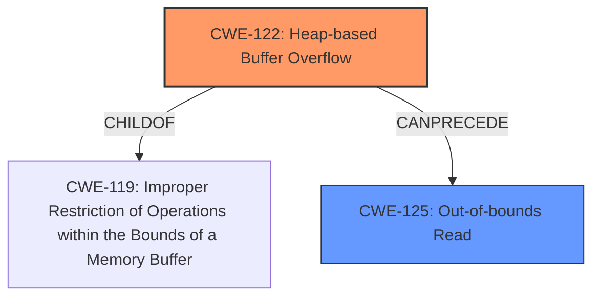

# Analysis Report for CVE-2024-5844

# Vulnerability Analysis Report: CVE-2024-5844

## Description

**Heap buffer overflow** in Tab Strip in Google Chrome prior to 126.0.6478.54 allowed a remote attacker to perform an out of bounds memory read via a crafted HTML page. (Chromium security severity Medium)

## Vulnerability Description Key Phrases

- **Weakness:** Heap buffer overflow
- **Impact:** perform an out of bounds memory read
- **Vector:** crafted HTML page
- **Attacker:** remote attacker
- **Product:** Google Chrome
- **Version:** prior to 126.0.6478.54
- **Component:** Tab Strip

## Analysis (with Relationship Data)

# Summary
| CWE ID | CWE Name | Confidence | CWE Abstraction Level | CWE Vulnerability Mapping Label | CWE-Vulnerability Mapping Notes |
|---|---|---|---|---|---|
| CWE-122 | Heap-based Buffer Overflow | 1.0 | Variant | Primary | Allowed |
| CWE-125 | Out-of-bounds Read | 0.7 | Base | Secondary | Allowed |

## Evidence and Confidence

*   **Confidence Score:** 0.85
*   **Evidence Strength:** HIGH

## Relationship Analysis
The primary CWE is CWE-122, a variant of a buffer overflow that occurs specifically in the heap. It is a child of CWE-119, which describes a more general class of buffer overflows. CWE-125 is a secondary weakness, representing the out-of-bounds read that results from the heap buffer overflow.



## Vulnerability Chain
The vulnerability chain starts with a **heap buffer overflow (CWE-122)**, which then leads to an **out-of-bounds read (CWE-125)**.

## Summary of Analysis
The initial analysis strongly suggests CWE-122 as the primary weakness due to the explicit mention of "Heap buffer overflow" in the vulnerability description. The vulnerability description also mentions an "out of bounds memory read," which maps to CWE-125. The retriever results also list CWE-122 and CWE-125 as high-ranking candidates.

The evidence from the vulnerability description is: "**Heap buffer overflow** in Tab Strip in Google Chrome prior to 126.0.6478.54 allowed a remote attacker to perform an out of bounds memory read via a crafted HTML page."

The graph relationships influenced the final selection by confirming that CWE-122 is a specific type of buffer overflow (child of CWE-119) and can precede CWE-125 (out-of-bounds read).

The selected CWEs are at the optimal level of specificity because CWE-122 accurately describes the type of buffer overflow (heap-based), and CWE-125 describes the resulting impact (out-of-bounds read).

Relevant CWE Information:

# Enhanced Context (25 CWEs)
The following CWEs were identified as potentially relevant to this vulnerability:

## CWE-451: User Interface (UI) Misrepresentation of Critical Information
**Abstraction Level**: Class
**Similarity Score**: 0.73
**Source**: dense
**Description**:
The user interface (UI) does not properly represent critical information to the user, allowing the information - or its source - to be obscured or spoofed. This is often a component in phishing attacks.
**Mapping Guidance**:
- Usage: Allowed-with-Review
- Rationale: This CWE entry is a Class and might have Base-level children that would be more appropriate
**Why not used**: This CWE is not relevant because the vulnerability is not related to UI misrepresentation.

## CWE-366: Race Condition within a Thread
**Abstraction Level**: Base
**Similarity Score**: 0.73
**Source**: dense
**Description**:
If two threads of execution use a resource simultaneously, there exists the possibility that resources may be used while invalid, in turn making the state of execution undefined.
**Mapping Guidance**:
- Usage: Allowed
- Rationale: This CWE entry is at the Base level of abstraction, which is a preferred level of abstraction for mapping to the root causes of vulnerabilities.
**Why not used**: The vulnerability description does not mention anything about race conditions.

## CWE-843: Access of Resource Using Incompatible Type ('Type Confusion')
**Abstraction Level**: Base
**Similarity Score**: 0.72
**Source**: dense
**Description**:
The product allocates or initializes a resource such as a pointer, object, or variable using one type, but it later accesses that resource using a type that is incompatible with the original type.
**Mapping Guidance**:
- Usage: Allowed
- Rationale: This CWE entry is at the Base level of abstraction, which is a preferred level of abstraction for mapping to the root causes of vulnerabilities.
**Why not used**: Type confusion is not mentioned in the vulnerability description.

## CWE-416: Use After Free
**Abstraction Level**: Variant
**Similarity Score**: 0.72
**Source**: dense
**Description**:
The product reuses or references memory after it has been freed. At some point afterward, the memory may be allocated again and saved in another pointer, while the original pointer references a location somewhere within the new allocation. Any operations using the original pointer are no longer valid because the memory "belongs" to the code that operates on the new pointer.
**Mapping Guidance**:
- Usage: Allowed
- Rationale: This CWE entry is at the Variant level of abstraction, which is a preferred level of abstraction for mapping to the root causes of vulnerabilities.
**Why not used**: Use-after-free is not the root cause mentioned in the description.

## CWE-125: Out-of-bounds Read
**Abstraction Level**: Base
**Similarity Score**: 0.71
**Source**: dense
**Description**:
The product reads data past the end, or before the beginning, of the intended buffer.
**Mapping Guidance**:
- Usage: Allowed
- Rationale: This CWE entry is at the Base level of abstraction, which is a preferred level of abstraction for mapping to the root causes of vulnerabilities.
**Why used**: The vulnerability description states that the **heap buffer overflow** allowed a remote attacker to perform an out of bounds memory read. This makes the CWE a secondary candidate.

## CWE-131: Incorrect Calculation of Buffer Size
**Abstraction Level**: Base
**Similarity Score**: 0.71
**Source**: dense
**Description**:
The product does not correctly calculate the size to be used when allocating a buffer, which could lead to a buffer overflow.
**Mapping Guidance**:
- Usage: Allowed
- Rationale: This CWE entry is at the Base level of abstraction, which is a preferred level of abstraction for mapping to the root causes of vulnerabilities.
**Why not used**: While this could be a contributing factor to the overflow, it is not explicitly stated in the description.

## CWE-124: Buffer Underwrite ('Buffer Underflow')
**Abstraction Level**: Base
**Similarity Score**: 0.70
**Source**: dense
**Description**:
The product writes to a buffer using an index or pointer that references a memory location prior to the beginning of the buffer.
**Mapping Guidance**:
- Usage: Allowed
- Rationale: This CWE entry is at the Base level of abstraction, which is a preferred level of abstraction for mapping to the root causes of vulnerabilities.
**Why not used**: The vulnerability description states an overflow, not an underflow.

## CWE-116: Improper Encoding or Escaping of Output
**Abstraction Level**: Class
**Similarity Score**: 0.70
**Source**: dense
**Description**:
The product prepares a structured message for communication with another component, but encoding or escaping of the data is either missing or done incorrectly. As a result, the intended structure of the message is not preserved.
**Mapping Guidance**:
- Usage: Allowed-with-Review
- Rationale: This CWE entry is a Class and might have Base-level children that would be more appropriate
**Why not used**: This vulnerability is not related to encoding or escaping of output.

## CWE-193: Off-by-one Error
**Abstraction Level**: Base
**Similarity Score**: 0.70
**Source**: dense
**Description**:
A product calculates or uses an incorrect maximum or minimum value that is 1 more, or 1 less, than the correct value.
**Mapping Guidance**:
- Usage: Allowed
- Rationale: This CWE entry is at the Base level of abstraction, which is a preferred level of abstraction for mapping to the root causes of vulnerabilities.
**Why not used**: While an off-by-one error could contribute, it's not the main issue.

## CWE-126: Buffer Over-read
**Abstraction Level**: Variant
**Similarity Score**: 0.70
**Source**: dense
**Description**:
The product reads from a buffer using buffer access mechanisms such as indexes or pointers that reference memory locations after the targeted buffer.
**Mapping Guidance**:
- Usage: Allowed
- Rationale: This CWE entry is at the Variant level of abstraction, which is a preferred level of abstraction for mapping to the root causes of vulnerabilities.
**Why not used**: CWE-125 is sufficient since


## CWE Relationship Analysis

Current CWEs represent these abstraction levels: .


### Vulnerability Chain Analysis

**Chain starting from CWE-416:**
- 416 (Use After Free) - ROOT


**Chain starting from CWE-116:**
- 116 (Improper Encoding or Escaping of Output) - ROOT


### CWE Relationship Diagram

```mermaid
graph TD
    classDef primary fill:#f96,stroke:#333,stroke-width:2px
    classDef secondary fill:#69f,stroke:#333
    classDef tertiary fill:#9e9,stroke:#333
```


*Report generated on 2025-07-14 00:53:51*
