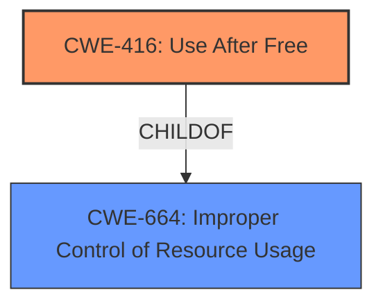

# Raw Analyzer Response for CVE-2024-5847

# Summary
| CWE ID | CWE Name | Confidence | CWE Abstraction Level | CWE Vulnerability Mapping Label | CWE-Vulnerability Mapping Notes |
|---|---|---|---|---|---|
| CWE-416 | Use After Free | 1.0 | Variant | Primary | Allowed |

## Evidence and Confidence

*   **Confidence Score:** 1.0
*   **Evidence Strength:** HIGH

## Relationship Analysis
The primary relationship to consider is that CWE-416 is a Variant-level CWE, providing a specific classification. There are potential CANFOLLOW relationships, but without further information, they are not applicable in this case. CWE-416 is also a child of higher-level Class CWEs, but it is more specific and preferred.

## Vulnerability Chain
The vulnerability chain is straightforward:
1.  **Root Cause:** **Use After Free** (CWE-416)
2.  **Impact:** Potential heap corruption, possibly leading to arbitrary code execution.

## Summary of Analysis
The vulnerability description clearly states that a **use-after-free** vulnerability exists in PDFium. The key phrases highlight the **rootcause** as **use after free**. The CVE Reference Links Content Summary confirms the presence of a **use-after-free** vulnerability within the PDFium component, leading to potential heap corruption. The Retriever Results identify CWE-416 as the top candidate. CWE-416 is a Variant-level CWE, making it a specific and appropriate choice. Therefore, CWE-416 is the most suitable CWE for this vulnerability.

Relevant CWE Information:

# Enhanced Context (25 CWEs)
The following CWEs were identified as potentially relevant to this vulnerability:

## CWE-416: Use After Free
**Abstraction Level**: Variant
**Similarity Score**: 0.75
**Source**: dense

**Description**:
The product reuses or references memory after it has been freed. At some point afterward, the memory may be allocated again and saved in another pointer, while the original pointer references a location somewhere within the new allocation. Any operations using the original pointer are no longer valid because the memory "belongs" to the code that operates on the new pointer.

**Mapping Guidance**:
- Usage: Allowed
- Rationale: This CWE entry is at the Variant level of abstraction, which is a preferred level of abstraction for mapping to the root causes of vulnerabilities.