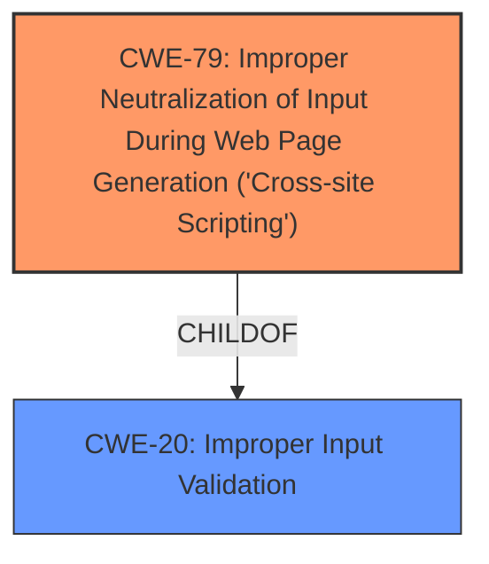

# Raw Analyzer Response for CVE-2024-5848

# Summary

| CWE ID | CWE Name | Confidence | CWE Abstraction Level | CWE Vulnerability Mapping Label | CWE-Vulnerability Mapping Notes |
|---|---|---|---|---|---|
| CWE-79 | Improper Neutralization of Input During Web Page Generation ('Cross-site Scripting') | 1.0 | Base | Allowed | Primary CWE: This CWE directly addresses the **cross-site scripting** vulnerability caused by **improper input validation**. |
| CWE-20 | Improper Input Validation | 0.7 | Class | Discouraged | Secondary Candidate: The root cause is **improper input validation**, but CWE-20 is too general. |

## Evidence and Confidence

*   **Confidence Score:** 0.9
*   **Evidence Strength:** HIGH

## Relationship Analysis

The primary relationship influencing my decision is the parent-child relationship between CWE-20 (Improper Input Validation) and CWE-79 (Improper Neutralization of Input During Web Page Generation ('Cross-site Scripting')). CWE-79 is a more specific instance of CWE-20, focusing on the context of web page generation. The vulnerability description clearly indicates that the **improper input validation** leads directly to a **cross-site scripting** issue, justifying the selection of the more specific CWE-79.

## Vulnerability Chain

The vulnerability chain starts with **improper input validation** (CWE-20, though not chosen as primary) which leads to the inclusion of user-supplied data in server responses without proper sanitization or encoding. This then results in **cross-site scripting** (CWE-79), allowing an attacker to inject malicious JavaScript.

## Summary of Analysis

My assessment is heavily based on the provided evidence, particularly the "Vulnerability Description Key Phrases" which explicitly mention "**improper input validation**" as the root cause and "**cross-site scripting**" as the weakness. The retriever results also strongly suggest CWE-79 as the most relevant CWE.

The graph relationships confirm that CWE-79 is a specific type of input validation issue within the context of web page generation. This aligns perfectly with the vulnerability description, which details how **improper input validation** leads to XSS.

I've chosen CWE-79 because it is the most specific and accurate representation of the vulnerability, directly addressing the **cross-site scripting** issue. While **improper input validation** (CWE-20) is a contributing factor, it's a more general weakness and less informative than CWE-79 in this context.

Relevant CWE Information:

**CWE-79: Improper Neutralization of Input During Web Page Generation ('Cross-site Scripting')**

*   This CWE accurately describes the vulnerability where user-controllable input is not properly neutralized before being included in a web page. This allows attackers to inject malicious scripts.
*   The security implication is that an attacker can execute arbitrary JavaScript code in the context of the user's browser, potentially leading to session hijacking, data theft, or defacement of the website.
*   CWE-79 is a Base level CWE, providing a good balance between specificity and generality.
*   The "Usage: Allowed" mapping guidance confirms that this is an appropriate CWE to use.

**CWE-20: Improper Input Validation**

*   While the vulnerability description mentions **improper input validation**, CWE-20 is a very broad category. It indicates that the application does not properly validate input, but it does not specify the type of validation that is missing or the specific consequences of the missing validation.
*   The "Usage: Discouraged" mapping guidance further suggests that a more specific CWE should be used if possible.
*   Therefore, while **improper input validation** is a contributing factor, CWE-20 is not the most appropriate CWE for this vulnerability.