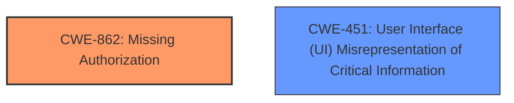

# Raw Analyzer Response for CVE-2024-5899

# Summary
| CWE ID | CWE Name | Confidence | CWE Abstraction Level | CWE Vulnerability Mapping Label | CWE-Vulnerability Mapping Notes |
|---|---|---|---|---|---|
| CWE-862 | Missing Authorization | 0.8 | Class | Primary | Allowed-with-Review |
| CWE-451 | User Interface (UI) Misrepresentation of Critical Information | 0.6 | Class | Secondary | Allowed-with-Review |

## Evidence and Confidence

*   **Confidence Score:** 0.7
*   **Evidence Strength:** MEDIUM

## Relationship Analysis
The primary relationship that influenced the decision was that CWE-862 is a Class-level CWE which has more specific Base-level children. However, none of those children seemed to fit the specific vulnerability as well as CWE-862 itself. CWE-451 was considered because the trust dialog not being shown is a misrepresentation of critical information.

## Vulnerability Chain
The vulnerability chain starts with the **improper use of ProjectBuilder.createProject**, leading to the **missing trust confirmation dialog**, ultimately resulting in the trusting of a project without user consent.

## Summary of Analysis
The primary focus was on identifying the root cause of the vulnerability. The vulnerability description and the CVE reference links content summary both indicate that the **missing trust confirmation dialog** is the core issue. This aligns well with CWE-862, Missing Authorization, as the dialog is meant to authorize the project for execution. While CWE-451, User Interface (UI) Misrepresentation of Critical Information, is also relevant, it is a secondary aspect of the vulnerability, as the primary issue is the absence of the authorization step.

The evidence for CWE-862 is: "This comes from the fact that both call the method ProjectBuilder.createProject which then calls ProjectManager.getInstance().createProject. This method, as its name suggests is intended to create a new project, not to import an existing one." and "The primary vulnerability is the **missing trust confirmation dialog**. This bypasses a key security feature of IntelliJ, which is designed to protect users from opening potentially untrusted or malicious projects."

The evidence for CWE-451 is: the **missing trust confirmation dialog** itself misrepresents the state of the project as trusted when it has not been explicitly authorized by the user.

The selection of CWE-862 as the primary CWE is at the optimal level of specificity because it directly addresses the core issue of the **missing authorization** check.

Relevant CWE Information:

# Enhanced Context (25 CWEs)
The following CWEs were identified as potentially relevant to this vulnerability:

## CWE-451: User Interface (UI) Misrepresentation of Critical Information
**Abstraction Level**: Class
**Similarity Score**: 0.69
**Source**: dense

**Description**:
The user interface (UI) does not properly represent critical information to the user, allowing the information - or its source - to be obscured or spoofed. This is often a component in phishing attacks.

**Mapping Guidance**:
- Usage: Allowed-with-Review
- Rationale: This CWE entry is a Class and might have Base-level children that would be more appropriate

## CWE-862: Missing Authorization
**Abstraction Level**: Class
**Similarity Score**: 0.407

**Description**: The product does not perform an authorization check when it is required.

**Mapping Guidance**:
- Usage: Allowed-with-Review
- Rationale: This CWE entry is a Class and might have Base-level children that would be more appropriate