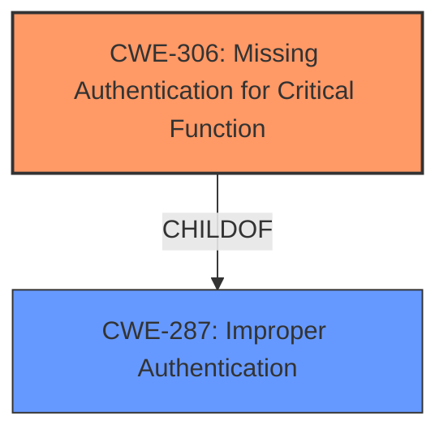

# Analysis Report for CVE-2024-5957

# Vulnerability Analysis Report: CVE-2024-5957

## Description

This vulnerability allows unauthenticated remote attackers to bypass authentication and gain APIs access of the Manager.

## Vulnerability Description Key Phrases

- **Impact:** bypass authentication
- **Attacker:** unauthenticated remote attackers

## Analysis (with Relationship Data)

# Summary
| CWE ID | CWE Name | Confidence | CWE Abstraction Level | CWE Vulnerability Mapping Label | CWE-Vulnerability Mapping Notes |
|---|---|---|---|---|---|
| CWE-306 | Missing Authentication for Critical Function | 1.0 | Base | Allowed | Primary CWE |

## Evidence and Confidence

*   **Confidence Score:** 1.0
*   **Evidence Strength:** HIGH

## Relationship Analysis
The primary CWE is CWE-306, which is a base-level CWE. There are several child CWEs for CWE-306, but none are a better fit than the base CWE. CWE-306 is related to CWE-287 (Improper Authentication), but since the vulnerability description explicitly states that authentication is bypassed, CWE-306 is a more accurate classification.



## Vulnerability Chain
The vulnerability chain starts with the **missing authentication** for a critical function, leading to the **impact** of an unauthenticated remote attacker gaining API access of the Manager.

## Summary of Analysis
Based on the vulnerability description, the most appropriate CWE is CWE-306 (Missing Authentication for Critical Function). The description clearly states that unauthenticated remote attackers can bypass authentication, indicating a **lack of authentication** for a critical function.

The vulnerability description key phrase is "**impact:** bypass authentication" and the attacker is "unauthenticated remote attackers". This directly aligns with CWE-306, which addresses situations where a product does not perform any authentication for functionality that requires a provable user identity.

The Retriever Results also lists CWE-306 as a top candidate. The CWE Classification Guidance also mentions that CWE-306 is relevant when no identity validation is enforced for sensitive functionality and "no login happened".

I considered other CWEs from the Retriever Results, but they were not as accurate as CWE-306. For example, CWE-287 (Improper Authentication) implies that some form of authentication is present but flawed, which is not the case in this vulnerability. CWE-285 (Improper Authorization) is about incorrect authorization checks, which is also not relevant since the vulnerability involves a complete bypass of authentication.

The choice of CWE-306 is at the optimal level of specificity because it directly addresses the root cause of the vulnerability: the **missing authentication** for a critical function.

Relevant CWE Information:

# Enhanced Context (25 CWEs)
The following CWEs were identified as potentially relevant to this vulnerability:

## CWE-306: Missing Authentication for Critical Function
**Abstraction Level**: Base
**Similarity Score**: 1075.06
**Source**: sparse

**Description**:
The product does not perform any authentication for functionality that requires a provable user identity or consumes a significant amount of resources.

**Mapping Guidance**:
- Usage: Allowed
- Rationale: This CWE entry is at the Base level of abstraction, which is a preferred level of abstraction for mapping to the root causes of vulnerabilities.

# Complete CWE Specifications

CWE-306: Missing Authentication for Critical Function

CWE-306: Missing Authentication for Critical Function

**Description**:
CWE-306: Missing Authentication for Critical Function

**Mapping Guidance**:
- Usage: Allowed
- Rationale: This CWE entry is at the Base level of abstraction, which is a preferred level of abstraction for mapping to the root causes of vulnerabilities.

**Relationships**:
- PARENTOF -> CWE-322
- PARENTOF -> CWE-288
- CHILDOF -> CWE-287
- CHILDOF -> CWE-287
- CHILDOF -> CWE-306


## CWE Relationship Analysis

Current CWEs represent these abstraction levels: .


### Vulnerability Chain Analysis

**Chain starting from CWE-288:**
- 288 (Authentication Bypass Using an Alternate Path or Channel) - ROOT


**Chain starting from CWE-306:**
- 306 (Missing Authentication for Critical Function) - ROOT


### CWE Relationship Diagram

```mermaid
graph TD
    classDef primary fill:#f96,stroke:#333,stroke-width:2px
    classDef secondary fill:#69f,stroke:#333
    classDef tertiary fill:#9e9,stroke:#333
```


*Report generated on 2025-07-14 01:02:19*
